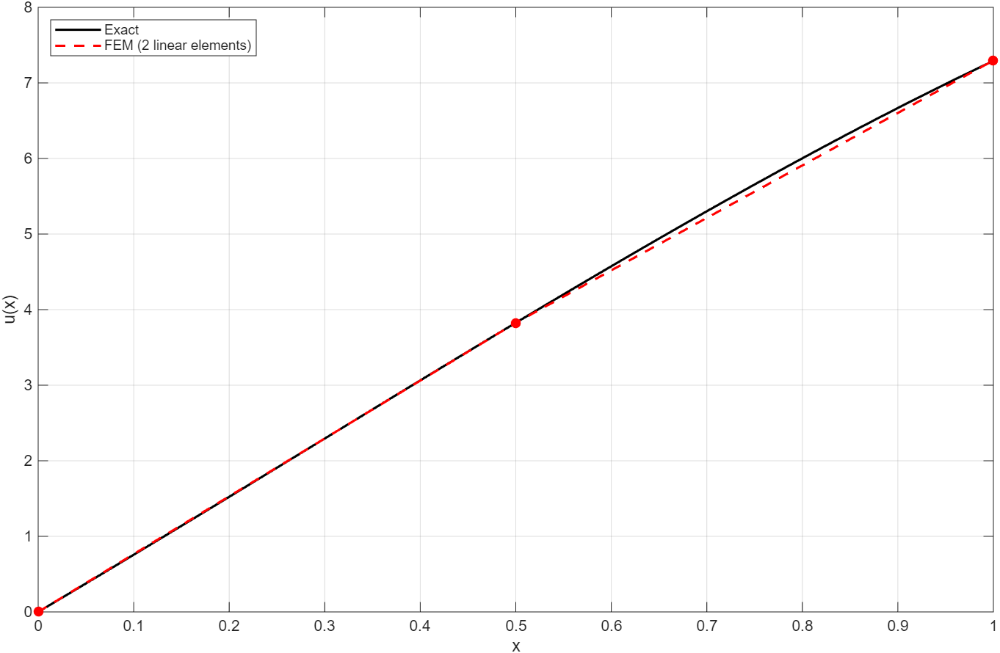

# Question 1


## I. Find the analytical solution

Multiply by -1 both sides,

$$
\frac{d}{dx} \left( \frac{1}{5+x} \frac{du}{dx} \right) = -x
$$ {#eq-1-1}

Integrate both sides,

$$
\int \frac{d}{dx} \left( \frac{1}{5+x} \frac{du}{dx} \right) \, dx = \int -x \, dx
$$ {#eq-1-2}

This yields,

$$
\frac{1}{5+x} \frac{du}{dx} = -\frac{1}{2}x^2 + C_1
$$ {#eq-1-3}

Apply $\left. \frac{1}{5+x} \frac{du}{dx} \right|_{x=1} = 1$ to @eq-1-3

Substitute $x = 1$ into our equation from Step 1,
$$
-\frac{1}{2}(1)^2 + C_1 = 1 \implies C_1 = 1.5
$$ {#eq-1-4}

Substitute x=1 into @eq-1-3 and re-arrange it,

$$
\frac{du}{dx} = (5+x) \left( -\frac{1}{2}x^2 + \frac{3}{2} \right)
\\ = -\frac{1}{2}x^3 - \frac{5}{2}x^2 + \frac{3}{2}x + \frac{15}{2}
$$ {#eq-1-6}

For Integrate both sides with respect to $x$ to find $u(x)$:

$$
\begin{aligned}
u(x) &= \int \left( -\frac{1}{2}x^3 - \frac{5}{2}x^2 + \frac{3}{2}x + \frac{15}{2} \right) \, dx
\\&= -\frac{1}{2}\left(\frac{x^4}{4}\right) - \frac{5}{2}\left(\frac{x^3}{3}\right) + \frac{3}{2}\left(\frac{x^2}{2}\right) + \frac{15}{2}x + C_2
\\&= -\frac{1}{8}x^4 - \frac{5}{6}x^3 + \frac{3}{4}x^2 + \frac{15}{2}x + C_2
\end{aligned}
$$ {#eq-1-9}

Apply $u(0)=0$ to find C_2, substitute $x=0$ into the expression for $u(x)$:

$$
0 = -\frac{1}{8}(0)^4 - \frac{5}{6}(0)^3 + \frac{3}{4}(0)^2 + \frac{15}{2}(0) + C_2
\\
\implies C_2 = 0
$$ {#eq-1-12}

Therefore, obtain the analytical solution

$$
u(x) = -\frac{1}{8}x^4 - \frac{5}{6}x^3 + \frac{3}{4}x^2 + \frac{15}{2}x
$$ {#eq-1-13}

## II. Find the approximate solution using an n = 2 Ritz/Galerkin approximation

$$
u(x) \approx c_0 + c_1 x + c_2 x^2
$$ {#eq-2-1}

Apply B.C u(0)=0, obtain c_0 =0. And then u(x) be simplified as:

$$
u(x) = c_1 x + c_2 x^2
$$ {#eq-2-2}

Based on Ritz/Galerkin methon, build a weight function w(x), and multiply the differential equation by w(x) and integrate over the domain [0,1],

$$
\int_0^1 w \left[ -\frac{d}{dx} \left( \frac{1}{5+x} \frac{du}{dx} \right) - x \right] dx = 0
$$ {#eq-2-3}

Integrate by parts,

$$
\int_0^1 \frac{1}{5+x} \frac{dw}{dx} \frac{du}{dx} dx - \left[ w \frac{1}{5+x} \frac{du}{dx} \right]_0^1 = \int_0^1 w x \, dx
$$ {#eq-2-4}

Apply B. C. $\frac{1}{5+x} \frac{du}{dx} = 1$ into @eq-2-4. Since u(0)=0, have to set w(0)=0 to comply u(x), so the weak form equation can be obtained,

$$
\int_0^1 \frac{1}{5+x} w' u' \, dx = \int_0^1 w x \, dx + w(1)
$$ {#eq-2-5}

Per the form of @eq-2-2, set $\phi$ as follows:

$\phi_1(x) = x \implies \phi_1' = 1$

$\phi_2(x) = x^2 \implies \phi_2' = 2x$

Substitute $u = c_1 \phi_1 + c_2 \phi_2$ into the weak form for each weight function $w = \phi_i$. This creates a system of linear equations: $[K]\{c\} = \{F\}$.

Construct stiffness matrix K, $K_{ij} = \int_0^1 \frac{1}{5+x} \phi_i' \phi_j' \, dx$

**$K_{11}$** (using $w=x, u=x$):

$$
K_{11} = \int_0^1 \frac{1}{5+x} (1)(1) \, dx = [\ln(5+x)]_0^1 = \ln(6) - \ln(5) = \ln(1.2)
$$ {#eq-2-6}

**$K_{12} = K_{21}$** (using $w=x, u=x^2$):

$$
K_{12} = \int_0^1 \frac{1}{5+x} (1)(2x) \, dx = 2 \int_0^1 \left( 1 - \frac{5}{5+x} \right) dx
$$ {#eq-2-7}

$$
= 2 \left[ x - 5\ln(5+x) \right]_0^1 = 2(1 - 5\ln(1.2))
$$ {#eq-2-8}

**$K_{22}$** (using $w=x^2, u=x^2$):

$$
K_{22} = \int_0^1 \frac{1}{5+x} (2x)(2x) \, dx = 4 \int_0^1 \frac{x^2}{5+x} dx= 4 \left( -4.5 + 25\ln(1.2) \right)
$$ {#eq-2-9}

Construct load vector items $\{F\}$ : $F_i = \int_0^1 \phi_i x \, dx + \phi_i(1)$

**$F_1$** (using $w=x$):

$$
F_1 = \int_0^1 (x)(x) \, dx + (1) = \left[ \frac{x^3}{3} \right]_0^1 + 1 = \frac{1}{3} + 1 = \frac{4}{3}
$$ {#eq-2-10}

**$F_2$** (using $w=x^2$):

$$
F_2 = \int_0^1 (x^2)(x) \, dx + (1)^2 = \left[ \frac{x^4}{4} \right]_0^1 + 1 = \frac{1}{4} + 1 = \frac{5}{4}
$$ {#eq-2-11}

Therefore, the linear system is:

$$
\begin{bmatrix}
\ln\left(\frac{6}{5}\right) & 2\left(1 - 5\ln\left(\frac{6}{5}\right)\right) \\
2\left(1 - 5\ln\left(\frac{6}{5}\right)\right) & 4\left(-4.5 + 25\ln\left(\frac{6}{5}\right)\right)
\end{bmatrix}
\begin{bmatrix} c_1 \\ c_2 \end{bmatrix}
=\begin{bmatrix} \frac{4}{3} \\ \frac{5}{4} \end{bmatrix}
$$ {#eq-2-12}

Use Matlab to solve this system get $c_1$ and $c_2$, the code as follows: 

```{matlab}
K11 = log(6/5);
K12 = 2*(1 - 5*log(6/5));
K22 = 4*(-4.5 + 25*log(6/5));
K = [K11 K12; K12 K22];
F = [4/3; 5/4];

c = K\F;
c1 = c(1);
c2 = c(2);

fprintf('c1 = %.6f, c2 = %.6f\n', c1, c2);
```

Output:

```text
c1 = 7.996964, c2 = -0.705297
```
Thus, the approximate solution is:
$$
u(x) \approx 7.9969638x - 0.7052971x^2
$$ {#eq-2-14}

## III. Find the approximate solution using FEM with two linear elements

### Discretization

Divide the domain $0 \le x \le 1$ into two linear elements of equal length.

Nodes: 3 Nodes ($x_1=0, x_2=0.5, x_3=1$)

**Elements:**

- Element 1 ($e_1$): Nodes 1 and 2 ($0 \le x \le 0.5$), Length $h_1 = 0.5$
- Element 2 ($e_2$): Nodes 2 and 3 ($0.5 \le x \le 1$), Length $h_2 = 0.5$

**Global Displacement Vector:** $\{U\} = [U_1, U_2, U_3]^T$

### Derive element wise

Similarly to @eq-2-5, we can get the weak form by integration by parts.

$$
\int_{0}^{1} \left( \frac{1}{5+x} \right) \frac{dw}{dx} \frac{du}{dx} \, dx - \left[ w \left( \frac{1}{5+x} \frac{du}{dx} \right) \right]_0^1 = \int_{0}^{1} w x \, dx
$$ {#eq-3-1}

Rearranging to isolate the integral terms:

$$
\int_{0}^{1} \frac{1}{5+x} \frac{dw}{dx} \frac{du}{dx} \, dx = \int_{0}^{1} w x \, dx + \left[ w \cdot \text{Flux} \right]_0^1
$$ {#eq-3-2}

For a generic element $e$ with nodes $1$ and $2$, we use linear shape functions $\psi_1^e$ and $\psi_2^e$.

Shape Functions:

$$
\psi_1^e(x) = \frac{x_2^e - x}{h_e}, \quad \psi_2^e(x) = \frac{x - x_1^e}{h_e}
$$ {#eq-3-3}

Derivatives:

$$
\frac{d\psi_1^e}{dx} = -\frac{1}{h_e}, \quad \frac{d\psi_2^e}{dx} = \frac{1}{h_e}
$$ {#eq-3-4}

#### Element Stiffness Matrix $[K^e]$

The stiffness matrix components are defined by the integral on the LHS of the weak form:

$$
K_{ij}^e = \int_{x_1^e}^{x_2^e} \frac{1}{5+x} \frac{d\psi_i^e}{dx} \frac{d\psi_j^e}{dx} \, dx
$$ {#eq-3-5}

Using $h_e = 0.5$, the derivatives are $\pm 2$. Thus, $\frac{d\psi_i}{dx}\frac{d\psi_j}{dx}$ is either $4$ (if $i=j$) or $-4$ (if $i \neq j$).

$$
K_{ij}^e = \pm 4 \int_{x_1^e}^{x_2^e} \frac{1}{5+x} \, dx = \pm 4 \Big[ \ln(5+x) \Big]_{x_1^e}^{x_2^e}
$$ {#eq-3-6}

For element 1 ($0$ to $0.5$):

$$
k_{val}^1 = 4 (\ln(5.5) - \ln(5)) = 4 \ln\left(1.1\right)
$$ {#eq-3-7}

$$
[K^1] = \begin{bmatrix} k_{val}^1 & -k_{val}^1 \\ -k_{val}^1 & k_{val}^1 \end{bmatrix}
$$ {#eq-3-8}

For element 2 ($0.5$ to $1$):

$$
k_{val}^2 = 4 (\ln(6) - \ln(5.5)) = 4 \ln\left(\frac{12}{11}\right)
$$ {#eq-3-9}

$$
[K^2] = \begin{bmatrix} k_{val}^2 & -k_{val}^2 \\ -k_{val}^2 & k_{val}^2 \end{bmatrix}
$$ {#eq-3-10}

#### Element Force Vector $\{f^e\}$

The force vector comes from the source term integral:

$$
f_i^e = \int_{x_1^e}^{x_2^e} x \cdot \psi_i^e(x) \, dx
$$ {#eq-3-11}

Element 1 ($e^1$):

$$
f_1^1 = \int_0^{0.5} x \frac{0.5-x}{0.5} dx = \frac{1}{24}
$$ {#eq-3-12}

$$
f_2^1 = \int_0^{0.5} x \frac{x}{0.5} dx = \frac{1}{12}
$$ {#eq-3-13}

Element 2 ($e^2$):

$$
f_1^2 = \int_{0.5}^{1} x \frac{1-x}{0.5} dx = \frac{1}{6}
$$ {#eq-3-14}

$$
f_2^2 = \int_{0.5}^{1} x \frac{x-0.5}{0.5} dx = \frac{5}{24}
$$ {#eq-3-15}

### Global Assembly

We assemble the element matrices into the global system $[K]\{U\} = \{F\}$ by summing contributions at shared nodes (specifically Node 2, which is shared by $e^1$ and $e^2$).

$$
\begin{bmatrix} K_{11}^1 & K_{12}^1 & 0 \\ K_{21}^1 & K_{22}^1 + K_{11}^2 & K_{12}^2 \\ 0 & K_{21}^2 & K_{22}^2 \end{bmatrix} \begin{bmatrix} U_1 \\ U_2 \\ U_3 \end{bmatrix} = \begin{bmatrix} f_1^1 \\ f_2^1 + f_1^2 \\ f_2^2 \end{bmatrix}
$$ {#eq-3-16}

Substituting the calculated values:

$$
\begin{bmatrix} k_{val}^1 & -k_{val}^1 & 0 \\ -k_{val}^1 & k_{val}^1 + k_{val}^2 & -k_{val}^2 \\ 0 & -k_{val}^2 & k_{val}^2 \end{bmatrix}
\begin{bmatrix} U_1 \\ U_2 \\ U_3 \end{bmatrix}
=
\begin{bmatrix} \frac{1}{24} \\ \frac{1}{12} + \frac{1}{6} \\ \frac{5}{24} \end{bmatrix}
$$ {#eq-3-17}

### Impose B.C

For essential B.C, from the problem statement $u(0)=0$. We modify the first row/column to enforce $U_1=0$. We can eliminate the first equation or explicitly set the diagonal to 1 and the RHS to 0.

For natural B.C (at $x=1$): The problem specifies $\left. \frac{1}{5+x} \frac{du}{dx} \right|_{x=1} = 1$. The boundary term from the weak form is $[w \cdot \text{Flux}]_0^1$. At node 3 ($x=1$), the weight function $\psi_2^2(1) = 1$. We add the flux value ($+1$) directly to the global force vector at Node 3 ($F_3$).

Reduced System (solving for $U_2, U_3$):

$$
\begin{bmatrix} k_{val}^1 + k_{val}^2 & -k_{val}^2 \\ -k_{val}^2 & k_{val}^2 \end{bmatrix}
\begin{bmatrix} U_2 \\ U_3 \end{bmatrix}
=
\begin{bmatrix} \frac{1}{4} \\ \frac{5}{24} + 1 \end{bmatrix}
$$ {#eq-3-18}

$$
\begin{bmatrix} k_{val}^1 + k_{val}^2 & -k_{val}^2 \\ -k_{val}^2 & k_{val}^2 \end{bmatrix}
\begin{bmatrix} U_2 \\ U_3 \end{bmatrix}
=
\begin{bmatrix} \frac{1}{4} \\ \frac{29}{24} \end{bmatrix}
$$ {#eq-3-19}

Use Matlab solve the linear system, plese see codes in the following.

```{matlab}
k1 = 4*(log(5.5) - log(5));
k2 = 4*(log(6) - log(5.5));

K = [k1 + k2, -k2; -k2, k2];
F = [1/4; 29/24];

U = K\F;
U2 = U(1);
U3 = U(2);

fprintf('U2 = %.6f, U3 = %.6f\n', U2, U3);
```

Output:

```text
c1 = 7.996963, c2 = -0.705297
U2 = 3.825230, U3 = 7.296998
```

Thus, the approximate nodal displacements are:

$$
U_1 = 0, \quad U_2 = 3.825230, \quad U_3 = 7.296998
$$ {#eq-3-20}

So, the FEM approximate solution is:

$$
u(x)= \begin{cases} 7.650460 x, & 0 \le x \le 0.5 \\ 3.825230 + 6.943536 (x - 0.5), & 0.5 < x \le 1 \end{cases}
$$ {#eq-3-21}

Use Matlab (codes please see in the following) to plot  hte exact and the approximate solution using the FEM as shown in @fig-3:

{#fig-3}

```{matlab}
% Exact solution
x = linspace(0, 1, 400);
u_exact = -(1/8)*x.^4 - (5/6)*x.^3 + (3/4)*x.^2 + (15/2)*x;

% FEM nodal values (U1 = 0)
k1 = 4*(log(5.5) - log(5));
k2 = 4*(log(6) - log(5.5));
K = [k1 + k2, -k2; -k2, k2];
F = [1/4; 29/24];
U = K\F;
U1 = 0; U2 = U(1); U3 = U(2);

% FEM piecewise linear solution
u_fem = zeros(size(x));
idx1 = x <= 0.5;
idx2 = x > 0.5;
u_fem(idx1) = U1 + (U2 - U1) * (x(idx1) - 0) / 0.5;
u_fem(idx2) = U2 + (U3 - U2) * (x(idx2) - 0.5) / 0.5;

% Plot
plot(x, u_exact, 'k-', 'LineWidth', 1.5); hold on;
plot(x, u_fem, 'r--', 'LineWidth', 1.5);
plot([0 0.5 1], [U1 U2 U3], 'ro', 'MarkerFaceColor', 'r');
grid on;
xlabel('x'); ylabel('u(x)');
legend('Exact', 'FEM (2 linear elements)', 'Location', 'NorthWest');
```
