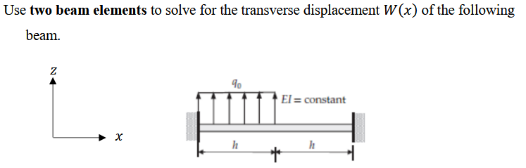
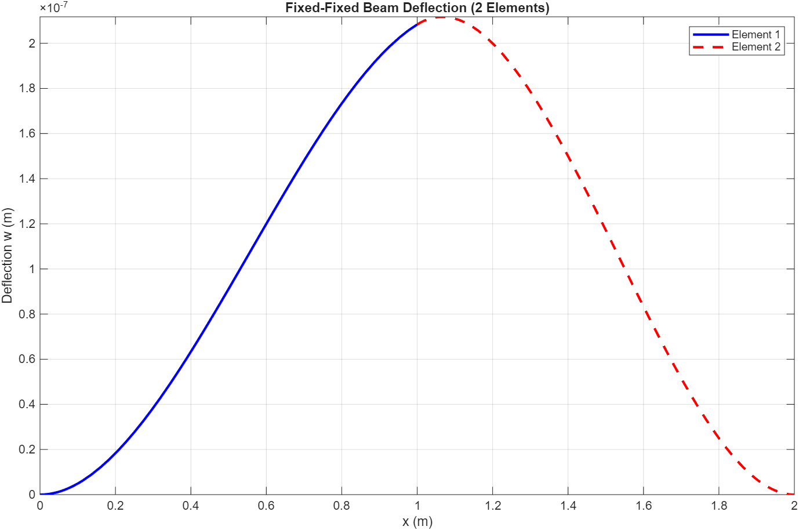
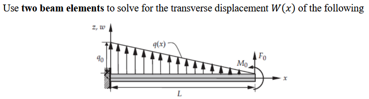
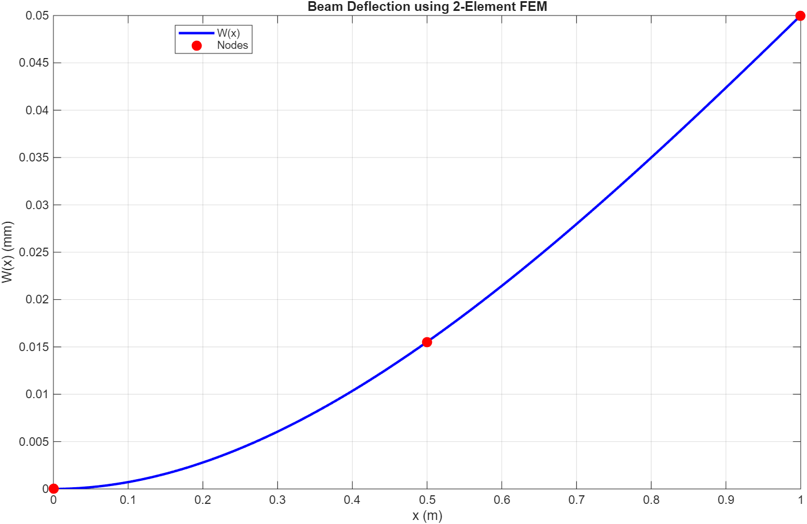

# Question 1



## I. Find the element wise stiffness matrix and force vectors.  

The stiffness matrix and force vectors will have the following form:
$$
K^{e} = \frac{2 E^{e} I^{e}}{L_{e}^{3}}
\begin{bmatrix}
6 & -3L_e & -6 & -3L_e \\
-3L_e & 2L_e^{2} & 3L_e & L_e^{2} \\
-6 & 3L_e & 6 & 3L_e \\
-3L_e & L_e^{2} & 3L_e & 2L_e^{2}
\end{bmatrix}
$$

$$
f^e = \left\{ \int_{x_1^e}^{x_2^e} \psi_i^e q dx \right\}
$$

Where:

- $L_e$ = h

For this problem,  due to $L_1=L_2, EI = constant$, implies $K_1=K_2$, so,

$$
K^1 = K^2 = \frac{2 EI}{h^{3}}
\begin{bmatrix}
6 & -3h & -6 & -3h \\
-3h & 2h^{2} & 3h & h^{2} \\
-6 & 3h & 6 & 3h \\
-3h & h^{2} & 3h & 2h^{2}
\end{bmatrix}
$$ {#eq-2-1}

Since $q_0$ is a uniform distributed load, we can use,
$$
f^e = \frac{q^e L_e}{12} \begin{Bmatrix} 6 \\ -L_e \\ 6 \\ L_e \end{Bmatrix}
$$
NB: This is the positive sign convention adopted by J. N. Reddy

 • Up: Positive • Clockwise: Positive

For element 1, $q^e=q_0$
$$
f^e = \frac{q_0 h}{12} \begin{Bmatrix} 6 \\ -h \\ 6 \\ h \end{Bmatrix}
$$ {#eq-2-2}

For element 2,  $q^e=0$
$$
f^e = \frac{q_0 h}{12} \begin{Bmatrix} 6 \\ -h \\ 6 \\ h \end{Bmatrix}= \begin{Bmatrix} 0 \\ 0 \\ 0 \\ 0 \end{Bmatrix}
$$ {#eq-2-3}

## II. Assemble the system. 

For this beam, we use two beam elements to discretize and assemble it.

{#fig-symbol}

Each beam element has 4 degrees of freedom. Assign a coordinate system as follows:

- $x_n^e$: Position of node $n$ for element $e$
- $w_n^e$: Local Transverse displacement of node $n$ for element $e$
- $\theta_n$: Local Slope of node $n$ for element $e$
- $W$: Global degree of freedom

For element 1,
$$
K^1 = \begin{bmatrix}  K_{11}^1 & K_{12}^1 & K_{13}^1 & K_{14}^1 \\ K_{21}^1 & K_{22}^1 & K_{23}^1 & K_{24}^1 \\ K_{31}^1 & K_{32}^1 & K_{33}^1 & K_{34}^1 \\ K_{41}^1 & K_{42}^1 & K_{43}^1 & K_{44}^1  \end{bmatrix}, \quad  f^1 = \begin{Bmatrix}  f_1^1 \\  f_2^1 \\  f_3^1 \\  f_4^1  \end{Bmatrix}
$$
For element 2,
$$
K^2 = \begin{bmatrix} K_{11}^2 & K_{12}^2 & K_{13}^2 & K_{14}^2 \\ K_{21}^2 & K_{22}^2 & K_{23}^2 & K_{24}^2 \\ K_{31}^2 & K_{32}^2 & K_{33}^2 & K_{34}^2 \\ K_{41}^2 & K_{42}^2 & K_{43}^2 & K_{44}^2 \end{bmatrix}, \quad f^2 = \begin{Bmatrix} f_1^2 \\ f_2^2 \\ f_3^2 \\ f_4^2 \end{Bmatrix}
$$
Since this system has 6 independent degrees of freedom, the global system will be:
$$
\left\{ K \right\}_{6\times 6}\left\{ W \right\}_{6\times 6}=\left\{ f \right\}_{6\times 6}
$$
Assemble @eq-2-1 and @eq-2-2,
$$
\begin{bmatrix}  K_{11}^1 & K_{12}^1 & K_{13}^1 & K_{14}^1 & 0 & 0 \\  K_{21}^1 & K_{22}^1 & K_{23}^1 & K_{24}^1 & 0 & 0 \\  K_{31}^1 & K_{32}^1 & K_{33}^1 + K_{11}^2 & K_{34}^1 + K_{12}^2 & K_{13}^2 & K_{14}^2 \\  K_{41}^1 & K_{42}^1 & K_{43}^1 + K_{21}^2 & K_{44}^1 + K_{22}^2 & K_{23}^2 & K_{24}^2 \\  0 & 0 & K_{31}^2 & K_{32}^2 & K_{33}^2 & K_{34}^2 \\  0 & 0 & K_{41}^2 & K_{42}^2 & K_{43}^2 & K_{44}^2  \end{bmatrix}  \begin{Bmatrix} W_1 \\ W_2 \\ W_3 \\ W_4 \\ W_5 \\ W_6 \end{Bmatrix} =  \begin{Bmatrix} f_1^1 \\ f_2^1 \\ f_3^1 + f_1^2 \\ f_4^1 + f_2^2 \\ f_3^2 \\ f_4^2 \end{Bmatrix}
$$ {#eq-global-system}

Substituting @eq-2-1, @eq-2-2, and @eq-2-3 into @eq-global-system, we have,
$$
\begin{bmatrix}
\frac{12 EI}{h^{3}} & -\frac{6 EI}{h^{2}} & -\frac{12 EI}{h^{3}} & -\frac{6 EI}{h^{2}} & 0 & 0 \\
-\frac{6 EI}{h^{2}} & \frac{4 EI}{h} & \frac{6 EI}{h^{2}} & \frac{2 EI}{h} & 0 & 0 \\
-\frac{12 EI}{h^{3}} & \frac{6 EI}{h^{2}} & \frac{24 EI}{h^{3}} & 0 & -\frac{12 EI}{h^{3}} & -\frac{6 EI}{h^{2}} \\
-\frac{6 EI}{h^{2}} & \frac{2 EI}{h} & 0 & \frac{8 EI}{h} & \frac{6 EI}{h^{2}} & \frac{2 EI}{h} \\
0 & 0 & -\frac{12 EI}{h^{3}} & \frac{6 EI}{h^{2}} & \frac{12 EI}{h^{3}} & \frac{6 EI}{h^{2}} \\
0 & 0 & -\frac{6 EI}{h^{2}} & \frac{2 EI}{h} & \frac{6 EI}{h^{2}} & \frac{4 EI}{h}
\end{bmatrix} \begin{bmatrix} W_1 \\ W_2 \\ W_3 \\ W_4 \\ W_5 \\ W_6 \end{bmatrix} = \begin{Bmatrix} \frac{q_0 h}{2} \\ -\frac{q_0 h^{2}}{12} \\ \frac{q_0 h}{2} \\ \frac{q_0 h^{2}}{12} \\ 0 \\ 0 \end{Bmatrix}
$$

## III. Implement the boundary conditions.  

In this problem, the beam is fixed at both ends, so,
$$
\begin{aligned}
w_1^1=w_2^2=0\\
\theta_1^1=\theta_2^2=0
\end{aligned}
$$


Per the relationship of the @fig-symbol, $W_1=W_2=W_5=W_6=0$. Set the elements of the corresponding row and f  are 0. @eq-3-2 becomes as follows:
$$
\begin{bmatrix}
1 & 0 & 0 & 0 & 0 & 0 \\
0 & 1 & 0 & 0 \\
-\frac{12 EI}{h^{3}} & \frac{6 EI}{h^{2}} & \frac{24 EI}{h^{3}} & 0 & -\frac{12 EI}{h^{3}} & -\frac{6 EI}{h^{2}} \\
-\frac{6 EI}{h^{2}} & \frac{2 EI}{h} & 0 & \frac{8 EI}{h} & \frac{6 EI}{h^{2}} & \frac{2 EI}{h} \\
0 & 0 & 0 & 0 & 1 & 0 \\
0 & 0 & 0 & 0 & 0 & 1
\end{bmatrix} \begin{bmatrix} W_1 \\ W_2 \\ W_3 \\ W_4 \\ W_5 \\ W_6 \end{bmatrix} = \begin{Bmatrix} 0 \\ 0 \\ \frac{q_0 h}{2} \\ \frac{q_0 h^{2}}{12} \\ 0 \\ 0 \end{Bmatrix}
$$ {#eq-3-2}


## IV. Solve for the nodal values and plot $W(x)$

Given: $h = 1 m \quad q_0 = 100 N/m \quad EI = 10^6 Nm^2$

Use Matlab to solve @eq-3-2. The source code is as follows:

```text
W =

   1.0e-05 *

    0.2083
    0.1042
```

To construct the full solution:
$$
w^e(x) = \sum_{j=1}^{4} W_j \psi_j(x)
$$
For element 1,
$$
\begin{aligned}
w^1(x) = \sum_{j=1}^{4} W_j \psi_j(x) \\
=0\times \psi_1 +0\times \psi_2 +W_3\psi_3+W_4\psi_4\\
=2.083\times 10^{-6}(3x^2 - 2x^3) +1.042 \times 10^{-6}(-x^2 + x^3)
\end{aligned}
$$
For  element 2,
$$
\begin{aligned}
w^2(x) = \sum_{j=1}^{4} W_j \psi_j(x) \\
=W_3\psi_1+W_4\psi_2 + 0\times \psi_3 +0\times \psi_4\\
= 2.083\times 10^{-6}(1 - 3\bar{x}^2 + 2\bar{x}^3) + 1.042 \times 10^{-6}(\bar{x} - 2\bar{x}^2 + \bar{x}^3)
\end{aligned}
$$
Equation for Element 2 (using global $x$): Replace $\bar{x}$ with $(x-1)$:

$$W_2(x) = \frac{25}{24\times 10^6} \left[ 2 - (x-1) - 4(x-1)^2 + 3(x-1)^3 \right] \quad \text{for } 1 \le x \le 2$$



The solution code is as follow:

```matlab
clear
% --- Data Setup ---
h = 1; q0 = 100; EI = 1e6;
syms x;

% Local Stiffness Matrix for an Euler-Bernoulli element
k= (EI/h^3) * [12, -6*h, -12, -6*h; 
                    -6*h, 4*h^2, 6*h, 2*h^2; 
                   -12, 6*h, 12, 6*h; 
                    -6*h, 2*h^2, 6*h, 4*h^2];

% Local Force Vector (Uniform load q0)
f1 = (q0*h/2) * [1; -h/6; 1; h/6];
f2= [0;0;0;0];
% --- Assembly & Boundary Conditions ---
% Since Node 1 (fixed) and Node 3 (fixed) have zero displacement,
% we only solve for the free degrees of freedom at Node 2 (index 3 and 4).
K_sub = k(3:4, 3:4) + k(1:2, 1:2); % Overlap at Node 2
F_sub = f1(3:4) + f2(1:2);           % Combined force at Node 2

% Solve for Node 2 displacements [w2; theta2]
W = K_sub \ F_sub
w2 = W(1); theta2 = W(2);

% --- Define Piecewise Solutions ---
% Element 1 (x from 0 to h) - Node 1 is [0,0], Node 2 is [w2, theta2]
N3 = (3*(x/h)^2 - 2*(x/h)^3);
N4 = x*((x/h)^2 - (x/h));
wx1 = N3*w2 + N4*theta2;

% Element 2 (x from h to 2h) - Node 2 is [w2, theta2], Node 3 is [0,0]
xi = x - h;
N1_e2 = 1 - 3*(xi/h)^2 + 2*(xi/h)^3;
N2_e2 = xi*(1 - xi/h)^2;
wx2 = N1_e2*w2 + N2_e2*theta2;

% --- Plotting ---
figure;
fplot(wx1, [0, h], 'b', 'LineWidth', 2); hold on;
fplot(wx2, [h, 2*h], 'r--', 'LineWidth', 2);
grid on; xlabel('x (m)'); ylabel('Deflection w (m)');
title('Fixed-Fixed Beam Deflection (2 Elements)');
legend('Element 1', 'Element 2');
```


\newpage
# Question 2




Given:
$$
\begin{aligned}
E &= 100~\text{GPa} \\
L &= 1~\text{m} \\
t &= 0.1~\text{m} \quad (\text{Square Cross Section}) \\
F_0 &= 100~\text{N} \\
M_0 &= -10~\text{N}\cdot\text{m} \quad (\text{J.N. Reddy Convention}) \\
q(x) &= -100x + 100
\end{aligned}
$$

First, calculate the bending stiffness $EI$ and the element constant.

- Moment of Inertia ($I$): For a square cross-section with side $t = 0.1 \text{ m}$:

  $$I = \frac{t^4}{12} = \frac{(0.1)^4}{12} = \frac{0.0001}{12} = 8.333 \times 10^{-6} \text{ m}^4$$

- Bending Stiffness ($EI$): Given $E = 100 \text{ GPa} = 100 \times 10^9 \text{ Pa}$:

  $$EI = (100 \times 10^9) \times \left( \frac{10^{-4}}{12} \right) = \frac{10^7}{12} \approx 833,333.33 \text{ N}\cdot\text{m}^2$$

- Element Length ($h_e$): Two elements for $L=1 \text{ m}$; $h_e = \frac{L}{2} = 0.5 \text{ m}$

- Stiffness Coefficient ($C$): This constant appears in the stiffness matrix:

  $$C = \frac{2EI}{h_e^3} = \frac{2\times 10^7 / 12}{(0.5)^3} = \frac{2\times 10^7}{12 \times 0.125} = \frac{2\times10^7}{1.5} \approx 13.3334 \times 10^6 \text{ N}/\text{m}$$

## I. Find the element wise stiffness matrix and force vectors.  

We define the local stiffness matrix and force vector for a single element $e$.

Let $L_e = 0.5$, $E = 100 \text{ GPa}$, $I = 8.333 \times 10^{-6} \text{ m}^4$.

Still using the formula provided previously:
$$
k^e = \frac{2EI}{L_e^3} \begin{bmatrix} 6 & -3L_e & -6 & -3L_e \\ -3L_e & 2L_e^2 & 3L_e & L_e^2 \\ -6 & 3L_e & 6 & 3L_e \\ -3L_e & L_e^2 & 3L_e & 2L_e^2 \end{bmatrix}
$$ {#eq-211}

Substitute C and L into @eq-211,

$$
\begin{aligned}
k^e&= C \begin{bmatrix} 6 & -3(0.5) & -6 & -3(0.5) \\ -3(0.5) & 2(0.5)^2 & 3(0.5) & (0.5)^2 \\ -6 & 3(0.5) & 6 & 3(0.5) \\ -3(0.5) & (0.5)^2 & 3(0.5) & 2(0.5)^2 \end{bmatrix} \\
&= 13.3334 \times 10^6 \begin{bmatrix} 6 & -1.5 & -6 & -1.5 \\ -1.5 & 0.5 & 1.5 & 0.25 \\ -6 & 1.5 & 6 & 1.5 \\ -1.5 & 0.25 & 1.5 & 0.5 \end{bmatrix}
\end{aligned}
$$

It applies to both Element 1 and Element 2 since they have identical geometry and material.

B. Distributed Load Vector ($f^e_{dist}$)

For the distributed load $q(x) = -100x + 100$:

- Element 1 ($e^1$): $x \in [0, 0.5]$. Load varies linearly from $q_a = 100$ to $q_b = 50$.
- Element 2 ($e^2$): $x \in [0.5, 1.0]$. Load varies linearly from $q_a = 50$ to $q_b = 0$.

We have the shape functions as follows:
$$
\begin{aligned}
\psi_1^e(x) &= 1 - 3\left(\frac{\bar{x}}{L_e}\right)^2 + 2\left(\frac{\bar{x}}{L_e}\right)^3 \\
\psi_2^e(x) &= -\bar{x}\left(1 -  \frac{\bar{x}}{L_e}\right)^2\\
\psi_3^e(x) &= 3\left(\frac{\bar{x}}{L_e}\right)^2 - 2\left(\frac{\bar{x}}{L_e}\right)^3 \\
\psi_4^e(x) &= -\bar{x}\left(-\frac{\bar{x}}{L_e} + \left(\frac{\bar{x}}{L_e}\right)^2\right)
\end{aligned}
$$

For a linear load varying from $q_a$ (left) to $q_b$ (right) over length $L_e$, the consistent force vector is:

For element 1:

$$
\begin{aligned}
f_1^1 = \int_0^{0.5} \psi_1^1(x) q(x) dx = \int_0^{0.5} \left(1 - 3\left(\frac{x}{0.5}\right)^2 + 2\left(\frac{x}{0.5}\right)^3\right) (-100x + 100) dx = 21.25 \\
\\ f_2^1 = \int_0^{0.5} \psi_2^1(x) q(x) dx= \int_0^{0.5} \left(-x\left(1 -  \frac{x}{0.5}\right)^2\right) (-100x + 100) dx = - \frac{5}{3} \\
\\ f_3^1 = \int_0^{0.5} \psi_3^1(x) q(x) dx= \int_0^{0.5} \left(3\left(\frac{x}{0.5}\right)^2 - 2\left(\frac{x}{0.5}\right)^3\right) (-100x + 100) dx = 16.25 \\
\\ f_4^1 = \int_0^{0.5} \psi_4^1(x) q(x) dx= \int_0^{0.5} \left(-x\left(-\frac{x}{0.5} + \left(\frac{x}{0.5}\right)^2\right)\right) (-100x + 100) dx = \frac{35}{24}
\end{aligned}
$$

For element 2:
$$
\begin{aligned}
f_1^2 = \int_{0.5}^{1} \psi_1^2(x) q(x) dx = \int_{0.5}^{1} \left(1 - 3\left(\frac{x-0.5}{0.5}\right)^2 + 2\left(\frac{x-0.5}{0.5}\right)^3\right) (-100x + 100) dx = 8.75 \\
f_2^2 = \int_{0.5}^{1} \psi_2^2(x) q(x) dx= \int_{0.5}^{1} \left(-(x-0.5)\left(1 -  \frac{x-0.5}{0.5}\right)^2\right) (-100x + 100) dx = -0.625 \\
f_3^2 = \int_{0.5}^{1} \psi_3^2(x) q(x) dx= \int_{0.5}^{1} \left(3\left(\frac{x-0.5}{0.5}\right)^2 - 2\left(\frac{x-0.5}{0.5}\right)^3\right) (-100x + 100) dx = 3.75 \\
f_4^2 = \int_{0.5}^{1} \psi_4^2(x) q(x) dx= \int_{0.5}^{1} \left(-(x-0.5)\left(-\frac{x-0.5}{0.5} + \left(\frac{x-0.5}{0.5}\right)^2\right)\right) (-100x + 100) dx = -\frac{5}{12}
\end{aligned}
$$

## II. Assemble the system. 

For this beam, we use two beam elements to discretize and assemble it.


Each beam element has 4 degrees of freedom. Assign a coordinate system as follows:

- $x_n^e$: Position of node $n$ for element $e$
- $w_n^e$: Local Transverse displacement of node $n$ for element $e$
- $\theta_n$: Local Slope of node $n$ for element $e$
- $W$: Global degree of freedom

The global system has 3 nodes and 6 Degrees of Freedom: $W_1, \theta_1, W_2, \theta_2, W_3, \theta_3$.

Since this system has 6 independent degrees of freedom, the global system will be:
$$
\left\{ K \right\}_{6\times 6}\left\{ W \right\}_{6\times 6}=\left\{ f \right\}_{6\times 6}
$$
Assemble @eq-2-1 and @eq-2-2,

We assemble the global system of size $6 \times 6$ to solve for the vector $\mathbf{W} = [W_1, W_2, W_3, W_4, W_5, W_6]^T$.

A. Element Mapping

Element 1: Corresponds to global indices [1, 2, 3, 4].
$$
K^{(1)} = 13.3334 \times 10^6 \begin{bmatrix} 6 & -1.5 & -6 & -1.5 \\ -1.5 & 0.5 & 1.5 & 0.25 \\ -6 & 1.5 & 6 & 1.5 \\ -1.5 & 0.25 & 1.5 & 0.5 \end{bmatrix}, \quad F^{(1)} = \begin{bmatrix} 21.25 \\ -\frac{5}{3} \\ 16.25 \\ \frac{35}{24} \end{bmatrix}
$$


Element 2: Corresponds to global indices [3, 4, 5, 6].
$$
K^{(2)} = 13.3334 \times 10^6 \begin{bmatrix} 6 & -1.5 & -6 & -1.5 \\ -1.5 & 0.5 & 1.5 & 0.25 \\ -6 & 1.5 & 6 & 1.5 \\ -1.5 & 0.25 & 1.5 & 0.5 \end{bmatrix}, \quad F^{(2)} = \begin{bmatrix} 8.75 \\ -0.625 \\ 3.75 \\ \frac{5}{12} \end{bmatrix}
$$


B. Global Stiffness Matrix

Overlap occurs at indices 3 and 4 (Node 2).
$$
\begin{aligned}
K_{global} &= \begin{bmatrix} k_{11}^1 & k_{12}^1 & k_{13}^1 & k_{14}^1 & 0 & 0 \\ k_{21}^1 & k_{22}^1 & k_{23}^1 & k_{24}^1 & 0 & 0 \\ k_{31}^1 & k_{32}^1 & \mathbf{k_{33}^1 + k_{11}^2} & \mathbf{k_{34}^1 + k_{12}^2} & k_{13}^2 & k_{14}^2 \\ k_{41}^1 & k_{42}^1 & \mathbf{k_{43}^1 + k_{21}^2} & \mathbf{k_{44}^1 + k_{22}^2} & k_{23}^2 & k_{24}^2 \\ 0 & 0 & k_{31}^2 & k_{32}^2 & k_{33}^2 & k_{34}^2 \\ 0 & 0 & k_{41}^2 & k_{42}^2 & k_{43}^2 & k_{44}^2 \end{bmatrix} \\
&= 13.3334 \times 10^6 \begin{bmatrix} 6 & -1.5 & -6 & -1.5 & 0 & 0 \\ -1.5 & 0.5 & 1.5 & 0.25 & 0 & 0 \\ -6 & 1.5 & 12 & 0 & -6 & -1.5 \\ -1.5 & 0.25 & 0 & 1 & 1.5 & 0.25 \\ 0 & 0 & -6 & 1.5 & 6 & 1.5 \\ 0 & 0 & -1.5 & 0.25 & 1.5 & 0.5 \end{bmatrix}
\end{aligned}
$$


C. Global Force Vector

Includes distributed loads plus the point loads ($F_0, M_0$) at Node 3 (indices 5 and 6).
$$
\begin{aligned}
F_{global} = \begin{bmatrix} f_1^1 \\ f_2^1 \\ f_3^1 + f_1^2 \\ f_4^1 + f_2^2 \\ f_3^2 + F_0 \\ f_4^2 + M_0 \end{bmatrix}
\\
= \begin{bmatrix} 21.25 \\ -\frac{5}{3} \\ 16.25 + 8.75 \\ \frac{35}{24} - 0.625 \\ 3.75 + 100 \\ \frac{5}{12} - 10 \end{bmatrix}
\end{aligned}
$$
Where:

- $F_0 = 100$
- $M_0 = -10$ (Ensure this sign is consistent with your clockwise positive convention).

## III. Implement the boundary conditions.  

The beam is fixed at the left end (Node 1). At $x=0$: $W_1 = 0$ and $W_2 = 0$.

This means we remove the **1st and 2nd rows** and the **1st and 2nd columns** from the system. We are left with a $4 \times 4$ system solving for indices 3, 4, 5, 6.

So, we can reduce System:
$$
\mathbf{K}_{red} = 13.3334 \times 10^6 \begin{bmatrix} 12 & 0 & -6 & -1.5 \\ 0 & 1 & 1.5 & 0.25 \\ -6 & 1.5 & 6 & 1.5 \\ -1.5 & 0.25 & 1.5 & 0.5 \end{bmatrix}
$$

$$
\mathbf{F}_{red} = \begin{bmatrix} 16.25 + 8.75 \\ \frac{35}{24} - 0.625 \\ 3.75 + 100 \\ \frac{5}{12} - 10 \end{bmatrix}
$$


Final Solution:
$$
\mathbf{W}_{red} = \mathbf{K}_{red}^{-1} \mathbf{F}_{red}
$$


## IV. Solve for the nodal values and plot $W(x)$

Given: $h_e = 0.5 \text{ m}$, $EI = 833{,}333.33 \text{ N}\cdot\text{m}^2$, $F_0 = 100 \text{ N}$, $M_0 = -10 \text{ N}\cdot\text{m}$.

Solve $\mathbf{W}_{red} = \mathbf{K}_{red}^{-1} \mathbf{F}_{red}$:

```text
  W1 (w1)      =  0.000000e+00  m
  W2 (th1)     =  0.000000e+00  rad
  W3 (w2)      =  1.553125e-05  m
  W4 (th2)     = -5.568750e-05  rad
  W5 (w3)      =  5.000000e-05  m
  W6 (th3)     = -7.700000e-05  rad
```

That is:
$$
W_3 = 1.5531 \times 10^{-5} \text{ m}, \quad W_4 = -5.5688 \times 10^{-5} \text{ rad}
$$
$$
W_5 = 5.0000 \times 10^{-5} \text{ m}, \quad W_6 = -7.7000 \times 10^{-5} \text{ rad}
$$

### Reconstruct $w(x)$ using shape functions

To construct the full solution:
$$
w^e(\bar{x}) = \sum_{j=1}^{4} W_j^e \psi_j^e(\bar{x})
$$
where the shape functions (with $L_e = 0.5$) are:
$$
\begin{aligned}
\psi_1(\bar{x}) &= 1 - 12\bar{x}^2 + 16\bar{x}^3 \\
\psi_2(\bar{x}) &= -\bar{x}(1 - 2\bar{x})^2 \\
\psi_3(\bar{x}) &= 12\bar{x}^2 - 16\bar{x}^3 \\
\psi_4(\bar{x}) &= 2\bar{x}^2 - 4\bar{x}^3
\end{aligned}
$$

**Element 1** ($0 \le x \le 0.5$, $\bar{x} = x$): Since $W_1 = W_2 = 0$,
$$
\begin{aligned}
w^1(x) &= W_3 \psi_3(x) + W_4 \psi_4(x) \\
&= 1.5531 \times 10^{-5} (12x^2 - 16x^3) + (-5.5688 \times 10^{-5})(2x^2 - 4x^3)
\end{aligned}
$$

**Element 2** ($0.5 \le x \le 1.0$, $\bar{x} = x - 0.5$):
$$
\begin{aligned}
w^2(\bar{x}) &= W_3 \psi_1(\bar{x}) + W_4 \psi_2(\bar{x}) + W_5 \psi_3(\bar{x}) + W_6 \psi_4(\bar{x}) \\
&= 1.5531 \times 10^{-5}(1 - 12\bar{x}^2 + 16\bar{x}^3) \\
&\quad + (-5.5688 \times 10^{-5})(-\bar{x}(1 - 2\bar{x})^2) \\
&\quad + 5.0000 \times 10^{-5}(12\bar{x}^2 - 16\bar{x}^3) \\
&\quad + (-7.7000 \times 10^{-5})(2\bar{x}^2 - 4\bar{x}^3)
\end{aligned}
$$





The solution code is as follows:

```matlab
%% CIV E 665 - Assignment 5, Question 2
%  Two-element Euler-Bernoulli beam FEM
%  Cantilever beam: fixed at left end, free at right end
%  q(x) = -100x + 100, F0 = 100 N, M0 = -10 N·m

clear; clc; close all;

%% Given data
E  = 100e9;        % Young's modulus [Pa]
L  = 1;            % Total beam length [m]
t  = 0.1;          % Square cross-section side [m]
F0 = 100;          % Point force at free end [N]
M0 = -10;          % Moment at free end [N·m] (J.N. Reddy convention)

nElem = 2;
Le = L / nElem;    % Element length = 0.5 m

%% Cross-section properties
I  = t^4 / 12;              % Moment of inertia
EI = E * I;                 % Bending stiffness
C  = 2 * EI / Le^3;         % Stiffness coefficient

fprintf('I  = %.6e m^4\n', I);
fprintf('EI = %.4f N·m^2\n', EI);
fprintf('C  = %.4e N/m\n', C);

%% Element stiffness matrix (same for both elements)
ke = C * [ 6,      -3*Le,  -6,      -3*Le;
          -3*Le,  2*Le^2,  3*Le,    Le^2;
          -6,      3*Le,   6,       3*Le;
          -3*Le,   Le^2,   3*Le,   2*Le^2];

%% Element force vectors from distributed load q(x) = -100x + 100
% Element 1: x in [0, 0.5]
syms x
Le_val = 0.5;

% Shape functions for element 1 (xbar = x)
psi1_e1 = 1 - 3*(x/Le_val)^2 + 2*(x/Le_val)^3;
psi2_e1 = -x*(1 - x/Le_val)^2;
psi3_e1 = 3*(x/Le_val)^2 - 2*(x/Le_val)^3;
psi4_e1 = -x*(-x/Le_val + (x/Le_val)^2);

q = -100*x + 100;

f1 = double([int(psi1_e1 * q, x, 0, 0.5);
             int(psi2_e1 * q, x, 0, 0.5);
             int(psi3_e1 * q, x, 0, 0.5);
             int(psi4_e1 * q, x, 0, 0.5)]);

% Element 2: x in [0.5, 1.0], xbar = x - 0.5
xbar = x - 0.5;
psi1_e2 = 1 - 3*(xbar/Le_val)^2 + 2*(xbar/Le_val)^3;
psi2_e2 = -xbar*(1 - xbar/Le_val)^2;
psi3_e2 = 3*(xbar/Le_val)^2 - 2*(xbar/Le_val)^3;
psi4_e2 = -xbar*(-xbar/Le_val + (xbar/Le_val)^2);

f2 = double([int(psi1_e2 * q, x, 0.5, 1.0);
             int(psi2_e2 * q, x, 0.5, 1.0);
             int(psi3_e2 * q, x, 0.5, 1.0);
             int(psi4_e2 * q, x, 0.5, 1.0)]);

fprintf('\nElement 1 force vector:\n');
disp(f1);
fprintf('Element 2 force vector:\n');
disp(f2);

%% Assemble global stiffness matrix (6x6)
K = zeros(6, 6);
K(1:4, 1:4) = K(1:4, 1:4) + ke;   % Element 1 -> DOFs 1-4
K(3:6, 3:6) = K(3:6, 3:6) + ke;   % Element 2 -> DOFs 3-6

%% Assemble global force vector (6x1)
F = zeros(6, 1);
F(1:4) = F(1:4) + f1;              % Element 1
F(3:6) = F(3:6) + f2;              % Element 2

% Add point loads at Node 3 (free end): F0 and M0
F(5) = F(5) + F0;
F(6) = F(6) + M0;

fprintf('Global force vector F:\n');
disp(F);

%% Apply boundary conditions: fixed at Node 1 => W1=0, W2=0
% Reduce system: remove DOFs 1 and 2
freeDOFs = [3, 4, 5, 6];
K_red = K(freeDOFs, freeDOFs);
F_red = F(freeDOFs);

fprintf('Reduced stiffness matrix K_red:\n');
disp(K_red);
fprintf('Reduced force vector F_red:\n');
disp(F_red);

%% Solve
W_red = K_red \ F_red;

% Full solution vector
W = zeros(6, 1);
W(freeDOFs) = W_red;

fprintf('Nodal solution vector W:\n');
fprintf('  W1 (w at node 1) = %.6e m\n', W(1));
fprintf('  W2 (theta at node 1) = %.6e rad\n', W(2));
fprintf('  W3 (w at node 2) = %.6e m\n', W(3));
fprintf('  W4 (theta at node 2) = %.6e rad\n', W(4));
fprintf('  W5 (w at node 3) = %.6e m\n', W(5));
fprintf('  W6 (theta at node 3) = %.6e rad\n', W(6));

%% Compute reactions at fixed end
R = K * W - F;
% Only non-zero at constrained DOFs (1 and 2)
fprintf('\nReactions at fixed end:\n');
fprintf('  R1 (shear force) = %.4f N\n', -R(1));
fprintf('  R2 (moment)      = %.4f N·m\n', -R(2));

%% Plot W(x)
nPts = 100;

% Element 1: x in [0, 0.5]
x1 = linspace(0, Le, nPts);
xbar1 = x1 / Le;
N1 = [1 - 3*xbar1.^2 + 2*xbar1.^3;
     -x1.*(1 - xbar1).^2;
      3*xbar1.^2 - 2*xbar1.^3;
     -x1.*(-xbar1 + xbar1.^2)];
w1 = W(1:4)' * N1;

% Element 2: x in [0.5, 1.0]
x2 = linspace(Le, 2*Le, nPts);
xbar2 = (x2 - Le) / Le;
xb = x2 - Le;  % local coordinate
N2 = [1 - 3*xbar2.^2 + 2*xbar2.^3;
     -xb.*(1 - xbar2).^2;
      3*xbar2.^2 - 2*xbar2.^3;
     -xb.*(-xbar2 + xbar2.^2)];
w2 = W(3:6)' * N2;

% Combine and plot
X = [x1, x2];
W_plot = [w1, w2];

figure;
plot(X, W_plot * 1e3, 'b-', 'LineWidth', 2);
xlabel('x (m)');
ylabel('W(x) (mm)');
title('Beam Deflection using 2-Element FEM');
grid on;

% Mark nodes
hold on;
nodes_x = [0, Le, 2*Le];
nodes_w = [W(1), W(3), W(5)] * 1e3;
plot(nodes_x, nodes_w, 'ro', 'MarkerSize', 8, 'MarkerFaceColor', 'r');
legend('W(x)', 'Nodes', 'Location', 'best');
hold off;
```
