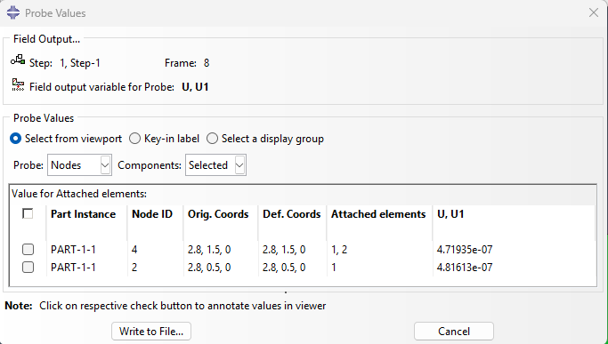
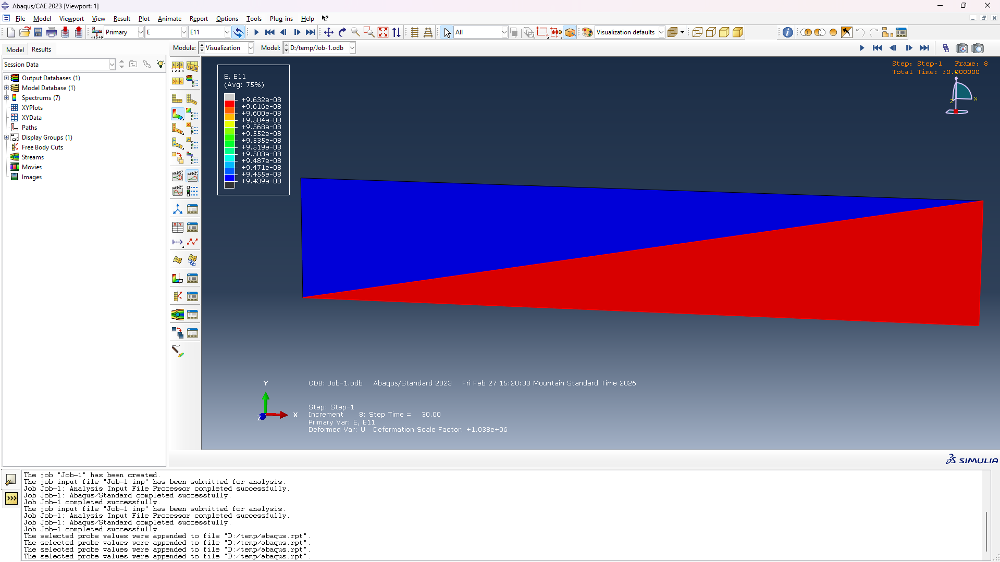

```{=latex}
\begin{center}
\includegraphics[page=2, trim=3cm 10cm 2cm 2cm, clip]{./Assignment 6.pdf}
\end{center}
```

\newpage

For 2D plane elasticity the weakform in matrix notation is shown at @eq-weakform.

$$
\underbrace{\left[ \int_{\Omega} [B]^T [C] [B] \, t \, dx dy \right]}_{\text{Stiffness}} \underbrace{\{u\}}_{\substack{\text{Nodal} \\ \text{Displacements}}} = \left\{ \underbrace{\int_{\Omega} [\psi]^T \begin{Bmatrix} f_x \\ f_y \end{Bmatrix} \, t \, dx dy}_{\text{Body Force}} \right\} + \underbrace{\oint_{\Gamma} [\psi]^T \begin{Bmatrix} t_x \\ t_y \end{Bmatrix} \, t \, dS}_{\text{Traction: Natural BC}}
$$ {#eq-weakform}


$[B]$ is the strain displacement matrix, consists of the derivatives of the shape functions $\psi_n$. The size of B depends on the type of element, which can be expressed as @eq-B.

$$
B = \begin{bmatrix}
\dfrac{\partial \psi_1}{\partial x} & 0 & \dfrac{\partial \psi_2}{\partial x} & 0 & \dfrac{\partial \psi_3}{\partial x} & \cdots & \dfrac{\partial \psi_n}{\partial x} & 0 \\[10pt]
0 & \dfrac{\partial \psi_1}{\partial y} & 0 & \dfrac{\partial \psi_2}{\partial y} & 0 & \dfrac{\partial \psi_3}{\partial y} & \cdots & \dfrac{\partial \psi_n}{\partial y} \\[10pt]
\dfrac{\partial \psi_1}{\partial y} & \dfrac{\partial \psi_1}{\partial x} & \dfrac{\partial \psi_2}{\partial y} & \dfrac{\partial \psi_2}{\partial x} & \dfrac{\partial \psi_3}{\partial y} & \cdots & \dfrac{\partial \psi_n}{\partial y} & \dfrac{\partial \psi_n}{\partial x}
\end{bmatrix}_{3 \times 2n}
$$ {#eq-B}

For the triangular element, B only has three shape fucntions, as shown in @eq-B3.

$$
B = \begin{bmatrix}
\dfrac{\partial \psi_1}{\partial x} & 0 & \dfrac{\partial \psi_2}{\partial x} & 0 & \dfrac{\partial \psi_3}{\partial x} & 0 \\[10pt]
0 & \dfrac{\partial \psi_1}{\partial y} & 0 & \dfrac{\partial \psi_2}{\partial y} & 0 & \dfrac{\partial \psi_3}{\partial y} \\[10pt]
\dfrac{\partial \psi_1}{\partial y} & \dfrac{\partial \psi_1}{\partial x} & \dfrac{\partial \psi_2}{\partial y} & \dfrac{\partial \psi_2}{\partial x} & \dfrac{\partial \psi_3}{\partial y} & \dfrac{\partial \psi_3}{\partial x}
\end{bmatrix}_{3 \times 6}
$$ {#eq-B3}

For linear triangular elements, in general, $\psi_j$ can be written as @eq-psi-j.

$$
\psi_j = \alpha_j + \beta_j x + \gamma_j y
$$ {#eq-psi-j}

Number the element 1 and element 2 as the red numbering shown as the @fig-numbering.

{#fig-numbering}

$\alpha \beta \gamma$ are constants evaluated from the coordinates fo the coefficient matrix.

$$
[\psi] =  \begin{bmatrix} \alpha_1 & \alpha_2 & \alpha_3 \\ \beta_1 & \beta_2 & \beta_3 \\ \gamma_1 & \gamma_2 & \gamma_3 \end{bmatrix} = \begin{bmatrix} 1 & x_1 & y_1 \\ 1 & x_2 & y_2 \\ 1 & x_3 & y_3 \end{bmatrix}^{-1}
$$

Based on our numbering system, for $\psi^1$,
$$
[\psi^1] =  \begin{bmatrix} \alpha_1 & \alpha_2 & \alpha_3 \\ \beta_1 & \beta_2 & \beta_3 \\ \gamma_1 & \gamma_2 & \gamma_3 \end{bmatrix} = \begin{bmatrix} 1 & x_1 & y_1 \\ 1 & x_2 & y_2 \\ 1 & x_3 & y_3 \end{bmatrix}^{-1}
$$

Using Matlab get the $\psi^1$and $psi^2$

```matlab
E1 = [1,0,0;1,5,0;1,5,1]
E2 = [1,0,1;1,0,0;1,5,1]
psi1 = inv(E1)
psi2 = inv(E2)
```

Output:
```text
E1 =
     1     0     0
     1     5     0
     1     5     1
E2 =
     1     0     1
     1     0     0
     1     5     1
psi1 =
    1.0000         0         0
   -0.2000    0.2000         0
         0   -1.0000    1.0000
psi2 =
         0    1.0000         0
   -0.2000         0    0.2000
    1.0000   -1.0000         0
```

Substitute $\psi$ in to @eq-B3.

$$
B^1 = \begin{bmatrix}
-0.2& 0 & 0.2 & 0 & 0 & 0 \\[10pt]
0 & 0 & 0 & -1.0 & 0 & 1 \\[10pt]
0 & -0.2 & -1.0 & 0.2 & 1 & 0
\end{bmatrix}_{3 \times 6}
$$ {#eq-B-number}

$$
B^2 = \begin{bmatrix}
-0.2& 0 & 0 & 0 & 0.2 & 0 \\[10pt]
0 & 1 & 0 & -1 & 0 & 0 \\[10pt]
1 & -0.2 & -1 & 0 & 0 & 0.2
\end{bmatrix}_{3 \times 6}
$$

The [C] consists of material constants. 

$$
C = \begin{bmatrix} c_{11} & c_{12} & 0 \\ c_{12} & c_{22} & 0 \\ 0 & 0 & c_{66} \end{bmatrix}_{3 \times 3}
$$

For plane stress

$$c_{11} = c_{22} = \frac{E}{1 - \nu^2}$$

$$c_{12} = \frac{E\nu}{1 - \nu^2}$$

$$c_{66} = \frac{E}{2(1 + \nu)}$$

Substitute the given data and use Matlab to solve it.

```text
C1 =

   1.0e+11 *

    1.0989    0.3297         0
    0.3297    1.0989         0
         0         0    0.3846
```

Subsitiute B, C, E, t into @eq-k and use Matlab solve it.
$$
[K^e] = \left[ [B^e]^T [C^e] [B^e] \int_{\Omega} \overbrace{t^e dx dy}^{dV} \right]
$$ {#eq-k}

```text
K1 =
   1.0e+10 *
    0.2198         0   -0.2198    0.3297         0   -0.3297
         0    0.0769    0.3846   -0.0769   -0.3846         0
   -0.2198    0.3846    2.1429   -0.7143   -1.9231    0.3297
    0.3297   -0.0769   -0.7143    5.5714    0.3846   -5.4945
         0   -0.3846   -1.9231    0.3846    1.9231         0
   -0.3297         0    0.3297   -5.4945         0    5.4945


K2 =
   1.0e+10 *
    2.1429   -0.7143   -1.9231    0.3297   -0.2198    0.3846
   -0.7143    5.5714    0.3846   -5.4945    0.3297   -0.0769
   -1.9231    0.3846    1.9231         0         0   -0.3846
    0.3297   -5.4945         0    5.4945   -0.3297         0
   -0.2198    0.3297         0   -0.3297    0.2198         0
    0.3846   -0.0769   -0.3846         0         0    0.0769

```

Assemble element wise [K], in our numbering case, for element 1

$$
\begin{bmatrix} K_{11}^1 & K_{12}^1 & K_{13}^1 & K_{14}^1 & K_{15}^1 & K_{16}^1 \\ K_{21}^1 & K_{22}^1 & K_{23}^1 & K_{24}^1 & K_{25}^1 & K_{26}^1 \\ K_{31}^1 & K_{32}^1 & K_{33}^1 & K_{34}^1 & K_{35}^1 & K_{36}^1 \\ K_{41}^1 & K_{42}^1 & K_{43}^1 & K_{44}^1 & K_{45}^1 & K_{46}^1 \\ K_{51}^1 & K_{52}^1 & K_{53}^1 & K_{54}^1 & K_{55}^1 & K_{56}^1 \\ K_{61}^1 & K_{62}^1 & K_{63}^1 & K_{64}^1 & K_{65}^1 & K_{66}^1 \end{bmatrix} \begin{Bmatrix} u_{2x} \\ u_{2y} \\ u_{3x} \\ u_{3y} \\ u_{4x} \\ u_{4y} \end{Bmatrix} = \begin{Bmatrix} f_{1x}^1 \\ f_{1y}^1 \\ f_{2x}^1 \\ f_{2y}^1 \\ f_{3x}^1 \\ f_{3y}^1 \end{Bmatrix}
$$

 for element 2

$$
\begin{bmatrix} K_{11}^2 & K_{12}^2 & K_{13}^2 & K_{14}^2 & K_{15}^2 & K_{16}^2 \\ K_{21}^2 & K_{22}^2 & K_{23}^2 & K_{24}^2 & K_{25}^2 & K_{26}^2 \\ K_{31}^2 & K_{32}^2 & K_{33}^2 & K_{34}^2 & K_{35}^2 & K_{36}^2 \\ K_{41}^2 & K_{42}^2 & K_{43}^2 & K_{44}^2 & K_{45}^2 & K_{46}^2 \\ K_{51}^2 & K_{52}^2 & K_{53}^2 & K_{54}^2 & K_{55}^2 & K_{56}^2 \\ K_{61}^2 & K_{62}^2 & K_{63}^2 & K_{64}^2 & K_{65}^2 & K_{66}^2 \end{bmatrix} \begin{Bmatrix} u_{1x} \\ u_{1y} \\ u_{2x} \\ u_{2y} \\ u_{4x} \\ u_{4y} \end{Bmatrix} = \begin{Bmatrix} f_{1x}^2 \\ f_{1y}^2 \\ f_{2x}^2 \\ f_{2y}^2 \\ f_{3x}^2 \\ f_{3y}^2 \end{Bmatrix}
$$

Notice that the element 1 and the element 2 have the common nodes u2 and u4. assemble them and apply the B.C condition.

$$
\begin{bmatrix}
K_{11}^2 & K_{12}^2 & K_{13}^2 & K_{14}^2 & 0 & 0 & K_{15}^2 & K_{16}^2 \\
K_{21}^2 & K_{22}^2 & K_{23}^2 & K_{24}^2 & 0 & 0 & K_{25}^2 & K_{26}^2 \\
K_{31}^2 & K_{32}^2 & K_{11}^1+K_{33}^2 & K_{12}^1+K_{34}^2 & K_{13}^1 & K_{14}^1 & K_{15}^1+K_{35}^2 & K_{16}^1+K_{36}^2 \\
K_{41}^2 & K_{42}^2 & K_{21}^1+K_{43}^2 & K_{22}^1+K_{44}^2 & K_{23}^1 & K_{24}^1 & K_{25}^1+K_{45}^2 & K_{26}^1+K_{46}^2 \\
0 & 0 & K_{31}^1 & K_{32}^1 & K_{33}^1 & K_{34}^1 & K_{35}^1 & K_{36}^1 \\
0 & 0 & K_{41}^1 & K_{42}^1 & K_{43}^1 & K_{44}^1 & K_{45}^1 & K_{46}^1 \\
K_{51}^2 & K_{52}^2 & K_{51}^1+K_{53}^2 & K_{52}^1+K_{54}^2 & K_{53}^1 & K_{54}^1 & K_{55}^1+K_{55}^2 & K_{56}^1+K_{56}^2 \\
K_{61}^2 & K_{62}^2 & K_{61}^1+K_{63}^2 & K_{62}^1+K_{64}^2 & K_{63}^1 & K_{64}^1 & K_{65}^1+K_{65}^2 & K_{66}^1+K_{66}^2
\end{bmatrix}
\begin{Bmatrix}
u_{1x} \\ u_{1y} \\ u_{2x} \\ u_{2y} \\ u_{3x} \\ u_{3y} \\ u_{4x} \\ u_{4y}
\end{Bmatrix}
=
\begin{Bmatrix}
f_{2x}^2 \\ 
f_{2y}^2 \\ 
f_{1x}^1 + f_{2x}^2 \\ 
f_{1y}^1 + f_{2y}^2 \\ 
f_{2x}^1 \\ 
f_{2y}^1 \\ 
f_{3x}^1 + f_{3x}^2 \\ 
f_{3y}^1 + f_{3y}^2
\end{Bmatrix}
$$

Due to node 1 and node 2 are fixed, so we can use 0 to simplify this matrix.

$$
\begin{aligned}
1.0 \times 10^{10} \begin{bmatrix}
  &  2.1429  & -0.7143  & -1.9231  &  0.3297\\
  & -0.7143  &  5.5714  &  0.3846  & -5.4945\\
   &-1.9231  &  0.3846 &   2.1429      &   0\\
 &   0.3297  & -5.4945  &       0  &  5.5714
\end{bmatrix}
\begin{Bmatrix}
u_{3x} \\ u_{3y} \\ u_{4x} \\ u_{4y}
\end{Bmatrix}
=
\begin{Bmatrix}
1000 \\ 
0 \\ 
1000 \\ 
0 + 0
\end{Bmatrix}
\end{aligned}
$$

Then use Matlab to solve it.

```text
Nodal Displacements [u3x; u3y; u4x; u4y] (in meters):
   1.0e-06 *
    0.4816
    0.0387
    0.4719
    0.0097
```

The Matlab code is shown as following:

```matlab
clear; clc; close all;

%% Shape function coefficients
E1 = [1,0,0; 1,5,0; 1,5,1];
E2 = [1,0,1; 1,0,0; 1,5,1];
psi1 = inv(E1)
psi2 = inv(E2)

%% B matrices (strain-displacement)
% Element 1: local nodes (1,2,3) -> global nodes (2,3,4)
% psi1 betas: [-0.2, 0.2, 0], gammas: [0, -1, 1]
B1 = [
    -0.2,    0,  0.2,    0,   0,   0;
       0,    0,    0, -1.0,   0, 1.0;
       0, -0.2, -1.0,  0.2, 1.0,   0
];

% Element 2: local nodes (1,2,3) -> global nodes (1,2,4)
% psi2 betas: [-0.2, 0, 0.2], gammas: [1, -1, 0]
B2 = [
   -0.2,    0,    0,    0,  0.2,   0;
      0,  1.0,    0, -1.0,    0,   0;
    1.0, -0.2, -1.0,    0,    0, 0.2
];

%% Material properties
E_mod = 100e9;  % Young's modulus (Pa)
nu = 0.3;       % Poisson's ratio
t = 0.2;        % Thickness (m)

% Material constants for plane stress condition
c11 = E_mod / (1 - nu^2);
c22 = c11;
c12 = E_mod * nu / (1 - nu^2);
c66 = E_mod / (2 * (1 + nu));

C1 = [c11 c12 0; c12 c22 0; 0 0 c66]
C2 = C1;

%% Element stiffness matrices: K^e = B^T * C * B * t * A
K1 = 0.5 * B1' * C1 * B1 * t * det(E1)
K2 = 0.5 * B2' * C2 * B2 * t * det(E2)

%% Assemble global stiffness matrix (8x8)
% Global DOF ordering: [u1x, u1y, u2x, u2y, u3x, u3y, u4x, u4y]
% Element 1: local (1,2,3) -> global (2,3,4) -> DOFs [3,4,5,6,7,8]
% Element 2: local (1,2,3) -> global (1,2,4) -> DOFs [1,2,3,4,7,8]
K_global = zeros(8, 8);

e1_dofs = [3, 4, 5, 6, 7, 8];
for i = 1:6
    for j = 1:6
        K_global(e1_dofs(i), e1_dofs(j)) = K_global(e1_dofs(i), e1_dofs(j)) + K1(i, j);
    end
end

e2_dofs = [1, 2, 3, 4, 7, 8];
for i = 1:6
    for j = 1:6
        K_global(e2_dofs(i), e2_dofs(j)) = K_global(e2_dofs(i), e2_dofs(j)) + K2(i, j);
    end
end

disp('Global K (8x8) / 1e10 =');
disp(K_global / 1e10);

%% Apply boundary conditions and solve
% Nodes 1,2 fixed -> DOFs 1,2,3,4 = 0
% Free DOFs: 5,6,7,8 -> [u3x, u3y, u4x, u4y]
free_dofs = [5, 6, 7, 8];
K_reduced = K_global(free_dofs, free_dofs);

disp('Reduced K (4x4) / 1e10 =');
disp(K_reduced / 1e10);

% Force: 1000 N in x-direction at nodes 3 and 4
F_reduced = [1000; 0; 1000; 0];

U_active = K_reduced \ F_reduced;

disp('Nodal Displacements [u3x; u3y; u4x; u4y] (in meters):');
disp(U_active);

% Full global displacement vector
U_global = zeros(8, 1);
U_global(free_dofs) = U_active;
disp('Full Global Displacement Vector:');
disp(U_global);
```


```{=latex}
\includepdf[pages={3}]{./Assignment 6.pdf}
```

Follow the simulation tutorial, the ux results I got is shown as the @fig-simulation

{#fig-simulation}

The node 4 in abaqus is my node 3, the node 2 is my node 4. I got same values.

{#fig-simulation-2}
