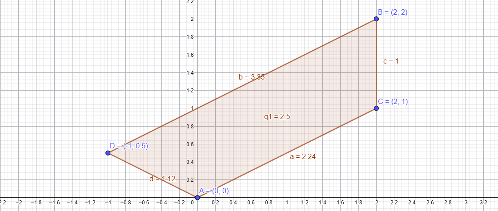
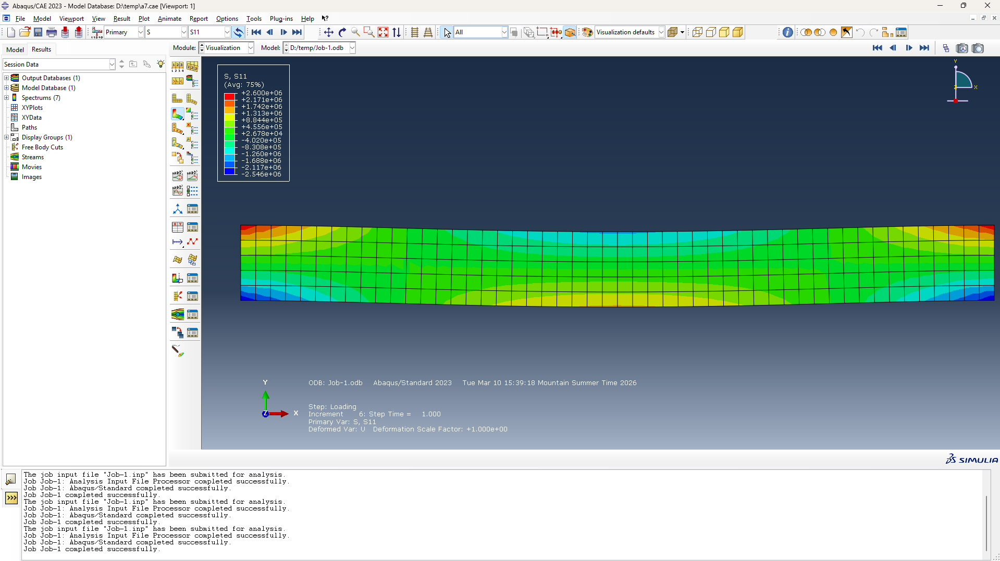

```{=latex}
\begin{center}
\includegraphics[page=2, trim=3cm 10cm 2cm 2cm, clip]{./Assignment 7.pdf}
\end{center}
```

\newpage

For 2D linear rectangular elements, the system matrix can be expressed as 

$$
\left.\left[\int_{\Omega}[B]^{T}[C][B] t d x d y\right]\{u\}=\left\{\int_{\Omega}[\psi]^{T}\left\{\begin{array}{l}
f_{x} \\
f_{y}
\end{array}\right\} t d x d y\right\}+\oint_{\Gamma}[\psi]^{T}\left\{\begin{array}{l}
t_{x} \\
t_{y}
\end{array}\right\} t d S\right\}
$$
where:
$$
B = \begin{bmatrix}
\frac{\partial \psi_{1}}{\partial x} & 0 & \frac{\partial \psi_{2}}{\partial x} & 0 & \frac{\partial \psi_{3}}{\partial x} & 0 & \frac{\partial \psi_{4}}{\partial x} & 0 \\
0 & \frac{\partial \psi_{1}}{\partial y} & 0 & \frac{\partial \psi_{2}}{\partial y} & 0 & \frac{\partial \psi_{3}}{\partial y} & 0 & \frac{\partial \psi_{4}}{\partial y} \\
\frac{\partial \psi_{1}}{\partial y} & \frac{\partial \psi_{1}}{\partial x} & \frac{\partial \psi_{2}}{\partial y} & \frac{\partial \psi_{2}}{\partial x} & \frac{\partial \psi_{3}}{\partial y} & \frac{\partial \psi_{3}}{\partial x} & \frac{\partial \psi_{4}}{\partial y} & \frac{\partial \psi_{4}}{\partial x}
\end{bmatrix}
$$
For this case, the numbering system is shown as the @fig-numbering.

{#fig-numbering}

$$
\psi_{1}=\left(1-\frac{\bar{x}}{a}\right)\left(1-\frac{\bar{y}}{b}\right) \quad \psi_{2}=\frac{\bar{x}}{a}\left(1-\frac{\bar{y}}{b}\right) \quad \psi_{3}=\frac{\bar{x}}{a} \frac{\bar{y}}{b} \quad \psi_{4}=\left(1-\frac{\bar{x}}{a}\right)\left(\frac{\bar{y}}{b}\right)
$$
where a and b are the length and width, respectively, so $a=5$ and $b=1$ in this case.

## B matrix
Substitute the gaven data in to $B$ and $\psi_i$
$$
\psi_{1}=\left(1-\frac{\bar{x}}{5}\right)\left(1-\frac{\bar{y}}{1}\right) \quad \psi_{2}=\frac{\bar{x}}{5}\left(1-\frac{\bar{y}}{1}\right) \quad \psi_{3}=\frac{\bar{x}}{5} \frac{\bar{y}}{1} \quad \psi_{4}=\left(1-\frac{\bar{x}}{5}\right)\left(\frac{\bar{y}}{1}\right)
$$

```text
B =
 
[y/5 - 1/5,         0, 1/5 - y/5,         0, y/5,   0,    -y/5,       0]
[        0,   x/5 - 1,         0,      -x/5,   0, x/5,       0, 1 - x/5]
[  x/5 - 1, y/5 - 1/5,      -x/5, 1/5 - y/5, x/5, y/5, 1 - x/5,    -y/5]
```

## C matrix
Use matlab to get the $[c]$, for plane stress assumption:
$$[c] = \frac{E}{1-\nu^2} \begin{bmatrix} 1 & \nu & 0 \\ \nu & 1 & 0 \\ 0 & 0 & \frac{1-\nu}{2} \end{bmatrix} = \frac{100 \times 10^9}{0.91} \begin{bmatrix} 1 & 0.3 & 0 \\ 0.3 & 1 & 0 \\ 0 & 0 & 0.35 \end{bmatrix}$$


## K matrix
Substitute $[c]$, $t$ and $[B]$ into @eq-K, thus we can get $[Ke1]$

$$
[Ke1]=\left[\int_{\Omega}[B]^{T}[C][B] t d x d y\right]
$${#eq-K}

```text
Ke1 = 
[ 1.429e+10,   3.571e+9,   4.945e+9,  -2.747e+8,  -7.143e+9,  -3.571e+9, -1.209e+10,   2.747e+8]
[  3.571e+9,  3.714e+10,   2.747e+8,   1.78e+10,  -3.571e+9, -1.857e+10,  -2.747e+8, -3.637e+10]
[  4.945e+9,   2.747e+8,  1.429e+10,  -3.571e+9, -1.209e+10,  -2.747e+8,  -7.143e+9,   3.571e+9]
[ -2.747e+8,   1.78e+10,  -3.571e+9,  3.714e+10,   2.747e+8, -3.637e+10,   3.571e+9, -1.857e+10]
[ -7.143e+9,  -3.571e+9, -1.209e+10,   2.747e+8,  1.429e+10,   3.571e+9,   4.945e+9,  -2.747e+8]
[ -3.571e+9, -1.857e+10,  -2.747e+8, -3.637e+10,   3.571e+9,  3.714e+10,   2.747e+8,   1.78e+10]
[-1.209e+10,  -2.747e+8,  -7.143e+9,   3.571e+9,   4.945e+9,   2.747e+8,  1.429e+10,  -3.571e+9]
[  2.747e+8, -3.637e+10,   3.571e+9, -1.857e+10,  -2.747e+8,   1.78e+10,  -3.571e+9,  3.714e+10]
```

## Element wise
Based on our numbering system and the given data.

Node 1: (0, 0) – Fixed
Node 2: (5, 0) – Free, subjected to $F_x = 1000 \text{ N}$
Node 3: (5, 1) – Free, subjected to $F_x = 1000 \text{ N}$
Node 4: (0, 1) – Fixed

So, the displacements at node 1 and 4 are zero, that is: $u_{1x} = u_{1y} = u_{4x} = u_{4y} = 0$

$$
U = \begin{bmatrix} 0\\0\\u_{2x}\\v_{2y}\\u_{3x}\\v_{3y}\\0\\0\end{bmatrix}
$$

Apply the boundary condition:
$$
f = \begin{bmatrix} 0\\0\\1000\\0\\1000\\0\\0\\0\end{bmatrix}
$$

Use zero to replace the corresponding rows and columns and then we can use matlab to solve the @eq-global

$$
[Ke1][U]=[f]
$${#eq-global}

```text
Displacements at free nodes:
      DOF        Value_m  
    _______    ___________

    {'u2x'}     4.8781e-07
    {'u2y'}     2.1875e-08
    {'u3x'}     4.8781e-07
    {'u3y'}    -2.1875e-08
```

The source code please see in the flowing.

```matlab
clear; clc; close all;
%% Constants 
E=100E9; mu=0.3; t=0.2;
% c11=E*(1-mu)/((1+mu)*(1-2*mu)); 
%Material constants for plane strain 
% c22=c11; c12=E*mu/((1+mu)*(1-2*mu)); c66=E/(2*(1+mu)); 
%Material constants for plane stress
c11 =1; c12 =mu
c22=c11; c21=c12; c66 = (1-mu)/2; 

C=E/(1-mu^2)*[c11 c12 0;c12 c22 0;0 0 c66]


%% Shape functions
syms x y
psi11=(1-x/5)*(1-y);
psi21=x/5*(1-y);
psi31=x*y/5;
psi41=(1-x/5)*y;
%Shape Function Matrix
psi_e1=[psi11 0 psi21 0 psi31 0 psi41 0;
    0 psi11 0 psi21 0 psi31 0 psi41];

%Strain Displacement Matrix
z = sym(0);

Be1=[diff(psi11,x) z diff(psi21,x) z diff(psi31,x) z diff(psi41,x) z;
     z diff(psi11,y) z diff(psi21,y) z diff(psi31,y) z diff(psi41,y);
     diff(psi11,y) diff(psi11,x) diff(psi21,y) diff(psi21,x) diff(psi31,y) diff(psi31,x) diff(psi41,y) diff(psi41,x)];


Ke1=t*int(int(transpose(Be1)*C*Be1,y,[0,1]),x,[0,5]);
disp(vpa(Ke1,4))

syms u2x u2y u3x u3y;

U = [0;0;u2x;u2y;u3x;u3y;0;0]
F = [0;0;1000;0;1000;0;0;0]

free_dofs = [3,4,5,6];
K_reduced = Ke1(free_dofs, free_dofs);
F_reduced = F(free_dofs);

% Solve the system: K_reduced * U_free = F_reduced
U_free = K_reduced \ F_reduced;

% Assign the solved values back to the full displacement vector
U(free_dofs) = U_free;

%% Display Results
fprintf('Displacements at free nodes:\n');
disp(table({'u2x'; 'u2y'; 'u3x'; 'u3y'}, double(U_free), ...
    'VariableNames', {'DOF', 'Value_m'}))
```

```{=latex}
\includepdf[pages={3}]{./Assignment 7.pdf}
```


# Solution for question 2

The element is shown as the @fig-2.


{#fig-2}

We should re-number this element by [A,C,B,D], which maps to [Node1, Node2, Node3, Node4].

For a isoparametric quardrilateral element, we can use the relationsihps we found between (x,y) and ($\zeta, \eta$)

$$
\begin{aligned}
x = \sum_{j}^{n=4} x_j N_j &= x_1 N_1 + x_2 N_2 + x_3 N_3 + x_4 N_4\\
&=2 N_2 + 2 N_3 - 1 N_4 \\
y = \sum_{j}^{n=4} y_j N_j &= y_1 N_1 + y_2 N_2 + y_3 N_3 + y_4 N_4\\
&=1 N_2 + 2 N_3 + 0.5 N_4 
\end{aligned}
$$

And the shape function:

$$
N_1 = \frac{(1 - \zeta)(1 - \eta)}{4}\\
N_2 = \frac{(1 + \zeta)(1 - \eta)}{4}\\
N_3 = \frac{(1 + \zeta)(1 + \eta)}{4}\\
N_4 = \frac{(1 - \zeta)(1 + \eta)}{4}
$$

The Jacobian matrix is:
$$
[J] = \begin{bmatrix} \frac{\partial x}{\partial \xi} & \frac{\partial y}{\partial \xi} \\[1ex] \frac{\partial x}{\partial \eta} & \frac{\partial y}{\partial \eta} \end{bmatrix} = \begin{bmatrix} J_{11} & J_{12} \\ J_{21} & J_{22} \end{bmatrix}
$$

Then we substitute the each node coordinate in to [J], About $J_{11}$：

$$
J_{11} = \frac{\partial x}{\partial \xi} = \sum_{i=1}^4 \frac{\partial N_i}{\partial \xi} x_i
= \frac{1}{4} \big[ -(1-\eta)(0) + (1-\eta)(2) + (1+\eta)(2) - (1+\eta)(-1) \big] = \mathbf{\frac{5 + \eta}{4}}
$$

About $J_{12}$：

$$
J_{12} = \frac{\partial y}{\partial \xi} = \sum_{i=1}^4 \frac{\partial N_i}{\partial \xi} y_i= \frac{1}{4} \big[ -(1-\eta)(0) + (1-\eta)(1) + (1+\eta)(2) - (1+\eta)(0.5) \big]
= \mathbf{\frac{2.5 + 0.5\eta}{4}}
$$

About $J_{21}$：

$$
J_{21} = \frac{\partial x}{\partial \eta} = \sum_{i=1}^4 \frac{\partial N_i}{\partial \eta} x_i= \frac{1}{4} \big[ -(1-\xi)(0) - (1+\xi)(2) + (1+\xi)(2) + (1-\xi)(-1) \big] = \mathbf{\frac{-1 + \xi}{4}}
$$

About  $J_{22}$：

$$
J_{22} = \frac{\partial y}{\partial \eta} = \sum_{i=1}^4 \frac{\partial N_i}{\partial \eta} y_i= \frac{1}{4} \big[ -(1-\xi)(0) - (1+\xi)(1) + (1+\xi)(2) + (1-\xi)(0.5) \big]= \mathbf{\frac{1.5 + 0.5\xi}{4}}
$$

Thus,

$$
[J] = \begin{bmatrix} \frac{5 + \eta}{4} & \frac{2.5 + 0.5\eta}{4} \\[1ex] \frac{-1 + \xi}{4} & \frac{1.5 + 0.5\xi}{4} \end{bmatrix}
$$

# Solution for question 3

I simulated the full scale geometry, so it's longer than the model in the tutorial video, as shown in th @fig-3. There is a little bit of difference between my results and the results of video. I thought its from the constraint setting between reference point and the top surface coupling.

{#fig-3}
