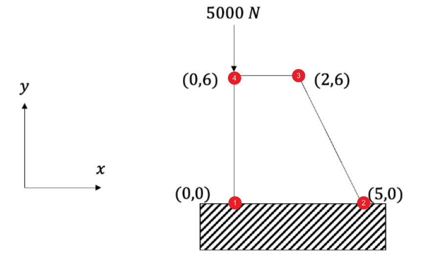

```{=latex}
\begin{center}
\includegraphics[page=2, trim=3cm 10cm 2cm 2cm, clip]{./Assignment 8.pdf}
\end{center}
```

\newpage

# Part I 

## System numbering

The numbering of the system is shown as below. All parts will be solved based on this numbering system.

{#fig-numbering}

Let's assign the four nodes in standard counter-clockwise order:  
Node 1: $(x_1, y_1) = (0, 0)$, Fixed  
Node 2: $(x_2, y_2) = (5, 0)$, Fixed  
Node 3: $(x_3, y_3) = (2, 6)$, Free  
Node 4: $(x_4, y_4) = (0, 6)$, Loaded ($F_y = -5000 \text{ N}$)

## Coordinate mapping

For a 2D quardrilateral element, we introduce the shape function $N_i(\zeta,\eta)$ to find the relationship between the local coordinates $(\zeta,\eta)$ and the global coordinates $(x,y)$ as shown below:

$$
\begin{aligned}
x = \sum_{i=1}^4 N_i(\zeta,\eta) x_i= x_1 N_1 + x_2 N_2 + x_3 N_3 + x_4 N_4 \\
= 5N_2 + 2N_3
\end{aligned}
$$

$$
\begin{aligned}
y = \sum_{i=1}^4 N_i(\zeta,\eta) y_i= y_1 N_1 + y_2 N_2 + y_3 N_3 + y_4 N_4 \\
= 6N_3 + 6N_4
\end{aligned}
$$

The shape functions for a 4 nodes quadrilateral element are defined as:

$$
\begin{aligned}
N_1 = \frac{1}{4}(1-\zeta)(1-\eta) \\
N_2 = \frac{1}{4}(1+\zeta)(1-\eta) \\
N_3 = \frac{1}{4}(1+\zeta)(1+\eta) \\
N_4 = \frac{1}{4}(1-\zeta)(1+\eta)
\end{aligned}
$$

## Jacobian matrix

Using those relationships, we can calculate the Jacobian matrix:

$$
J = \begin{bmatrix} \sum \frac{\partial N_i}{\partial \xi} x_i & \sum \frac{\partial N_i}{\partial \xi} y_i \\ \sum \frac{\partial N_i}{\partial \eta} x_i & \sum \frac{\partial N_i}{\partial \eta} y_i \end{bmatrix} = \begin{bmatrix} \frac{1}{4}(7 - 3\eta) & 0 \\ -\frac{3}{4}(1 + \xi) & 3 \end{bmatrix}
$$

The determinant is $|J| = \frac{3}{4}(7 - 3\eta)$.

## B matrix

The B matrix can be calculated as:

$$
[B^*] = 
\begin{bmatrix} 
1 & 0 & 0 & 0 \\ 
0 & 0 & 0 & 1 \\ 
0 & 1 & 1 & 0 
\end{bmatrix} 
\begin{bmatrix} 
\frac{\partial \zeta}{\partial x} & \frac{\partial \eta}{\partial x} & 0 & 0 \\ 
\frac{\partial \zeta}{\partial y} & \frac{\partial \eta}{\partial y} & 0 & 0 \\ 
0 & 0 & \frac{\partial \zeta}{\partial x} & \frac{\partial \eta}{\partial x} \\ 
0 & 0 & \frac{\partial \zeta}{\partial y} & \frac{\partial \eta}{\partial y} 
\end{bmatrix} 
\begin{bmatrix} 
\frac{\partial N_1}{\partial \zeta} & 0 & \frac{\partial N_2}{\partial \zeta} & 0 & \frac{\partial N_3}{\partial \zeta} & 0 & \frac{\partial N_4}{\partial \zeta} & 0 \\ 
\frac{\partial N_1}{\partial \eta} & 0 & \frac{\partial N_2}{\partial \eta} & 0 & \frac{\partial N_3}{\partial \eta} & 0 & \frac{\partial N_4}{\partial \eta} & 0 \\ 
0 & \frac{\partial N_1}{\partial \zeta} & 0 & \frac{\partial N_2}{\partial \zeta} & 0 & \frac{\partial N_3}{\partial \zeta} & 0 & \frac{\partial N_4}{\partial \zeta} \\ 
0 & \frac{\partial N_1}{\partial \eta} & 0 & \frac{\partial N_2}{\partial \eta} & 0 & \frac{\partial N_3}{\partial \eta} & 0 & \frac{\partial N_4}{\partial \eta} 
\end{bmatrix}
$$

Substituting the shape functions and the 

## Material properties matrix

For a plane stress condition with $E = 20 \times 10^9 \text{ Pa}$ and $\nu = 0.2$:

$$
C = \frac{E}{1-\nu^2} \begin{bmatrix} 1 & \nu & 0 \\ \nu & 1 & 0 \\ 0 & 0 & \frac{1-\nu}{2} \end{bmatrix} = 20.833 \times 10^9 \begin{bmatrix} 1 & 0.2 & 0 \\ 0.2 & 1 & 0 \\ 0 & 0 & 0.4 \end{bmatrix} \text{Pa}
$$

## Element stiffness matrix

In natural coordinates, the stiffness matrix can be expressed using:

$$
K^{e}=[\int_{-1}^{1} \int_{-1}^{1}[\overbrace{\left.B^{*}\right]^{T}[C]\left[B^{*}\right] \operatorname{tdet}(J)}^{f\left((X_{i}(\zeta, \eta),Y_{j}(\zeta, \eta)\right)} d \zeta d \eta]=\sum_{j=1}^{n} \sum_{i=1}^{n} w_{i} w_{j} f(X_{i}(\zeta, \eta),Y_{j}(\zeta, \eta))
$${#eq-stiffness-matrix}

For $n=2$ Gauss quadrature,

$$
\begin{aligned}
W_1 = W_2 = 1 \\
X_1 = \frac{1}{\sqrt{3}}, X_2 = -\frac{1}{\sqrt{3}} \\
Y_1 = \frac{1}{\sqrt{3}}, Y_2 = -\frac{1}{\sqrt{3}}
\end{aligned}
$$

The stiffness matrix is calculated as:

$$
K^e = (1)(1)f(\frac{1}{\sqrt{3}}, \frac{1}{\sqrt{3}}) + (1)(1)f(-\frac{1}{\sqrt{3}}, \frac{1}{\sqrt{3}}) + (1)(1)f(\frac{1}{\sqrt{3}}, -\frac{1}{\sqrt{3}}) + (1)(1)f(-\frac{1}{\sqrt{3}}, -\frac{1}{\sqrt{3}})
$$

And then the global stiffness matrix can be assembled as:

Since there is only one element in this problem, the global stiffness matrix $K$ is identical to the element stiffness matrix $K^e$. Use matlab to calculate the $B$ matrix, the stiffness matrix, and the reduced stiffness matrix without considering the fixed degrees of freedom. The results are shown below:

```text
B =
 
[                   -(4*(n/4 - 1/4))/(3*n - 7),                                             0,                     (4*(n/4 - 1/4))/(3*n - 7),                                             0,                    -(4*(n/4 + 1/4))/(3*n - 7),                                             0,                     (4*(n/4 + 1/4))/(3*n - 7),                                             0]
[                                            0, z/12 - ((n/4 - 1/4)*(z + 1))/(3*n - 7) - 1/12,                                             0, ((n/4 - 1/4)*(z + 1))/(3*n - 7) - z/12 - 1/12,                                             0, z/12 - ((n/4 + 1/4)*(z + 1))/(3*n - 7) + 1/12,                                             0, ((n/4 + 1/4)*(z + 1))/(3*n - 7) - z/12 + 1/12]
[z/12 - ((n/4 - 1/4)*(z + 1))/(3*n - 7) - 1/12,                    -(4*(n/4 - 1/4))/(3*n - 7), ((n/4 - 1/4)*(z + 1))/(3*n - 7) - z/12 - 1/12,                     (4*(n/4 - 1/4))/(3*n - 7), z/12 - ((n/4 + 1/4)*(z + 1))/(3*n - 7) + 1/12,                    -(4*(n/4 + 1/4))/(3*n - 7), ((n/4 + 1/4)*(z + 1))/(3*n - 7) - z/12 + 1/12,                     (4*(n/4 + 1/4))/(3*n - 7)]
 
K_gauss
[1.2611e+10,  4.6196e+9, -9.1385e+9, -2.5362e+9,  -8.4038e+9, -4.0761e+9,   4.9316e+9,  1.9928e+9]
[ 4.6196e+9, 1.0603e+10,  -4.529e+8, -1.9223e+9,  -4.0761e+9, -7.6942e+9,   -9.058e+7, -9.8631e+8]
[-9.1385e+9,  -4.529e+8, 1.0527e+10, -1.6304e+9,   4.9316e+9,  -9.058e+7,  -6.3205e+9,  2.1739e+9]
[-2.5362e+9, -1.9223e+9, -1.6304e+9,  5.3945e+9,   1.9928e+9, -9.8631e+8,   2.1739e+9, -2.4859e+9]
[-8.4038e+9, -4.0761e+9,  4.9316e+9,  1.9928e+9,  1.8921e+10,  5.4348e+9, -1.5449e+10, -3.3514e+9]
[-4.0761e+9, -7.6942e+9,  -9.058e+7, -9.8631e+8,   5.4348e+9, 1.4966e+10,  -1.2681e+9, -6.2852e+9]
[ 4.9316e+9,  -9.058e+7, -6.3205e+9,  2.1739e+9, -1.5449e+10, -1.2681e+9,  1.6838e+10, -8.1522e+8]
[ 1.9928e+9, -9.8631e+8,  2.1739e+9, -2.4859e+9,  -3.3514e+9, -6.2852e+9,  -8.1522e+8,  9.7574e+9]
```
The complete code for part can be found in @sec-code-part1.

# Part II

For 1st degree of f in Gauss integration, the number of integration points is 1, and the integration point is at $x_1 = 0$, and the associated weight is $W_1 = 2$. and the Gauss point is at $\zeta = 0, \eta = 0$, Thus the stiffness matrix can be calculated as:

$$
K^{e}=[\int_{-1}^{1} \int_{-1}^{1}[\overbrace{\left.B^{*}\right]^{T}[C]\left[B^{*}\right] \operatorname{tdet}(J)}^{f\left((X_{i}(\zeta, \eta),Y_{j}(\zeta, \eta)\right)} d \zeta d \eta]=\sum_{j=1}^{n} \sum_{i=1}^{n} w_{i} w_{j} f(X_{i}(\zeta, \eta),Y_{j}(\zeta, \eta))
$${#eq-stiffness-matrix-11}

For $n=1$ Gauss quadrature,
$$
K^e = \sum_{j=1}^{1} \sum_{i=1}^{1} w_i w_j f(X_i(\zeta, \eta), Y_j(\zeta, \eta)) = 2\times 2 f(0, 0)
$$

Due to the node 1 and node 2 are fixed, the DOF of node 1 and node 2 are removed, and the reduced stiffness matrix is:

$$
\begin{bmatrix} \epsilon_x \\ \epsilon_y \\ \gamma_{xy} \end{bmatrix} = \begin{bmatrix}  B_{15} & B_{16} & B_{17} & B_{18} \\   \dots & \dots & \dots & \dots \\  \dots & \dots & \dots & \dots \end{bmatrix} \begin{bmatrix} u_{3x} \\ u_{3y} \\ u_{4x} \\ u_{4y} \end{bmatrix}
$$

Thus, the stiffness matrix for the free DOFs is:

```text
B_free =
 
[                   -(4*(n/4 + 1/4))/(3*n - 7),                                             0,                     (4*(n/4 + 1/4))/(3*n - 7),                                             0]
[                                            0, z/12 - ((n/4 + 1/4)*(z + 1))/(3*n - 7) + 1/12,                                             0, ((n/4 + 1/4)*(z + 1))/(3*n - 7) - z/12 + 1/12]
[z/12 - ((n/4 + 1/4)*(z + 1))/(3*n - 7) + 1/12,                    -(4*(n/4 + 1/4))/(3*n - 7), ((n/4 + 1/4)*(z + 1))/(3*n - 7) - z/12 + 1/12,                     (4*(n/4 + 1/4))/(3*n - 7)]

K_ff_reduced =

   1.0e+10 *

    1.1409    0.4464   -0.7937   -0.2381
    0.4464    0.9772   -0.0298   -0.1091
   -0.7937   -0.0298    0.9325   -0.1786
   -0.2381   -0.1091   -0.1786    0.4563

Warning: Matrix is close to singular or badly scaled. Results may be inaccurate. RCOND =  1.916475e-17. 
> In cive665_8 (line 67)
 

U_free =

   1.0e+09 *

    2.6214
   -0.8738
    2.6214
    2.1845
```

It should be noted that a warning occurred, indicating that the matrix is singular, which means that the system has zero-energy modes (spurious/hourglass modes) and cannot resist certain deformation patterns. This is a common issue with reduced integration elements, and it indicates that the element may not provide accurate results for certain loading conditions or deformation patterns. The "Hourglass Effect" can lead to non-physical deformations and inaccurate stress predictions, especially in bending-dominated problems (see [spurious mode](https://engcourses-uofa.ca/books/introduction-to-solid-mechanics/finite-element-analysis/one-and-two-dimensional-isoparametric-elements-and-gauss-integration/gauss-integration/#gauss-integration-for-two-dimensional-triangle-isoparametric-elements12)) 

The complete code for part II can be found in @sec-code-part2.

# Part III

Based on the part I and applying the boundary conditions, and then reducing the stiffness matrix to the free DOFs.


```matlab
...continue part I...
free_DOFs = 5:8

F = [0;0;0;0;0;0;0;-5000];

K_gauss_reduced = K_gauss(free_DOFs,free_DOFs)
F_reduced = F(free_DOFs)
U = K_gauss_reduced\ F_reduced;

fprintf('%.4e\n', U);
```

```text
-5.8406e-07
-2.1765e-07
-5.9600e-07
-9.0303e-07
```
Thus the displacements for this system are:

$$
\begin{aligned}
U_{1x} &= 0 \text{ m} \\
U_{1y} &= 0 \text{ m} \\
U_{2x} &= 0 \text{ m} \\
U_{2y} &= 0 \text{ m} \\
U_{3x} &= -5.8406 \times 10^{-7} \text{ m} \\
U_{3y} &= -2.1765 \times 10^{-7} \text{ m} \\
U_{4x} &= -5.9600 \times 10^{-7}  \text{ m} \\
U_{4y} &= -9.0303 \times 10^{-7} \text{ m}
\end{aligned}
$$

The complete code please see @sec-code-part3.

# Code 

## Part I {#sec-code-part1}
```matlab
tic
clear
clc
close all
%% Constants plane stree condition
E=20E9;
mu=0.2;
c11=E/((1+mu)*(1-mu));
c22=c11;
c12=E*mu/((1+mu)*(1-mu));
c66=E/(2*(1+mu));
C=[c11 c12 0;c12 c22 0;0 0 c66]
t=1;

%% Isoparametric Mapping
syms z n
% The 4 shape functions for a linear isoparametric quadrilateral element
N1=(1-z)*(1-n)/4;
N2=(1+z)*(1-n)/4;
N3=(1+z)*(1+n)/4;
N4=(1-z)*(1+n)/4;
%Isoparametric mapping between x and y
x=5*N2+2*N3+0*N4;
y=0*N2+6*N3+6*N4;
%Jacobian Matrix
J=[diff(x,z) diff(x,n);diff(y,z) diff(y,n)]

%Transpose of the Inverse Jacobian matrix used in [B*]
J_invT=transpose(inv(J))
b1=[1 0 0 0;0 0 0 1;0 1 1 0]; %First matrix for [B*]
b2=[J_invT(1,1) J_invT(1,2) 0 0;J_invT(2,1) J_invT(2,2) 0 0
;0 0 J_invT(1,1) J_invT(1,2);0 0 J_invT(2,1) J_invT(2,2)];
b3=[diff(N1,z) 0 diff(N2,z) 0 diff(N3,z) 0 diff(N4,z) 0;
diff(N1,n) 0 diff(N2,n) 0 diff(N3,n) 0 diff(N4,n) 0;
0 diff(N1,z) 0 diff(N2,z) 0 diff(N3,z) 0 diff(N4,z);
0 diff(N1,n) 0 diff(N2,n) 0 diff(N3,n) 0 diff(N4,n)];
B=b1*b2*b3

% K=int(int(t*transpose(B)*C*B*det(J),z,[-1,1]),n,[-1,1]);
% Gauss Integration
KI1=subs(t*transpose(B)*C*B*det(J),[z,n],[1/sqrt(3),1/sqrt(3)]);
KI2=subs(t*transpose(B)*C*B*det(J),[z,n],[-1/sqrt(3),1/sqrt(3)]);
KI3=subs(t*transpose(B)*C*B*det(J),[z,n],[1/sqrt(3),-1/sqrt(3)]);
KI4=subs(t*transpose(B)*C*B*det(J),[z,n],[-1/sqrt(3),-1/sqrt(3)]);
K_gauss=KI1+KI2+KI3+KI4;
disp('K_gauss')
disp(vpa(K_gauss,5))
% toc
```

## Part II{#sec-code-part2}
```matlab
tic
clear
clc
close all

%% Constants plane stress condition
E = 20E9;
mu = 0.2;
c11 = E/((1+mu)*(1-mu));
c22 = c11;
c12 = E*mu/((1+mu)*(1-mu));
c66 = E/(2*(1+mu));
C = [c11 c12 0; c12 c22 0; 0 0 c66];
t = 1;

%% Isoparametric Mapping
syms z n
% The 4 shape functions for a linear isoparametric quadrilateral element
N1 = (1-z)*(1-n)/4;
N2 = (1+z)*(1-n)/4;
N3 = (1+z)*(1+n)/4;
N4 = (1-z)*(1+n)/4;

% Isoparametric mapping between x and y
x = 5*N2 + 2*N3 + 0*N4;
y = 0*N2 + 6*N3 + 6*N4;

% Jacobian Matrix
J = [diff(x,z) diff(x,n); diff(y,z) diff(y,n)];

% Transpose of the Inverse Jacobian matrix used in [B*]
J_invT = transpose(inv(J));

b1 = [1 0 0 0; 0 0 0 1; 0 1 1 0]; % First matrix for [B*]
b2 = [J_invT(1,1) J_invT(1,2) 0 0; J_invT(2,1) J_invT(2,2) 0 0; 
      0 0 J_invT(1,1) J_invT(1,2); 0 0 J_invT(2,1) J_invT(2,2)];
b3 = [diff(N1,z) 0 diff(N2,z) 0 diff(N3,z) 0 diff(N4,z) 0;
      diff(N1,n) 0 diff(N2,n) 0 diff(N3,n) 0 diff(N4,n) 0;
      0 diff(N1,z) 0 diff(N2,z) 0 diff(N3,z) 0 diff(N4,z);
      0 diff(N1,n) 0 diff(N2,n) 0 diff(N3,n) 0 diff(N4,n)];
B = b1*b2*b3;

%% --- Part II: 1x1 Gauss Integration (Reduced Integration) ---
disp('=== Part II: 1x1 Reduced Integration ===')

% 1x1 integration evaluates ONLY at origin (z=0, n=0)
% The weight for a 1-point Gauss rule in 2D is W = 2 * 2 = 4
K_integrand = t * transpose(B) * C * B * det(J);
K_reduced_sym = 4 * subs(K_integrand, [z, n], [0, 0]);

% Convert from symbolic to double precision matrix for numerical solving
K_reduced = double(K_reduced_sym); 
disp('8x8 Reduced Stiffness Matrix:')
disp(vpa(K_reduced_sym, 5)) % Display symbolic for cleaner output if desired

%% --- Apply Boundary Conditions & Solve Displacements ---
% DOFs: [u1, v1, u2, v2, u3, v3, u4, v4] -> Indices 1 to 8
% Nodes 1 & 2 are fixed -> DOFs 1, 2, 3, 4 are zero
% Nodes 3 & 4 are free  -> DOFs 5, 6, 7, 8
free_dofs = 5:8;

% Extract the 4x4 stiffness matrix for the free DOFs
K_ff = K_reduced(free_dofs, free_dofs);

% Define Force Vector at Node 4 (Downward 5000 N -> F_v4 = -5000)
% F_free order: [F_u3; F_v3; F_u4; F_v4]
F_free = [0; 0; 0; -5000];

disp('Attempting to solve for Displacements [u3; v3; u4; v4]...')

% Check the condition number of the matrix to detect singularity
if rcond(K_ff) < 1e-12
    warning('The stiffness matrix is singular (determinant is zero)!');
    disp('Result: No unique solution exists.');
    disp('Explanation: 1x1 integration triggered the "Hourglass Effect" (zero-energy mode).');
    disp('The element has lost its stiffness against certain bending deformations.');
else
    % This block will likely NOT run because K_ff is singular
    U_free = K_ff \ F_free;
    disp('Nodal Displacements (m):')
    disp(U_free)
end

toc
```
## Part III{#sec-code-part3}
```matlab
tic
clear
clc
close all
%% Constants plane stress condition
E=20E9;
mu=0.2;
c11=E/((1+mu)*(1-mu));
c22=c11;
c12=E*mu/((1+mu)*(1-mu));
c66=E/(2*(1+mu));
C=[c11 c12 0;c12 c22 0;0 0 c66]
t=1;

%% Isoparametric Mapping
syms z n
% The 4 shape functions for a linear isoparametric quadrilateral element
N1=(1-z)*(1-n)/4;
N2=(1+z)*(1-n)/4;
N3=(1+z)*(1+n)/4;
N4=(1-z)*(1+n)/4;
%Isoparametric mapping between x and y
x=5*N2+2*N3+0*N4;
y=0*N2+6*N3+6*N4;
%Jacobian Matrix
J=[diff(x,z) diff(x,n);diff(y,z) diff(y,n)]

%Transpose of the Inverse Jacobian matrix used in [B*]
J_invT=transpose(inv(J))
b1=[1 0 0 0;0 0 0 1;0 1 1 0]; %First matrix for [B*]
b2=[J_invT(1,1) J_invT(1,2) 0 0;J_invT(2,1) J_invT(2,2) 0 0
;0 0 J_invT(1,1) J_invT(1,2);0 0 J_invT(2,1) J_invT(2,2)];
b3=[diff(N1,z) 0 diff(N2,z) 0 diff(N3,z) 0 diff(N4,z) 0;
diff(N1,n) 0 diff(N2,n) 0 diff(N3,n) 0 diff(N4,n) 0;
0 diff(N1,z) 0 diff(N2,z) 0 diff(N3,z) 0 diff(N4,z);
0 diff(N1,n) 0 diff(N2,n) 0 diff(N3,n) 0 diff(N4,n)];
B=b1*b2*b3

% K=int(int(t*transpose(B)*C*B*det(J),z,[-1,1]),n,[-1,1]);
% Gauss Integration
KI1=subs(t*transpose(B)*C*B*det(J),[z,n],[1/sqrt(3),1/sqrt(3)]);
KI2=subs(t*transpose(B)*C*B*det(J),[z,n],[-1/sqrt(3),1/sqrt(3)]);
KI3=subs(t*transpose(B)*C*B*det(J),[z,n],[1/sqrt(3),-1/sqrt(3)]);
KI4=subs(t*transpose(B)*C*B*det(J),[z,n],[-1/sqrt(3),-1/sqrt(3)]);
K_gauss=KI1+KI2+KI3+KI4;
disp('K_gauss')
disp(vpa(K_gauss,5))
% toc

free_DOFs = 5:8

F = [0;0;0;0;0;0;0;-5000];

K_gauss_reduced = K_gauss(free_DOFs,free_DOFs)
F_reduced = F(free_DOFs)
U = K_gauss_reduced\ F_reduced;

fprintf('%.4e\n', U);
```
