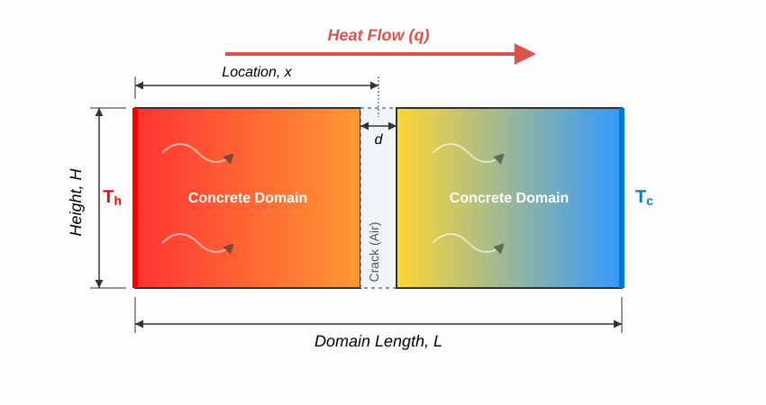
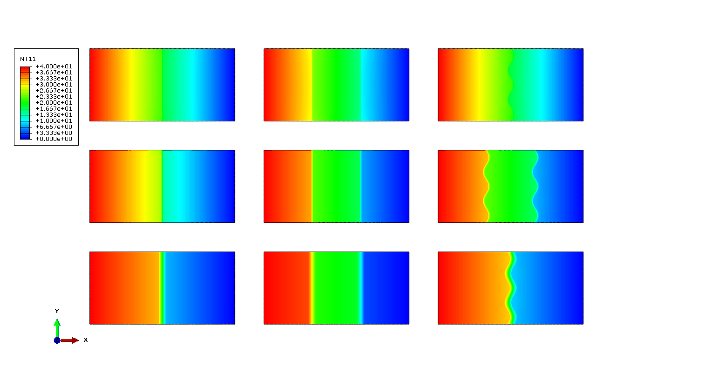
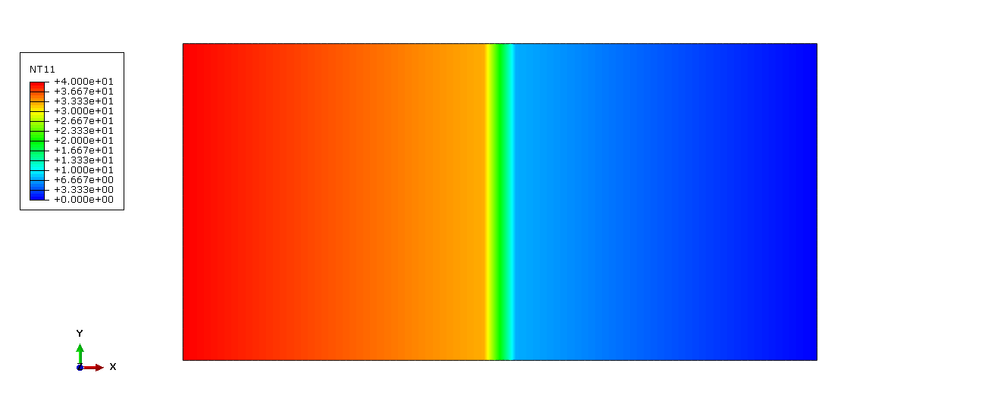
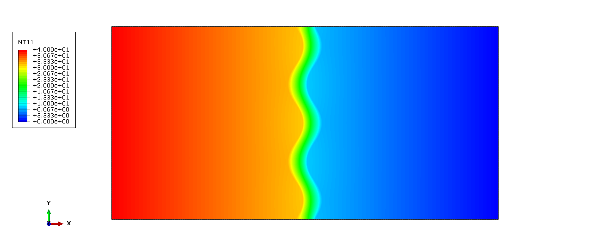

# Heat Transfer Across Concrete Cracks {.plain}

## Agenda

1. Background and Motivation
2. Problem Definition and Scope
3. Methodology Overview
4. Results and Key Findings
5. Discussion and Conclusions
6. Future Work and Acknowledgments

### About Jinpeng Zhu

- Graduate student (Civil and Environmental Engineering)
- Research interest: Heat transfer in cementitious materials, FEM simulation
- Focus today: Quantifying thermal resistance across concrete cracks using Abaqus

## Background and Motivation

**Why cracks matter in concrete structures:**

- Cracking is ubiquitous in concrete (shrinkage, thermal gradients, loading)
- Cracks interrupt heat conduction paths
- Critical for underground structures, cold-region infrastructure, geothermal systems

**Motivation:**

- Deepen understanding of concrete degradation mechanisms
- Develop rigorous FEM workflow with validation against analytical solutions
- Quantify thermal resistance for engineering applications

## Problem Definition

**Key Parameters:**

- **Aperture (d)**: 0.5 mm, 1.5 mm, 5.0 mm
- **Crack Stages**: Single planar, Double planar, Tortuous (sinusoidal)
- **Materials**: Concrete ($k = 0.89$ W/m·K), Air ($k = 0.024$ W/m·K)
- **Boundary Conditions**: Hot face $T_h = 40^\circ$C, Cold face $T_c = 0^\circ$C

See @fig-problem-statement for crack examples in concrete structures.

{width=60% #fig-problem-statement}

::: {style="font-size: 0.5em; color: gray;"}
\tiny
Crack examples in concrete structures [@fig-problem-statement]
:::

## Scope of Work

| Case ID | Crack Type | Aperture (mm) | Description |
|---------|------------|---------------|-------------|
| Ref | - | 0.0 | Intact concrete (baseline) |
| S1-D05 | Single Planar | 0.5 | One planar crack, thin |
| S1-D15 | Single Planar | 1.5 | One planar crack, medium |
| S1-D50 | Single Planar | 5.0 | One planar crack, wide |
| S2-D05 | Double Planar | 0.5 | Two parallel cracks |
| S2-D15 | Double Planar | 1.5 | Two parallel cracks |
| S2-D50 | Double Planar | 5.0 | Two parallel cracks |
| S3-D05 | Tortuous | 0.5 | Sinusoidal crack path |
| S3-D15 | Tortuous | 1.5 | Two sinusoidal crack path |
| S3-D50 | Tortuous | 5.0 | Sinusoidal crack path |

## Methodology Overview

**FEM Workflow in Abaqus:**

1. **Geometry**: 2D rectangular domain (100 mm × 50 mm)
2. **Meshing**: 8-node quadratic heat transfer elements (DC2D8)
3. **Materials**: Isotropic concrete and air properties
4. **Boundary Conditions**: Prescribed temperatures, adiabatic edges
5. **Validation**: Compare against analytical thermal circuit solutions

{width=60% #fig-system-schematic}

See @fig-system-schematic for the domain geometry and boundary conditions.

## Results: Temperature Distribution

{width=75% #fig-nt11-all}

- Temperature steps precisely at crack locations
- Larger apertures → more severe temperature drops
- Tortuous cracks distort isotherms following sinusoidal path

@fig-nt11-all shows the temperature distribution for all nine simulation cases.

## Results: Thermal Resistance Data

| Case | Total Q (W) | $R_{th}$ (K/W) | $k_{eff}$ (W/m·K) | Decay (%) |
|:-----|------------:|---------------:|------------------:|----------:|
| Ref | 17.80 | 2.25 | 0.890 | 0.00% |
| S1-D05 | 15.46 | 2.59 | 0.773 | -13.13% |
| S1-D15 | 11.88 | 3.37 | 0.594 | -33.27% |
| S1-D50 | 6.69 | 5.98 | 0.334 | -62.43% |
| S2-D05 | 13.68 | 2.92 | 0.684 | -23.15% |
| S2-D15 | 8.91 | 4.49 | 0.446 | -49.92% |
| S2-D50 | 4.12 | 9.71 | 0.206 | -76.87% |
| S3-D05 | 15.76 | 2.54 | 0.788 | -11.44% |
| S3-D15 | 9.64 | 4.15 | 0.482 | -45.82% |
| S3-D50 | 7.26 | 5.51 | 0.363 | -59.24% |

## Key Finding 1: Aperture Effect

**Primary driver: Crack aperture**

- Expanding aperture from 0.5 mm to 5.0 mm dramatically reduces heat flux
- $k_{eff}$ drops from 0.77 to 0.33 W/m·K for single planar cracks
- Air gap dominates overall thermal resistance

@fig-s1-d50-nt11 shows the temperature contour for S1-D50 (wide crack).

{width=50% #fig-s1-d50-nt11}

## Key Finding 2: Interface Accumulation

**Compounding effect of multiple cracks:**

- S2 (double cracks) exhibits non-linear resistance increase
- Transition from S1-D15 (-33%) to S2-D15 (-50%) highlights fragmentation effect
- Two interfaces + doubled aperture = significantly higher thermal barrier

@fig-planar-vs-tortuous shows the planar crack case, and @fig-tortuous-case shows the tortuous case.

{width=45% #fig-planar-vs-tortuous} 

{width=45% #fig-tortuous-case}

## Key Finding 3: Compensation Effect

**Non-linear geometry effect in tortuous cracks:**

- S3-D05 (11.44% decay) performs better than S1-D05 (13.13% decay)
- Increased interface length provides wider conduction bridge
- At large apertures (5.0 mm), path length penalty dominates

- **Narrow cracks**: Area benefit outweighs path penalty
- **Wide cracks**: Path length dominates, reducing $k_{eff}$

## Discussion: Practical Implications

1. **Thermal Sensing**: DTS (Distributed Temperature Sensing) must account for crack tortuosity
2. **Underground Mining**: Multi-layered fracturing acts as effective thermal insulator
3. **Geothermal Modeling**: Need non-linear compensation models for accurate predictions
4. **Ventilation Design**: Heat stress mitigation in ultra-deep environments

## Conclusions

1. **Performance decay**: 11.4% to 76.9% reduction in $k_{eff}$ compared to intact concrete
2. **Aperture effect**: Primary driver of thermal degradation
3. **Interface accumulation**: Non-linear increase in $R_{th}$ with crack multiplicity
4. **Compensation effect**: Tortuosity provides partial mitigation at narrow apertures

## Future Work

- Extend to 3D volumetric analysis
- Incorporate coupled hydro-thermal (HT) effects
- Transient thermal analysis
- Include radiative heat transfer at high-temperature gradients
- Apply to stochastic crack networks in heterogeneous rock masses

## Acknowledgments

- Dr. Mostafa Mohamed (Instructor) for guidance and feedback
- University of Alberta, Department of Civil and Environmental Engineering
