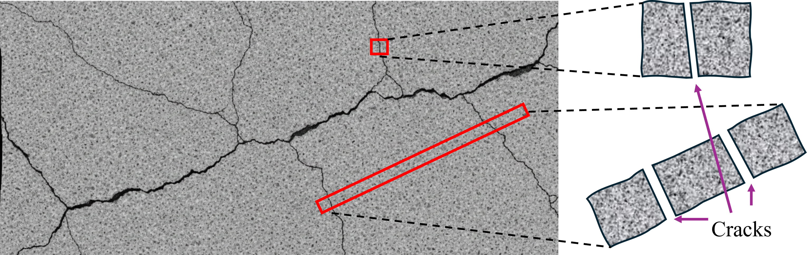
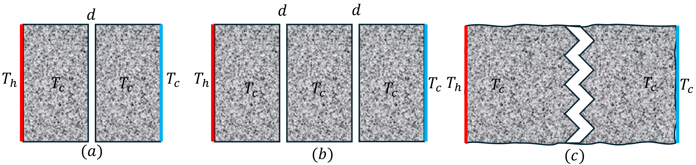

# Background and Motivation
Cracking is common in concrete due to shrinkage, loading, and thermal cycling, and it can significantly affect heat transfer in addition to durability and strength, as shown in the @fig-fracture-demo. In underground structures, cold-region infrastructure, thermal protection systems, and subsurface energy applications, cracks influence serviceability, operational safety, and long-term performance.

{#fig-fracture-demo}

A crack interrupts solid conduction and forces heat to cross a gap (air, moisture, or infill), and in some cases radiation also contributes. This can produce a temperature change at the crack and reduce the effective thermal conductivity of the member. The magnitude of this thermal barrier depends mainly on the crack aperture $d$ (clearance) and the crack geometry, particularly whether the crack is planar or tortuous (which increases effective path length in 2D or interface area in 3D).

Most existing approaches represent cracking through homogenized effective properties, but the thermal effect of a small number of controlled cracks is less directly quantified in a way that can be verified. This term paper will develop and verify an Abaqus-based FEM workflow to quantify heat transfer across cracked concrete, focusing on how crack aperture and crack geometry (planar versus tortuous) control the equivalent interface thermal resistance under prescribed thermal loading, while also using the project to build practical understanding of FEM modeling and how to apply it to real engineering problems. Assuming isotropic concrete to make sure the interpretation and validation possible.

# Methods

This study combines finite element modeling in Abaqus with simplified analytical checks to quantify crack-controlled thermal resistance in concrete. The properties of concrete and air are easy to get from previous literature or industry database.

**Finite element simulation (Abaqus)**: The numerical work is organized into three geometry stages (see @fig-geometry): 1) single planar crack with uniform aperture $d$; 2) two planar cracks (two interfaces) each with aperture $d$; 3) single tortuous crack with the same nominal aperture $d$, but a longer crack path (2D) or larger effective interface area (3D). Thermal loading will be applied as prescribed temperatures $T_h$ and $T_c$ on opposite boundaries to create a steady temperature gradient and an approximately 1D heat-flow direction in the far field. Mechanical loading will be neglected to keep verification clean; crack aperture $d$ will be prescribed geometrically rather than computed from a coupled stress analysis.

{#fig-geometry}

**Analytical verification**: Form Abaqus outputs, an equivalent area-specific interface resistance. For verification and applying the FEM knowledge from the class, another results from hand-verifying will be compared and discussed with the Abaqus outputs.

# Tentative Timeline

| Week | Due Date | Main work                                                    |
| ---- | -------- | ------------------------------------------------------------ |
| 9    | Mar 03   | learning Abaqus|
| 10   | Mar 10   | literature review|
| 11   | Mar 17   | modeling|
| 12   | Mar 24   | hand verification|
| 13   | Mar 31   | organize and analysis results, draft manuscript |
| 14   | Apr 07   | revise, finalize, and submit                                 |

