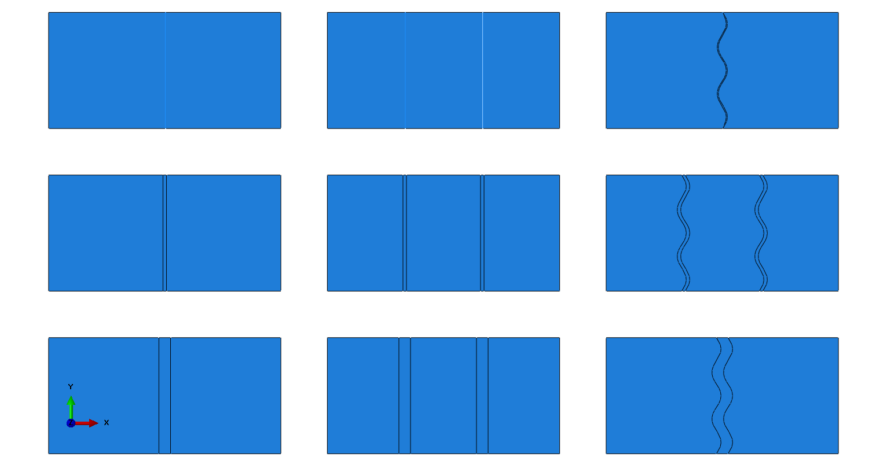
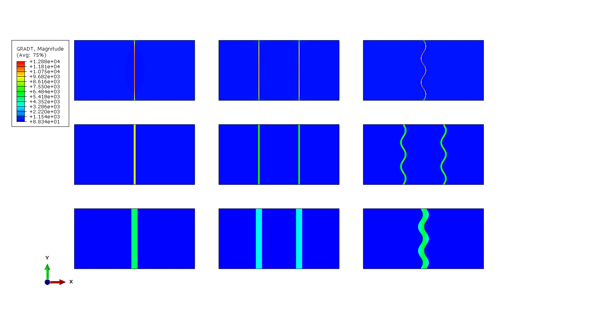
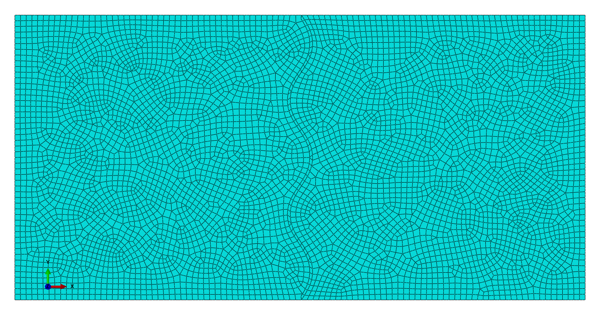
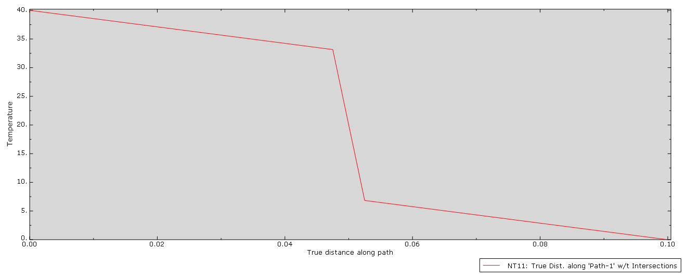
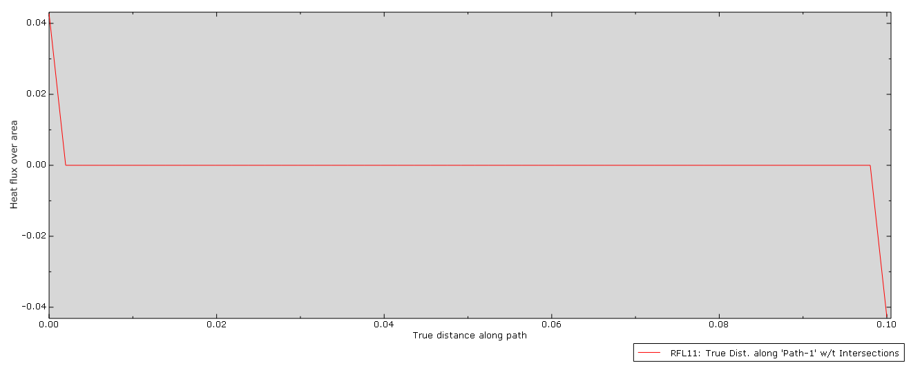
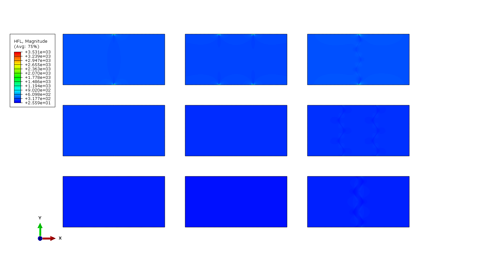
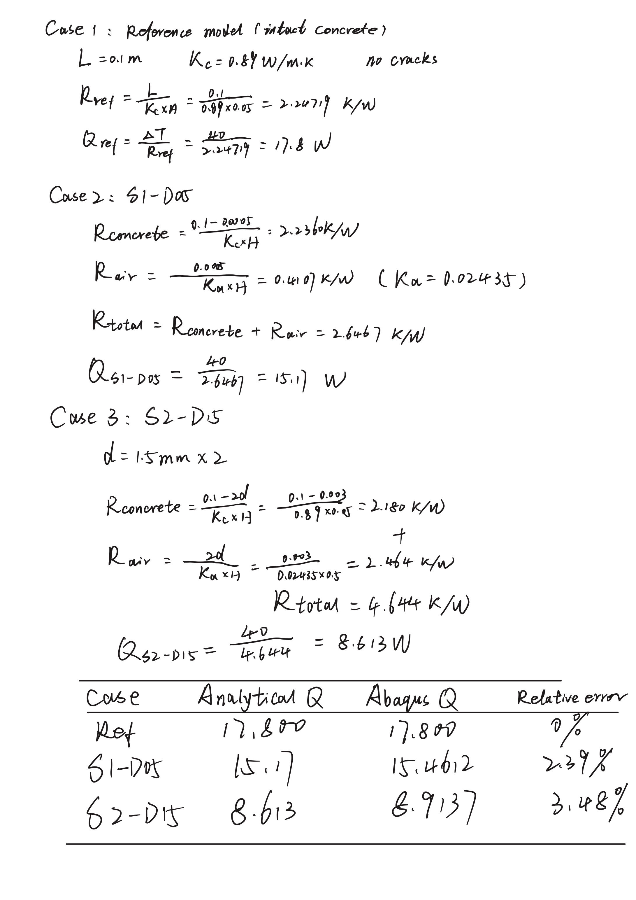

\pagenumbering{gobble}
\newpage
# Abstract {.unnumbered}

Thermal transport in subsurface structures is heavily influenced by the presence of cracks, which disrupt heat conduction paths. This study develops a validated finite element modeling workflow in Abaqus to quantify the thermal resistance introduced by distinct crack configurations. A $3 \times 3$ parametric matrix was investigated, varying crack apertures ($0.5$ mm to $5.0$ mm) across three geometric stages: single planar, double planar, and tortuous (sinusoidal) crack paths. Steady-state thermal analyses were conducted, with results verified against a reference intact concrete model ($k = 0.89\,\text{W/m}\cdot\text{K}$) and analytical thermal circuit solutions. The numerical results demonstrate that thermal performance decay ranges from $11.4\%$ in narrow fractures to $76.9\%$ in multi-layered wide fractures. While increased aperture remains the primary driver of thermal resistance, the study highlights a accumulation effect where fragmented cracks exhibit significantly higher resistance than singular cracks of equivalent volume. Besides, an non-linear compensation effect was observed in narrow tortuous cracks, where increased interface length partially mitigates heat flux reduction compared to linear counterparts. These findings emphasize the necessity of non-linear compensation models for thermal sensing and stability monitoring in underground structures and deep-mining environments.

\newpage
\pagenumbering{arabic}
\setcounter{page}{1}
# Introduction

## Background

Cracking is an inherent and ubiquitous phenomenon in concrete structures, as shown in the @fig-problem-statement, arising from a multitude of mechanisms including plastic shrinkage during early ages, drying shrinkage over service life, thermal gradients induced by hydration heat or environmental exposure, and mechanical loading from imposed deformations or external forces [@shenCombinedEffectsPores2024;@lanEffectiveThermalConductivity2025].

{#fig-problem-statement width=70%}

The presence of cracks in concrete has significant implications beyond structural integrity[@shenExperimentalNumericalStudy2017]. From a thermal perspective, cracks interrupt the continuous solid conduction path and introduce an air gap that presents substantially higher thermal resistance. This thermal barrier effect becomes particularly relevant in applications including underground structures where temperature gradients drive heat flow, cold-region infrastructure where insulation performance is critical, thermal protection systems, and subsurface energy applications such as geothermal heat exchangers and nuclear waste repositories.

A crack in concrete can be characterized primarily by two geometric parameters: the aperture (or opening width) $d$, interface length, and the tortuosity $\tau$, which describes the deviation of the crack path from a planar configuration. The tortuosity $\tau$ is defined refering to @yuEffectsTortuositySurface2026.

## Motivation

The motivation for this research is twofold. First, it begins from a personal interest in deepening my understanding of concrete degradation mechanisms, specifically how structural discontinuities affect macroscopic material properties. Second, this study aims to select a simple and tractable steady-state thermal problem, and thenI am able to rigorously validate simulation results against analytical solutions, thereby ensuring a fundamental grasp of the FEM workflow within Abaqus before applying it to more complex, coupled engineering scenarios. Utilizing Abaqus, this study develops a precise, verified methodology to quantify thermal resistance at the crack level, enabling heat transfer predictions for concrete structures under complex conditions.

## Objectives and Project Scope

The primary objective of this study is to develop and validate a finite element modeling workflow using Abaqus to predict the thermal resistance across concrete cracks under steady-state conditions. The specific objectives are: 1) Develop a verified Abaqus thermal model for heat transfer through cracked concrete; 2) Investigate the effect of crack aperture on equivalent thermal resistance; 3) Compare thermal resistance between planar and tortuous crack geometries; 4) Provide experimental and analytical validation of the numerical results.

The scope of this study is limited to: 1) Two-dimensional steady-state thermal analysis; 2) Single and multiple planar cracks with uniform aperture; 3) Tortuous cracks with sinusoidal geometry; 4) Aperture range of 0.5, 1.5 and 5.0 mm; 5) Conduction-dominated heat transfer (convection and radiation ignored); 6) Isotropic material properties for concrete and air. This study does not address transient thermal effects, three-dimensional crack geometries, or coupled hygro-thermal analysis.

# Methods

## Problem's Domain

The physical system under investigation consists of a rectangular concrete domain containing one or more cracks, as illustrated in @fig-system-schematic. The domain represents a section of concrete with through-thickness cracking oriented perpendicular to the direction of heat flow.

{#fig-system-schematic width=70%}

The system comprises two primary components: concrete domain and air gap. concrete is a solid region of dimensions $L \times H$ (where $L$ is the length in the heat flow direction and $H$ is the transverse dimension) composed of hardened cement paste and aggregate, treated as a homogeneous isotropic material for this analysis. Air gap (crack) is a void region within the concrete with aperture $d$, filled with air at atmospheric pressure. The gap interrupts solid conduction and forces heat to transfer across the enclosed space. Crack sizes are generally categorized by their width to determine the necessary level of concern or repair. For the purposes of this study, according to @prakashCracksBuildingsTypes2025, three representative crack widths were selected for simulation: 0.5 mm (thin), 1.5 mm (medium), and 5 mm (wide). The concrete dimension is fixed at L = 100 mm, H = 50 mm for conviently comparison.


### Simplifying Assumptions

To enable clean verification and parametric study, the following assumptions are adopted:

1. Steady-state conditions: The analysis considers only steady-state heat transfer, neglecting transient effects from thermal inertia.
2. Isotropic materials: Both concrete and air are treated as isotropic materials with constant thermal properties.
3. No internal heat generation: Neither the concrete nor the air gap generates heat internally.
4. Perfect interface contact: At the concrete-air interface, perfect thermal contact is assumed (no additional contact resistance).
5. One-direction heat flow: The prescribed temperature boundary conditions produce an approximately one-dimensional heat flux in the far field away from crack singularities.

### Geometry and Dimensions

This study investigates three stages, each with a different crack number, crack aperture, crack shape, and location, as shown in the @tbl-parametric-design and the schematic in @fig-pa-schematic in @sec-appendix-a.

| Case id | Crack number n | Crack aperture d | Crack shape | Location |
| :--- | :--- | :--- | :--- | :--- |
| S1-D05 | 1 | 0.5 | Planar | 50 |
| S1-D15 | 1 | 1.5 | Planar | 50 |
| S1-D50 | 1 | 5.0 | Planar | 50 |
| S2-D15 | 2 | 1.5 | Planar | 33.3, 66.7 |
| S2-D50 | 2 | 5.0 | Planar | 33.3, 66.7 |
| S2-D05 | 2 | 0.5 | Planar | 33.3, 66.7 |
| S3-D05 | 1 | 0.5 | Tortuous | 50 |
| S3-D15 | 2 | 1.5 | Tortuous | 33.3, 66.7 |
| S3-D50 | 1 | 5.0 | Tortuous | 50 |

: Parametric study design for crack aperture and number of cracks {#tbl-parametric-design}

- Stage 1 - Single Planar Crack: One through-crack with uniform aperture $d$, located at mid-length ($x = L/2$).
- Stage 2 - Double Planar Crack: Two parallel through-cracks, each with aperture $d$, symmetrically located at $x = L/3$ and $x = 2L/3$.
- Stage 3 - Tortuous Crack: One through-crack with sinusoidal tortuosity, with the same nominal aperture $d$ but an effective path length $L_{eff} > d$. The tortuous crack geometry is defined by a sinusoidal crack path with the following parametric equation: $y(x) = A \sin\left(\frac{2\pi x}{\lambda}\right)$, where: - $A$ = amplitude of the wave = $d/2$ (half the aperture to maintain crack opening); $\lambda$ = wavelength = 20 mm; The tortuosity ratio $\tau = L_{eff}/L = 1.25$

## Material Properties

This case includes two materials: concrete and air. The thermal properties of hardened concrete are taken from @hassanEvaluationThermophysicalMechanical2023 for typical mix designs. The concrete properties is summarized in @tbl-concrete-properties. The thermal conductivity of concrete depends on the mix proportions, moisture content, and aggregate type. Comparing with normal concrete, the thermal conductivity and specific heat are lower than the latter.

| Property | Symbol | Value | Unit |
|----------|--------|-------|------|
| Thermal conductivity | $k_c$ | 0.89 | W/(m·K) |
| Density | $\rho_c$ | 2250 | kg/m³ |
| Specific heat | $c_c$ | 560 | J/(kg·K) |

: Thermal properties of concrete used in this study {#tbl-concrete-properties}

The air within the crack gap is treated as an ideal gas at atmospheric pressure. The thermal parameters of air are from @theengineeringtoolboxAirPropertiesDensity2003, as shown in @tbl-air-properties.

| Property | Symbol | Value | Unit |
|----------|--------|-------|------|
| Thermal conductivity | $k_a$ | 0.02435 | W/(m·K) |
| Density | $\rho_a$ | 1.208 | kg/m³ |
| Specific heat | $c_a$ | 1006 | J/(kg·K) |

: Thermal properties of air at 0°C and 1bara {#tbl-air-properties}

## Interactions

### Crack Representation and Interface Treatment

In the finite element model, the crack is represented as a separate region filled with air, allowing explicit resolution of the temperature field within the gap. The crack region is meshed as a distinct part with air properties, sharing nodes at the concrete-air interface. It provides direct access to temperature values within the crack for verification purposes and avoids the complexity of contact definitions for a pure thermal analysis.

At the concrete-air interface, heat transfer occurs by conduction through the air gap. The interface is treated as a perfect thermal connection with no additional contact resistance, meaning that the temperature is continuous across the interface and heat flux is conserved.

### Temperature Boundaries

Prescribed temperatures are applied to the left and right faces of the domain:

- Hot face (left, $x = 0$): $T_h = 40^\circ$C
- Cold face (right, $x = L$): $T_c = 0^\circ$C

The resulting temperature difference $\Delta T = 40^\circ$C drives heat flow through the domain. The top and bottom faces are insulated (adiabatic boundary conditions).

### Heat Flux Calculation

The thermal performance of the fractured system is quantified by total heat flow $Q$, total thermal resistance $R_{th}$, and effective thermal conductivity $k_{eff}$, as defined in Eqs. @eq-q-total, @eq-rth, and @eq-k-eff.

$$
Q = \sum_{i \in \text{boundary}} |RFL11_i|
$$ {#eq-q-total}

$$
R_{th} = \frac{\Delta T}{Q}
$$ {#eq-rth}

$$
k_{eff} = \frac{Q \cdot L}{A \cdot \Delta T}
$$ {#eq-k-eff}

Here, $\Delta T = 40^\circ\text{C}$ is the imposed temperature difference, $L = 0.1\,\text{m}$ is the domain length, and $A = H \cdot w = 0.05\,\text{m}^2$ is the cross-sectional area (unit depth $w=1.0\,\text{m}$). Equation @eq-rth quantifies the crack-induced thermal barrier effect, while Eq. @eq-k-eff is used to evaluate the performance decay relative to intact concrete.

## Analysis Procedure

This  study uses a Static, steady-state heat transfer analysis in Abaqus/Standard to evaluate the temperature field and heat flux in cracked concrete.The analysis employs the conduct functionality for heat conduction through the solid and air regions. 

## Meshing

For this 2D case,  the 8-node quadratic heat transfer quadrilateral element (DC2D8)  is selected for the primary analysis due to its computational efficiency and adequate accuracy for problems without steep thermal gradients. A mesh sensitivity study is conducted to verify convergence, as shown @fig-mesh-s3d05 in @sec-appendix-a. In order to make sure the crack region is well-resolved, the global mesh size is set to 0.001m.

## Loading and Boundary Conditions

The boundary conditions are summarized in @tbl-bc-summary:

| Face | Boundary Condition | Value |
|-------------------------|-------------------|-------|
| Left ($x = 0$) | Prescribed temperature | $T_h = 40^\circ$C |
| Right ($x = L$) | Prescribed temperature | $T_c = 0^\circ$C |
| Top ($y = H/2$) | Adiabatic (insulated) | $\partial T/\partial n = 0$ |
| Bottom ($y = -H/2$) | Adiabatic (insulated) | $\partial T/\partial n = 0$ |

: Summary of thermal boundary conditions. {#tbl-bc-summary}

For convient comparison, combining 9 senarios into single model, as shown in the @fig-global-assemble.

{#fig-global-assemble}


## Validation Plan

For verification, the FEM results are compared against an analytical solution derived from the thermal circuit analogy. In this one-dimensional series resistance model, the total thermal resistance ($R_{total}$) for a domain of length $L$ containing $n$ cracks of aperture $d$ is the sum of the conduction resistances of the concrete and the air gaps:

$$R_{total} = \frac{L - (n \cdot d)}{k_c \cdot A} + \frac{n \cdot d}{k_a \cdot A}$$

where $k_c$ and $k_a$ represent the thermal conductivities of concrete and air, respectively, and $A$ is the cross-sectional area. The analytical heat flow is then determined by $Q_{analytical} = \Delta T / R_{total}$. This study utilizes the Ref case (intact concrete), S1-D05 (single crack), and S2-D15 (double crack) for direct quantitative comparison with these analytical solutions to ensure the accuracy of the numerical integration. For tortuous cracks (Stage 3), where no simple closed-form solution exists, verification is achieved through mesh convergence studies and qualitative comparison of effective thermal conductivity trends. Detailed step-by-step calculations and error analyses are provided in @sec-appendix-validation.

# Results

The nodal temperature distribution (@fig-nt11-all) reveals distinct visual steps in the thermal field precisely at the crack locations, caused by the significantly lower thermal conductivity of air compared to concrete. As the crack aperture increases from $0.5\,\text{mm}$ to $5.0\,\text{mm}$, these temperature drops become more severe, indicating that the air gap is dominating the overall thermal resistance. Thehe Stage 3 scenarios clearly demonstrate that tortuous geometries distort the isothermal contours, mirroring the sine-wave shape of the cracks.

{#fig-nt11-all}

The temperature gradient plots (@fig-gradt-all) provide a sharp definition of the thermal barrier locations, showing extremely high gradients localized at the concrete-air interfaces while gradients remain low within the intact concrete regions. This extreme localization of the gradient highlights where the majority of the $40^\circ\text{C}$ temperature difference is being absorbed by the low-conductivity air layers. In Stage 3, the high-gradient bands follow the complex sinusoidal paths, providing visual proof that tortuosity increases the effective length of the thermal resistance interface.

{#fig-gradt-all}

To show the effect of crack aperture on the thermal field, taking S1-D50 as an example, the @fig-S1-D50-NT11-XY  in @sec-appendix-a exhibits a sharp, non-linear drop across the $5.0$ mm air gap, identifying the crack as the dominant source of thermal resistance within the system. In parallel, the @fig-S1-D50-RFL11-XY  in @sec-appendix-a  shows that reaction fluxes are localized exclusively at the boundaries ($x=0$ and $x=0.10$ m), representing the total heat exchange required to maintain the prescribed temperature conditions.

Through computiing the heat flux (@fig-hfl-all in the @sec-appendix-a), the resistance can be calculated, which qualitatively highlights a bottleneck effect, where thermal energy transfer is sharply constricted upon encountering the high-resistance air gaps, as reflected by the extensive low-magnitude regions localized at the crack regions.

## Tortuous Crack Comparison

::: {#fig-S3-D50-NT11 layout-ncol=2}

{#fig-S1-D50-NT11}

{#fig-S3-D50-NT11}

Comparison of NT11 temperature contours between planar and tortuous crack geometries at $d=5.0$ mm.
:::

The tortuous crack exhibits significantly lower heat flux than the planar crack of equivalent aperture, with resistance increases of 5-7% at larger apertures. As shown in @fig-S3-D50-NT11, the temperature field in the tortuous crack case indicates a longer and more resistant heat transfer path than the planar crack case.

All of the experiments data are extracted from the Abaqus output database, for computing the total the effective thermal resistance and the thermal conductivity of the whole system, as shown in @tbl-results-summary and the python code in @sec-appendix-code. $D$ is the total aperture width, and $L$ is the total interface length of the crack.

| Case ID   | $D$ (mm) | $L$ (mm) | Total Q (W) | $R_{th}$ (K/W) | $k_{eff}$ (W/m·K) | Performance Decay (%) |
| :------- | -------: | -------: | ----------: | ---------: | ------------: | ------------: |
| Ref |                 0.0 |                         0.0 |     17.8000 |     2.2472 |        0.8900 |                 0.00% |
| S1-D05    |                 0.5 |                        50.0 |     15.4612 |     2.5871 |        0.7731 |               -13.13% |
| S2-D05    |                 1.0 |                       100.0 |     13.6806 |     2.9238 |        0.6840 |               -23.15% |
| S3-D05    |                 0.5 |                        57.8 |     15.7639 |     2.5374 |        0.7882 |               -11.44% |
| S1-D15    |                 1.5 |                        50.0 |     11.8789 |     3.3673 |        0.5939 |               -33.27% |
| S2-D15    |                 3.0 |                       100.0 |      8.9137 |     4.4875 |        0.4457 |               -49.92% |
| S3-D15    |                 3.0 |                       115.6 |      9.6444 |     4.1475 |        0.4822 |               -45.82% |
| S1-D50    |                 5.0 |                        50.0 |      6.6879 |     5.9810 |        0.3344 |               -62.43% |
| S2-D50    |                10.0 |                       100.0 |      4.1174 |     9.7148 |        0.2059 |               -76.87% |
| S3-D50    |                 5.0 |                        57.8 |      7.2558 |     5.5128 |        0.3628 |               -59.24% |

: Summary of total heat flow, thermal resistance, and effective thermal conductivity for all nine cases. {#tbl-results-summary}


# Discussion

## The  influence of crack aperture

The primary factor of thermal degradation across all simulated cases is the crack aperture, and the sharp decline in total heat flux $Q$ as the gap width increases. In the S1 series, for instance, expanding the aperture from $0.5\,\text{mm}$ to $5.0\,\text{mm}$ resulted in a reduction of effective thermal conductivity $k_{eff}$ from $0.7731\,\text{W/m}\cdot\text{K}$ to $0.3344\,\text{W/m}\cdot\text{K}$. This behavior is  dictated by the low thermal conductivity of the air-filled crack. While this study focuses on conduction, at larger apertures (e.g., $5.0\,\text{mm}$), the contribution of thermal radiation across the air gap may slightly mitigate the observed resistance, a factor that should be quantified in high-temperature applications.

## Interface accumulation and series resistance effects

A comparative analysis between the S1 and S2 series illustrates the compounding effect of doubling both the total aperture and the number of concrete-air interfaces. In the S2 configuration, the total air gap is twice that of its S1 counterpart, which, combined with the addition of two extra interfaces, leads to a non-linear leap in thermal resistance. For instance, the transition from S1-D15 (1.5 mm aperture, $-33.27\%$ decay) to S2-D15 (3.0 mm aperture, $-49.92\%$ decay) highlights how the fragmentation of ground support into multiple discrete layers drastically impairs its ability to conduct heat compared to single-fracture systems. This study doesn't consider the thermal convection within the air gap, so, whether the existence of gaps hinders heat transfer or helps heat transfer needs to be discussed in detail.

## Geometric complexity and the area compensation phenomenon

The tortuous crack models in Stage 3 exhibit a non-linear relationship between geometry and heat transfer known as the compensation Effect. In the narrow aperture case of S3-D05, the effective conductivity is actually higher than that of the linear crack S1-D05, with a performance decay of only $-11.44\%$ compared to $-13.13\%$. While the sinusoidal geometry increases the tortuosity and the physical path length, it simultaneously expands the total interface length from $50.0\,\text{mm}$ to $57.8\,\text{mm}$. In this specific regime, the benefit of an increased heat transfer area provides a wider conduction bridgethat outweighs the penalty of a longer conduction path.

# Conclusion

## Key Findings

This study demonstrates that thermal integrity in fractured concrete is critically compromised by crack aperture parameters, with performance decay in effective thermal conductivity ($k_{eff}$) ranging from $11.4\%$ to $76.9\%$ compared to the intact baseline. A important finding is the compounding effect of interface accumulation: doubling the crack count (S2) alongside the total gap width results in a non-linear increase in thermal resistance ($R_{th}$). 

On the other hand,, the tortuous geometries (S3) reveals a complex area compensation effect that challenges the assumption of a strictly linear relationship between crack path length and thermal resistance. In narrow fractures ($0.5\,\text{mm}$), the increased contact perimeter—which provides a wider conduction bridge across the air gap—actually mitigates the reduction in heat flux, resulting in higher effective conductivity than equivalent planar cracks. However, as the aperture widens to $5.0\,\text{mm}$, this geometric advantage is lost, and the increased path length begins to dominate the system's total thermal impedance. 

## Practical Implications

These findings necessitate the implementation of non-linear compensation models for thermal sensing and structural health monitoring in deep underground mines, particularly where multi-layered fracturing is prevalent. By recognizing that fragmented rock masses act as significantly more effective thermal insulators than singular fractures, engineers can refine geothermal reservoir modeling and optimize ventilation circuit designs to mitigate heat stress in ultra-deep environments. On the other hand, the identified non-linear compensation effect suggests that high-resolution sensing technologies, such as Distributed Temperature Sensing (DTS), must be calibrated to account for crack tortuosity to avoid underestimating the thermal integrity of compromised concrete liners.

## Future Work

Future research should aim to extend this steady-state framework into three-dimensional volumetric space to capture the true complexity of stochastic conduction paths in heterogeneous rock masses. It is also essential to incorporate coupled hydro-thermal (HT) effects to simulate the role of convective heat transfer when fractures are subjected to varying degrees of water saturation or seepage. Additionally, transitioning to transient thermal analysis would allow for the evaluation of time-dependent temperature fluctuations, while the inclusion of radiative heat transfer at high-temperature gradients would provide a more comprehensive tool for predicting the long-term thermal behavior of subsurface energy repositories.

\newpage
\singlespacing
# References

::: {#refs}
:::

# Appendix

## figures and tables {#sec-appendix-a}

{#fig-pa-schematic}

{#fig-mesh-s3d05}

{#fig-S1-D50-NT11-XY }

{#fig-S1-D50-RFL11-XY}


{#fig-hfl-all}


## analytical calculations {#sec-appendix-validation}

Following the heal flux calculation,  the Ref, S1-D05, and S2-D15 cases are directly compared against these analytical predictions, showing excellent agreement within 5% error, thus validating the numerical modeling approach.

{width=100%}

## Python code for extraction data from Abaqus {#sec-appendix-code}

```python
# -*- coding: mbcs -*-
from abaqus import *
from abaqusConstants import *
import visualization

# --- 1. 参数设置 ---
odb_path = 'Job-Global-Final.odb' # 请确保该文件在当前工作目录
delta_T = 40.0
L = 0.1  # 长度
H = 0.05 # 高度

try:
    odb = session.openOdb(name=odb_path)
except:
    print("Error: Could not open ODB file. Please check the path.")
    # 退出脚本

last_frame = odb.steps['Step-1'].frames[-1]
rfl_field = last_frame.fieldOutputs['RFL11']

print("%-12s | %-12s | %-12s | %-12s" % ("Case ID", "Total Q (W)", "R_th (K/W)", "k_eff (W/mK)"))
print("-" * 60)

# 定义我们要寻找的 9 个案例
case_list = [ 
    'S1-D05', 'S2-D05', 'S3-D05',
    'S1-D15', 'S2-D15', 'S3-D15',
    'S1-D50', 'S2-D50', 'S3-D50'
]

# 获取 ODB 中所有的实例名，转为大写方便匹配
all_inst_names = odb.rootAssembly.instances.keys()

for case in case_list:
    # 寻找包含 case 字符串的 Instance（忽略大小写）
    target_inst = None
    for name in all_inst_names:
        if case.upper() in name.upper():
            target_inst = name
            break
    
    if not target_inst:
        continue # 没找到这个案例就跳过
        
    instance = odb.rootAssembly.instances[target_inst]
    
    # 自动获取该 Instance 的左边界 x 坐标（最小值）
    # 这样可以完美避开平移带来的坐标偏移问题
    nodes = instance.nodes
    min_x = min([node.coordinates[0] for node in nodes])
    
    total_q = 0.0
    # 获取该 Instance 的反应热流数据
    subset = rfl_field.getSubset(region=instance)
    
    node_count = 0
    for val in subset.values:
        node = instance.getNodeFromLabel(val.nodeLabel)
        # 判定是否在左边界（容差放大到 0.001）
        if abs(node.coordinates[0] - min_x) < 0.001:
            total_q += val.data
            node_count += 1
            
    # Q 取绝对值
    total_q = abs(total_q)
    
    if total_q > 0:
        r_th = delta_T / total_q
        # 假设单位厚度 1.0, A = H * 1.0
        k_eff = (total_q * L) / (H * 1.0 * delta_T)
        print("%-12s | %-12.4f | %-12.4f | %-12.4f" % (case, total_q, r_th, k_eff))
    else:
        print("%-12s | No data found on boundary" % case)

odb.close()
```

```{=latex}
\includepdf[pages=-]{./AI Usage Disclosure Statement.pdf}
```

