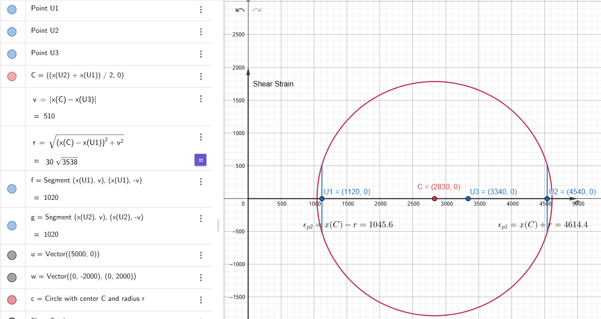
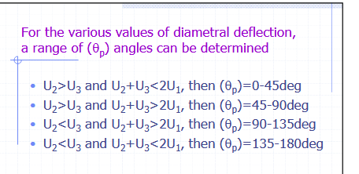

# Homework No. 1

Due: January 22, 2026

A borehole deformation gauge test is conducted within a drill hole initially 5.0 cm in diameter.  Young’s Modulus is known to be $6.897 \times 10^4$ MPa.  The U1 axis of the gauge was installed parallel to the true horizontal direction.  The following diametral displacement data were measured following overcoring:

U1 = 1120 micro cm  
U2 = 4540 micro cm  
U3 = 3340 micro cm  

## Q1. Calculate the principal stresses and their orientation

Based on the known information, we can get Mohor's circle as follows:

Due to a lack of information about Poisson's ratio, we can only use the following equations (USBM Deformation Gage Test) to calculate the principal stresses:

$$
\sigma_1 = \frac{E}{6d} \left[(U_1 + U_2 + U_3) + \frac{\sqrt{2}}{2} \sqrt{(U_1 - U_2)^2 + (U_2 - U_3)^2 + (U_3 - U_1)^2} \right]
$$ {#eq-sigma-1}

$$
\sigma_3 = \frac{E}{6d} \left[(U_1 + U_2 + U_3) - \frac{\sqrt{2}}{2} \sqrt{(U_1 - U_2)^2 + (U_2 - U_3)^2 + (U_3 - U_1)^2} \right]
$$ {#eq-sigma-3}

$$
\theta_p = 0.5 \tan^{-1} \left( \frac{\sqrt{3}(U_2 - U_3)}{2U_1 - U_2 - U_3} \right)
$$ {#eq-theta}

For convenient computation, set $S=U_1 + U_2 + U_3$, and $D=\frac{\sqrt{2}}{2} \sqrt{(U_1 - U_2)^2 + (U_2 - U_3)^2 + (U_3 - U_1)^2}$

$$
S=1120+4540+3340=9000 \,\text{micro cm}
$$

$$
D=\frac{\sqrt{2}}{2} \sqrt{(1120 - 4540)^2 + (4540 - 3340)^2 + (3340 - 1120)^2} \approx 3005.4
$$

Substitute $E = 6.897 \times 10^4$ MPa, and $d = 5$ cm into @eq-sigma-1 and @eq-sigma-3 and @eq-theta (1 micro cm = 10e-6 cm),
$$
\sigma_1=\frac{6.897\times 10^4}{6\times5}(9000\times10^{-6}+3005.4 \times 10^{-6})\\
=27.6\ \mathrm{MPa}
$$

$$
\sigma_3=\frac{6.897\times 10^4}{6\times5}(9000\times10^{-6}-3005.4 \times 10^{-6})\\
=13.78 \ \mathrm{MPa}
$$

$$
\theta_p^\prime = 0.5 \tan^{-1} \left( \frac{\sqrt{3}(4540 - 3340)}{2\times 1120 - 4540 - 3340} \right)\\
=-10.115^\circ
$$

For the various conditions, we have the rule as shown below,

Due to U2>U3 and U2+U3>2U1,so
$$
\theta_p=90-|\theta_p^\prime|=79.89^\circ
$$

## Q2 Does this test show the true orientation of the in-situ principal stresses, and if it doesn’t, what would you have to do to measure the true 3-dimensional orientation of the principal stresses?

No, it doesn't. 

This result couldn't show the true orientation of the in-situ principal stresses. Because the real in-situ stresses are affected by the 3D environment, this deformation gauge test only measured the plane perpendicular to the borehole, which is a casting of the true principal stresses. Therefore, to get the true 3-dimensional orientation of the principal stresses, at least three different orientations are required. Once we get three crossing stresses, we can use the principal stresses rule to find a plane that has zero shear stress, and then get the perpendicular direction as the true orientation of the in-situ principal stresses.

