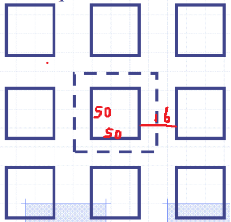

# Problem

A 6-ft coal seam at a depth of 750 ft is to be mined by a room-and-pillar system incorporating 16-ft entries and pillar and pillars that are 50 x 50 ft square. What must be the minimum laboratory compressive strength analysis for 4-in. cubes if stability is to be achieved? Use Holland-Gaddy formula.

# Solution

The schematic sketch of the problem description is shown in the @fig-illustrition.

{#fig-illustrition}

Based on this, We have:

Area Total = Area of pillar + Area of entry=(50+16)ft x (50+16)ft=66ft x 66ft=4356 ft²  
Pillar Area=50ft x 50ft=2500 ft²                                                        
Mined Out Area=Area Total - Pillar Area=4356 ft² - 2500 ft²=1856 ft²                    
Ratio of pillar area to total area (R)=1856 / 4356 =0.4264                     

The Holland-Gaddy formalu is as shown in @eq-holland-gaddy:

$$
\sigma_{pstrength} = \frac{KW^{0.5}}{H}
$${#eq-holland-gaddy}

Where:

- $\sigma_{pstrength}$ ultimate compressive strength of pillar material, in psi
- $K$  coefficient depending on the coal comprising the pillar.
- $W$ least width of pillar, in inches
- $H$ thickness of pillar, in inches.

We use @eq-sigma-v to estimate in-situ vertical stress:

$$
\sigma_v \approx 1.1 \text{psi/ft of depth}=1.1\times 750 = 825 \text{ psi}
$${#eq-sigma-v}

Then, estimate the pillar stress using tributary area theory:

$$
\sigma_p = \sigma_v \times \frac{1}{1-R}=825 \times \frac{1}{1-0.4264}=1438 \text{ psi}
$$

Set $\sigma_p=\sigma_{pstrength}$, for make sure the minimum stability requirement.

$$
1438 = \frac{K\times 600^{0.5}}{72}\implies K=4226.8 \text{psi}
$$

The K is defined as the coefficient depending on the coal comprising the pillar, which can be estimated by the strength of the cube (lab specimen) using the @eq-k:

$$
K = \sigma_{c} D^{0.5}
$${#eq-k}

Where:

- $\sigma_{c}$ strength of the cube (lab specimen)
- $D$ edge dimension of the cube, in inches.

Substitute K=4226.8 and D=4 ft into @eq-k,

$$
4226.8 = \sigma_c\times 4^{0.5} \implies \sigma_c=2113.4 \text{psi}
$$

Thus, the minimum laboratory compressive strength for 4 inches must be greater than 2113.4 psi.

