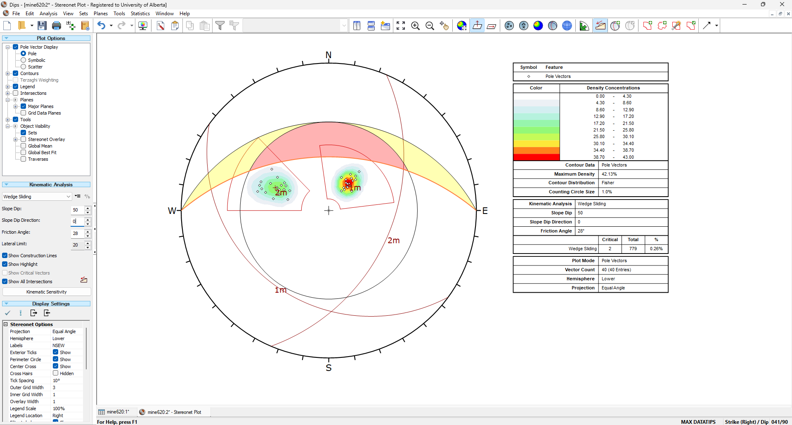
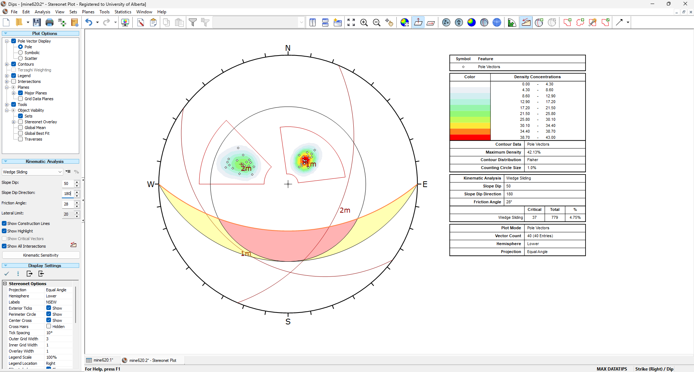
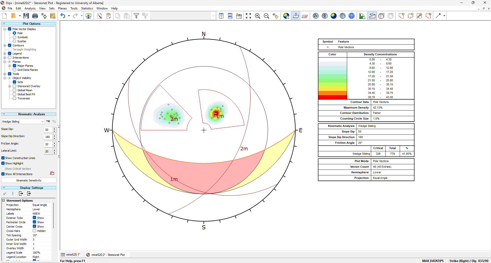
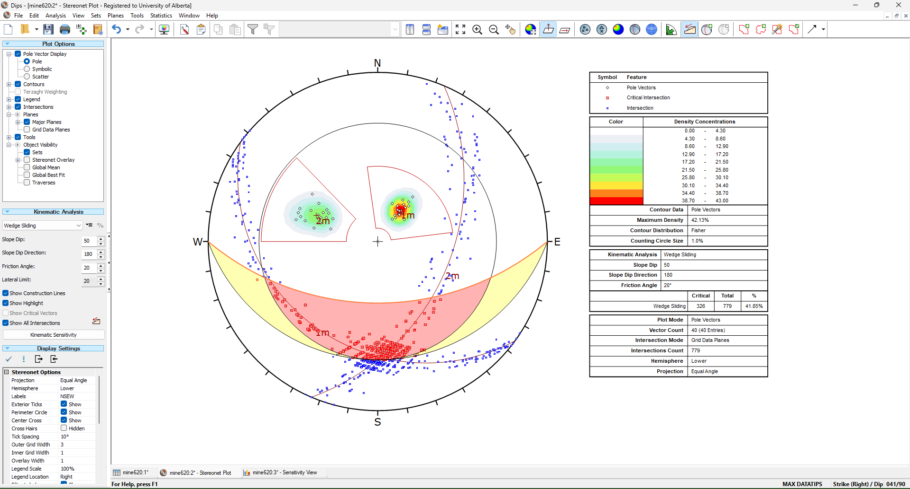
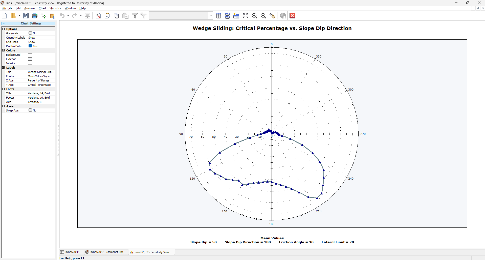
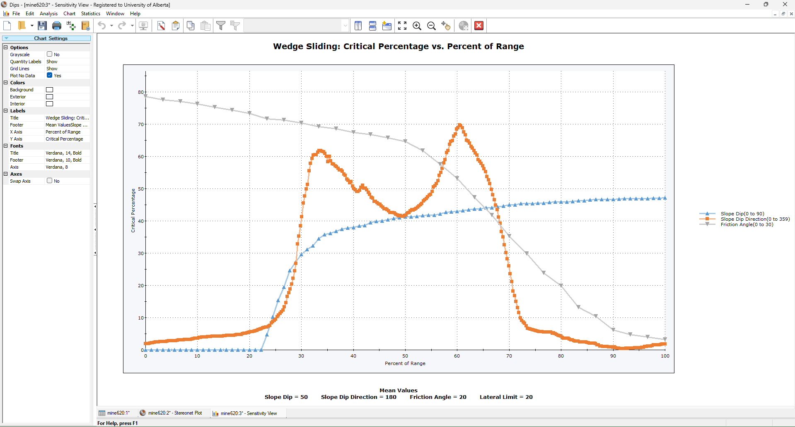

# Problem

Dips Software

A given quarry is roughly rectangular, with the long side of the rectangular being the east sideline. The quarry has historically used a 50-degree slope angle on all sides. Typically, the quarry is dry but heavy rains have been known to saturate the area. The angle of friction of the 28 degrees.
Recently, the quarry has been experiencing a series of small wedge failures.
You have conducted a discontinuity survey to determine the likelihood that these small failures indicate a significant problem.

Strike / Dip

125 25 119 2 7 126 25 25 37

127 23 111 27 24 42 27 33

129 29 123 18 25 47 21 41

128 23 127 26 30 37 20 53

131 25 129 23 18 39 28 40

140 23 128 33 23 53 36 51

127 20 131 31 18 51 12 42

123 21 128 37 16 48 33 45

121 32 125 25 32 39 15 53

122 25 125 30 23 40 15 32

# Anlysis

Input the gaven data to Dips, we can get the results by kinematic analysis.

::: {#fig-base layout-ncol=2}
{#fig-1-1}

{#fig-1-2}

The current situation of slope dip direction of 0 and 180
:::

Based on the current results, for slope dip direction of 0°(as shown in the @fig-1-1), the kinematic analysis indicates low risk of wedge sliding, critical percentage is 0.26%, the joint orientation are outside the the critical sliding window. However, for slope dip direciton of 180 (as shown in the @fig-1-2), the critical sliding window is very close to the joint intersection, which indicates a potential risk of wedge sliding, the critical percentage is 4.75%.

For the slope dip direction of 180, we can get the results as shown in the @fig-180, if the friction angle decrease to 20 by heavey rains.

:::: {#fig-180 layout="[1,1]"}
{#fig-2-1}

{#fig-2-2}

When the friction angle decrease to 20
::::

As shown in the @fig-2-1 and @fig-2-2, the critical percentage increase to 41.85%, which indicates a very high risk of wedge sliding, the joint intersection is well within the critical sliding window. Some necessary methods, such as rock bolts, should be taken to prevent the wedge sliding.

{#fig-radar}

Performing the futher analysis of the critical percentage with different slope dip direction, we can get the radar map as shown in the @fig-radar. There are two peaks in the radar map, which are around 120 and 220. At the same time, the critical percentage is very low when the slope dip direction is in around [0-90] and [270-359].

{#fig-critical-analysis}

# Summary

Combining the analysis of slope angle, friction angle and slope dip direction, we can get the results as shown in the @fig-critical-analysis. we need focus on the slope dip direction range of [110-250], which has a higher risk of wedge sliding. If the friction angle decrease or the rock severely weathered, the risk of wedge sliding will increase significantly. Should take some necessary methods, such as rock bolts or shotcrete or drainage to prevent the wedge sliding.