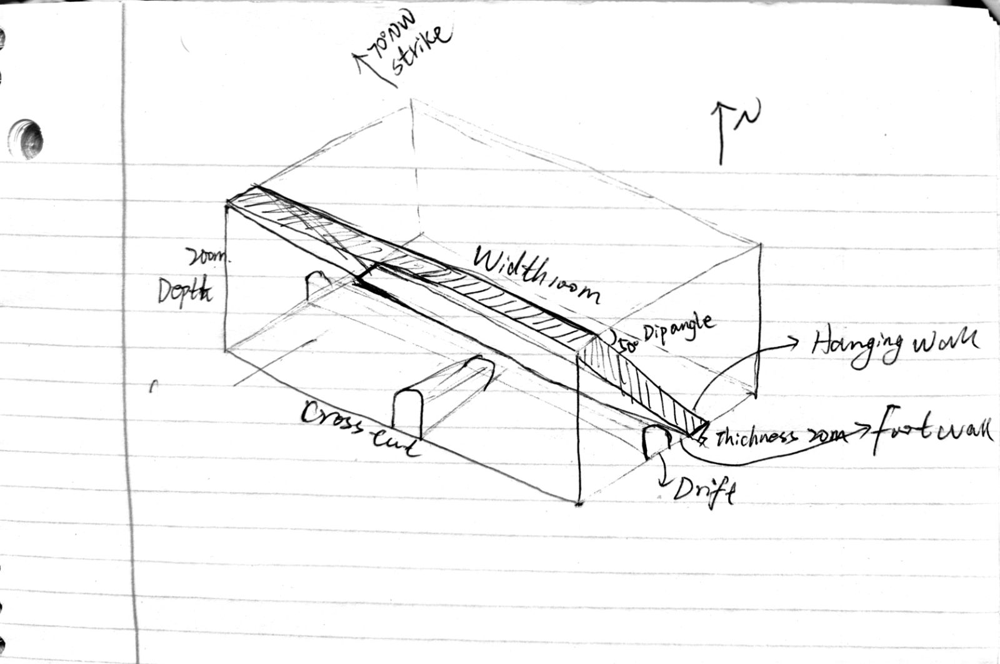
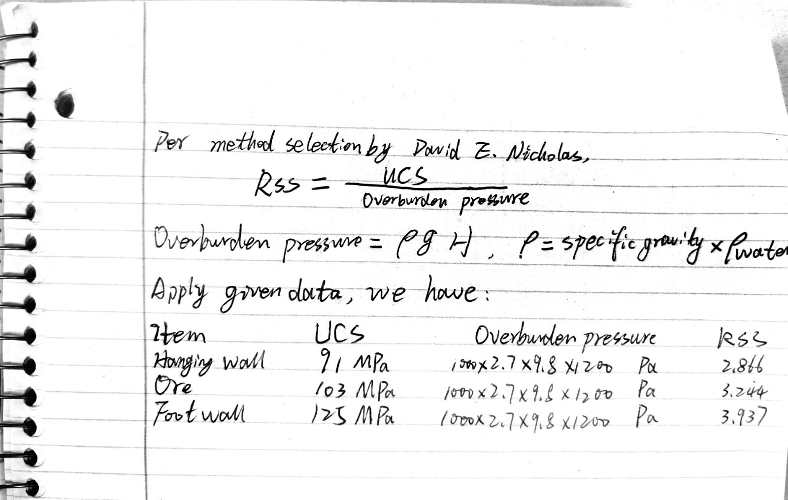
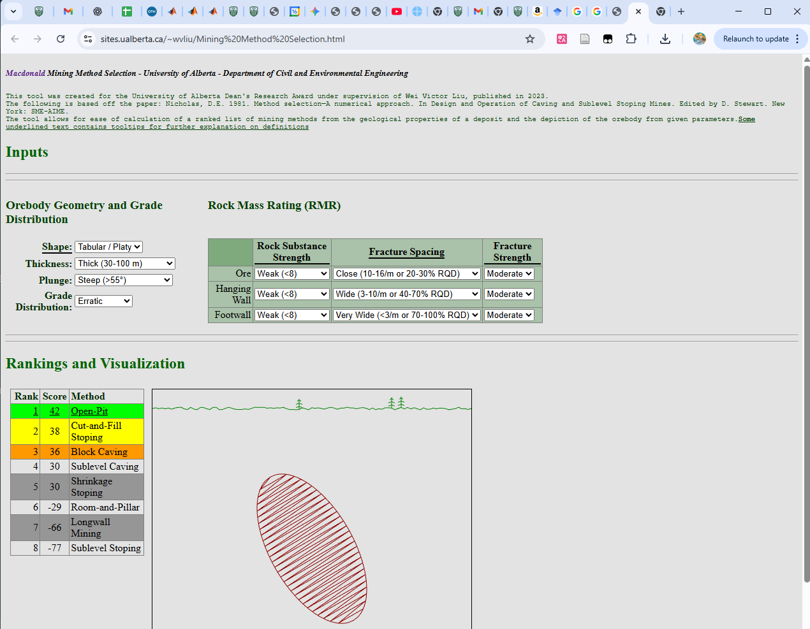

## question 1

To get the length of the decline, which means the distance between the the bottom and the portal of the decline in 3D, so we can use 3D distance formula to calculate it.

$$
L = \sqrt{(\Delta x)^2 + (\Delta y)^2 + (\Delta z)^2}
$$ {#eq-eulers-formula}

Where: $L$ is the length of the decline; $\Delta x$ is the horizontal distance in the east-west direction; $\Delta y$ is the horizontal distance in the north-south direction; $\Delta z$ is the vertical distance

Apply the values provided into the @eq-eulers-formula:

$$
L = \sqrt{(6400-7000)^2 + (10500-9600)^2 + (4260-4010)^2} \approx 1110.18 \text{ ft}
$$

So the length of the decline is approximately 1110.18 ft.

## question 2

Since the top of ore body thickness and the bottom of ore body thickness are different, we assume the ore body thickness changes linearly from the top to the bottom. So the average thickness of the ore body can be calcuated as:
$$
Thickness_{avg} = \frac{10 + 20}{2}=15 \text{ m}
$$

To get the ore deposit based on the given data, we can use the formula below:
$$
\text{Ore Deposit} = \text{Volume} \times \text{Density}
$$ {#eq-ore-deposit}

For volume,
$$
\begin{aligned}
\text{Volume} &= \text{Area} \times \text{Thickness}_{avg}\\
&= \text{Strike distance} \times \text{Dip distance} \times \text{Thickness}_{avg}\\
&= 400\times 500 \times 15\\
&= 30000000 \text{ m}^3
\end{aligned}
$$

Therefore, apply the volume and density into the @eq-ore-deposit:
$$
\text{Ore Deposit} = 30000000 \times 2.45 = 73500000 \text{ t}
$$

## question 3

As shownn in the @fig-freehand-sketch.

{#fig-freehand-sketch}

\newpage
## question 4

### subquestion 1

The process to solve Rock Substance Strength (RSS) is shown in the below.

\newpage
### subquestion 2

The snapshot of UofA Macdonald Mining Method Selection Tool is shown in the @fig-macdonald-tool.

{#fig-macdonald-tool}

Based on the result of the UofA Macdonald Mining Method Selection Tool, the first suitable method is open pit, but we can't choose it due to the deposit depth up to 1200m, so the first two suitable underground methods are:

1. Cut-and-Fill Method scores 38, ranks 1st in underground method.
2. Block Caving Method scores 36, ranks 2nd in underground method.
