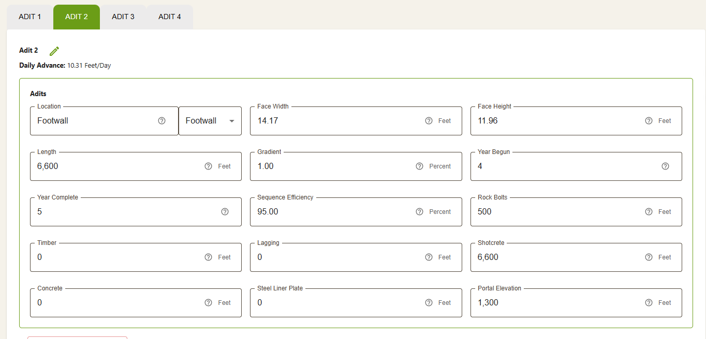
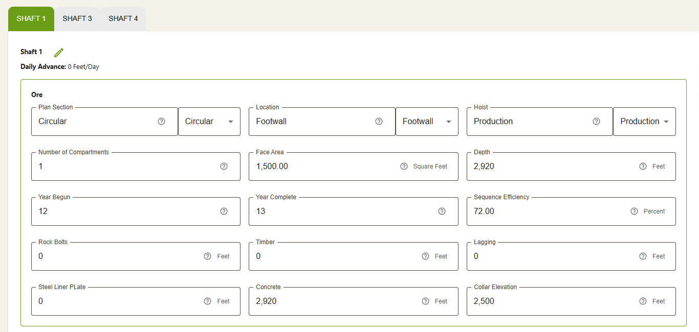
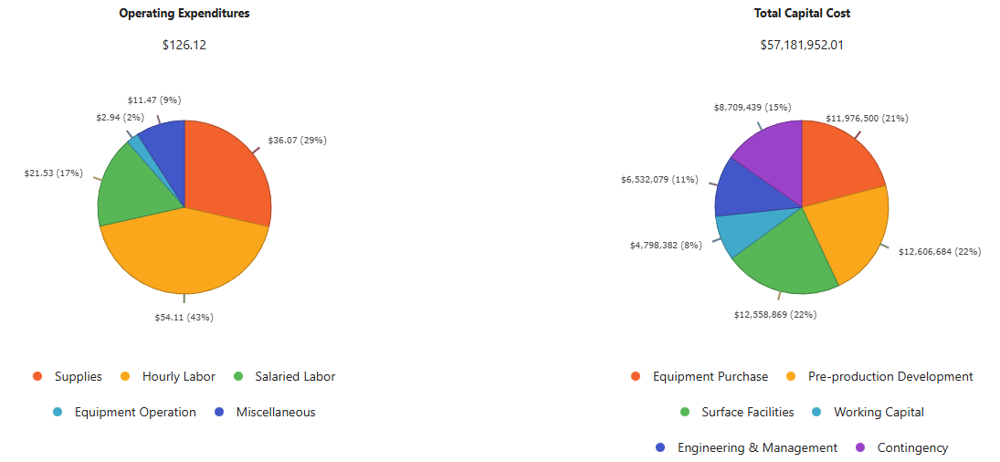
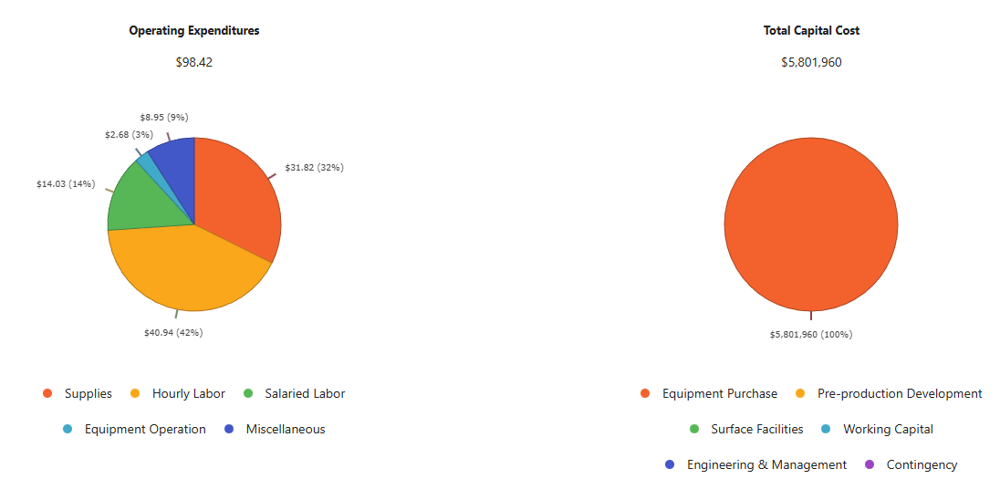
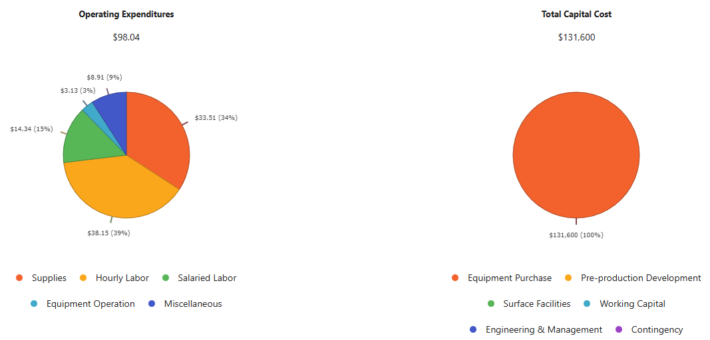

# Validate the numbers of "Remaining Minable Resources i" in Sequences #2 and #3

Based on the preset information. At the begining, we have 8200000 tons resources and two stopings. The first sequence includes Year-3, Year-4, and Year-5. So, the resource that will be mined can be calculated as follows:

$$
\begin{aligned}\text{amount of sequence 1} &= \text{daily production} \times \text{ \#of year } \times 320
&=768000
\end{aligned}
$$

Therefore, for sequence 2, the remaining minable resource is equal to 8200000-768000=7432000.

Similarly, the resource that will be mined in sequence 2 can be calculated as follows:

$$
\begin{aligned}\text{amount of sequence 1} &= \text{daily production} \times \text{ \#of year } \times 320
&=1600 \times 8 \times 320 = 409600
\end{aligned}
$$

Thus, for sequence 3, the remaining minable resource is equal to 7432000-4096000=3336000. The numbers of "Remaining Minable Resources" in Sequence #2 and Sequence #3 are correct.

# In the software chat, there is a relationship between “Resource size, tons” and “Production, tpd.” Please use hand calculations to verify the relationship. Is this relationship accurate?

According to the tip information, the guideline production rates are calculated using Taylor's Rule (see @eq-taylor).

Substitute the resources, 

$$
\text{Life of Mine} = 0.2 \times 8200000^{ 0.25 } \pm 1.2 \\
= 10.7 \text{year}
$$

This leads to an estimate of the daily production:

$$
\text{Daily production} = \frac{Resource}{\text{Life of Mine} \times \text{320}}
= \frac{8200000}{10.7 \times {320}}
= 2395
$$

We use the interpolation method to get the production from this table. The formula for linear interpolation is:
$$
y=y_{1}+\frac{x-x_{1}}{x_{2}-x_{1}} \times\left(y_{2}-y_{1}\right)
$$ {#eq-interpolation}

Substitute the values into the @eq-interpolation:
$$
y=1,500+\frac{3,200,000}{5,000,000} \times(1,000)
= 2140
$$
As we can see, there is a bias between 2395 and 2140. I think this is because we set a different number of workdays. If we take the number of workdays as 358 days, we can get these two numbers very close.

# Verify Taylor's Rule

$$
\text{Life of Mine}=0.2\times(\text{expected ore tonnes})^{ 0.25 } \pm 1.2 \text{years}
$$ {#eq-taylor}

For sequence #1, the life of mine under Taylor's rule,
$$
\text{Life of Mine} = 0.2 \times 768000^{ 0.25 } \pm 1.2 \\
= 5.9\ \text{years}
$$
For sequence #2, the life of mine under Taylor's rule,
$$
\text{Life of Mine} = 0.2 \times 4096000^{ 0.25 } \pm 1.2 \\
= 9.0\ \text{years}
$$
For sequence #3, the life of mine under Taylor's rule,
$$
\text{Life of Mine} = 0.2 \times 3336000^{ 0.25 } \pm 1.2 \\
= 8.55\ \text{years}
$$
In our project,  for sequence #1, #2, and #3, we panned 3 years, 8 years, and 2 years for each sequence, respectively. These numbers don't match Taylor's Rule.

# As a design engineer, how do you decide the "Life of Mine"? Please have a discussion.

As a design engineer, I should have a comprehensive understanding of each project before we decide the "Life of Mine".

First, we should refer to the empirical formula (e.g., Taylor's Rule) or the history database to obtain a rough life of mine.

And then, we should collect as much detailed data as possible, such as the detailed geological conditions and the equipment and technical constraints. Using these conditions as some justification, variables adjust the rough life of mine obtained before.

Finally, we should also pay attention to the mining market based on economic considerations.

In conclusion, we should keep a consecutive dynamic action for optimizing the mining schedule to get the maximum profit as much as possible.

# Add Adit #2 using a similar dimension (compared with Adit #1) and 500 ft rock bolts at the “Portal Elevation” of 1300 ft.

The parameters of Adit #2 is shown in the @fig-adit2.

{#fig-adit2}

# Add one shaft using the following settings:

The paramertes of the shaft is shown in the @fig-shaft.

{#fig-shaft}

# Report the "Capital Costs" to build Adit#2 and the shaft

The capital costs to build Adit #2 and the shaft are shown in the @tbl-capital-costs.

| name     | Year 1        | Year 2        | Year 3 | Year 4        | Year 5        | …    | Year 12        | Year 13        |
| -------- | ------------- | ------------- | ------ | ------------- | ------------- | ---- | -------------- | -------------- |
| Shaft #1 | $0            | $0            | $0     | $0            | $0            | …    | $21,775,741.01 | $21,775,741.01 |
| Adit #1  | $4,915,392.93 | $4,915,392.93 | $0     | $0            | $0            | …    | $0             | $0             |
| Adit #2  | $0            | $0            | $0     | $4,805,504.19 | $4,805,504.19 | …    | $0             | $0             |
| Drifts   | $0            | $600,100.10   | $0     | $0            | $0            | …    | $0             | $0             |
:Capital Costs {#tbl-capital-costs}

# What are the Total Capital Cost and Total Operating Cost for the whole project?

The executive summary of the total project cost is shown in the following.

{#fig-exec-summary-1}

From @fig-exec-summary-1,  we plan to mine 76800 tonnes, so the total operating cost of sequence 1 is:

$$
768000\times 126.12= 96860160
$$

{#fig-exec-summary-2}

From @fig-exec-summary-2 ,  we plan to mine 76800 tonnes, so the total operating cost of sequence 2 is:

$$
4096000\times 98.42= 403128320
$$

{#fig-exec-summary-3}

From @fig-exec-summary-3,  we plan to mine 76800 tonnes, so the total operating cost of sequence 3 is:

$$
3336000\times 98.04= 327061440
$$

Thus, the total operating costs are 327061440+403128320+96860160=827049920.

The total capital costs are 131600+5801960+57,181,952.01=63115512.01

Based on the total project cost summary, the capital costs are listed as annual expenditures across the 22-year project timeline. Summing the values as follows: which includes equipment purchase, pre-production development, surface facilities, working capital, engineering, management, and contingency)

The "Total Operating Costs" sums the individual components: supplies, labor, equipment operation, and miscellaneous for each year of production (Years 3 to 22). 
