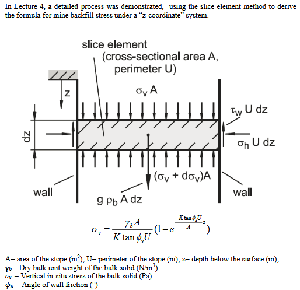
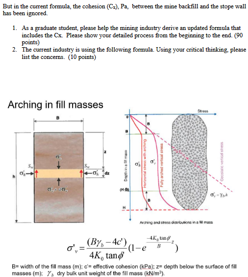
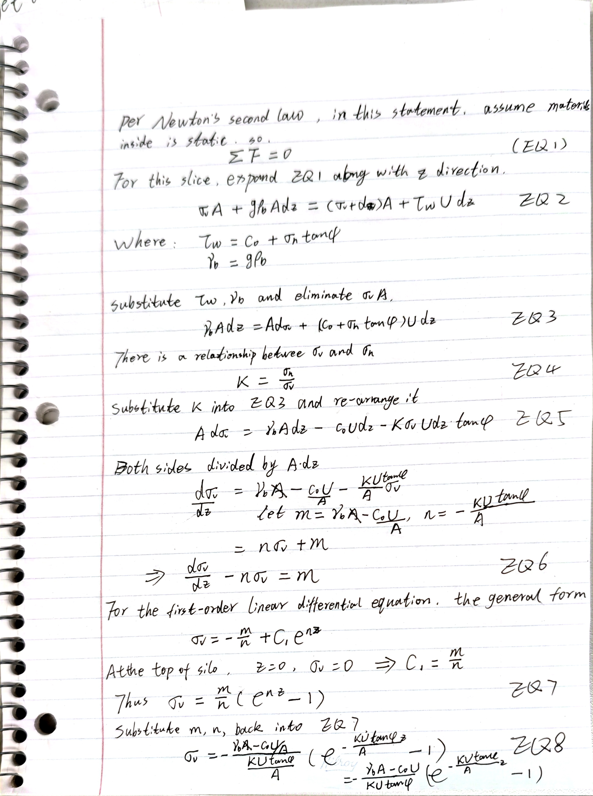

# Question statement

## 1. Derivation process

## 2. Comparison between two equations

The current industry is using the following formula.
$$
\sigma'_v = \frac{(B\gamma_b - 4c')}{4K_0 \tan\phi'} \left( 1 - e^{\frac{-4K_0 \tan\phi'}{B}z} \right)
$$
Where: 

- $\sigma'_v$': Width of the trench or silo (m).
- **$c'$**: Effective cohesion (kPa).
- **$z$**: Depth below the surface of fill masses (m).
- **$\gamma_b$**: Dry bulk unit weight of the fill mass (kN/m3).

Here is our EQ9.
$$
\sigma_v = \frac{\gamma_b A - c_0 U}{KU \tan\phi} \left( 1 - e^{-\frac{KU \tan\phi}{A} z} \right)
$$
Compare them, we can find that: The current industry formula assumes that the silo shape is a square with a width of B. So the $\frac{A}{U}=\frac{B^2}{4B}=\frac{B}{4}\implies A=\frac{BU}{4}$, substitute into EQ9, divide the numerator and denominator by $U$,  we can get $\sigma_v = \frac{B\gamma_b - 4c_0}{4K \tan \phi} (1 - e^{-\frac{4K \tan \phi}{B} z})$

However, some key points require attention.

First, the current formula simplifies the silo shape. When we use the other shapes, like a circle or an ellipse, the extra error occurs.

Second, the effective cohesion is not totally from the materials or the wall of silo, it is determined by both of them at the same time.

Third, the $\gamma_b$ might not be a constant; the materials at the bottom of silo might be slightly greater than the materials at the top, because the finer particles could fill into the fractures due to gravity.

Last, the process of removing material from the silo for use.  The static friction between the material and the wall will become sliding friction. The formula might no longer be applicable.

These points require engineers to be concerned about them in real projects, dynamically and continuously.
