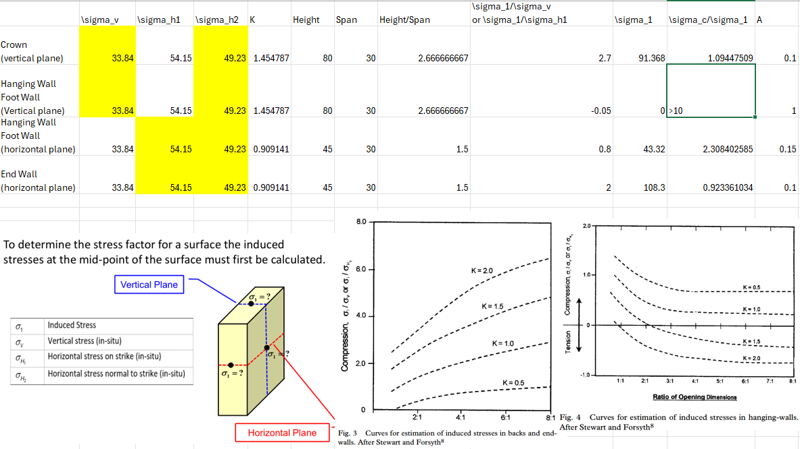
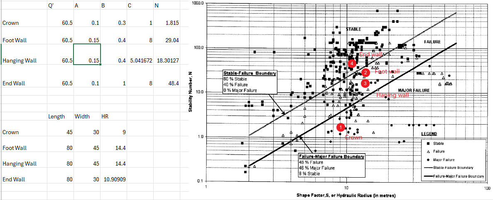

# Question 1

RQD: The method for measuring rock quality refer the [@deereRockQualityDesignation1988]

## Shape factor (HR) and the RQD

Refer [@ngi_q_handbook_2025]

For hanging wall and foot wall: 
$$
HR = \frac{80\times 45}{2(45+80)}=14.4
$$

For crown:

$$
HR = \frac{30\times 45}{2(45+30)}=9
$$

For the end wall

$$
HR = \frac{80\times 30}{2(30+80)}=10.9
$$

Based on the RQD, Jn, Jr, and Ja, we can get the $Q'$

$$
Q' = \frac{RQD}{J_n}\times \frac{J_r}{J_a} = 60.5
$$

The stability number (N) is related to $Q'$, A, B, and C, as shown in the @eq-N

$$
N = Q' \times A \times B \times C
$${#eq-N}

Where:
- A is the measure of the ratio of intact rock strength to induced stress. As the maximum compressive stress acting parallel to a free stope face approaches the uniaxial compressive strength of the rock, factor A degrades to reflect the related instability due to rock yield.
- B is the measure of is the measure of the relative orientation of dominant jointing with respect to a free stope face. Joints forming shallow angle (10-30 degrees) with the free face are likely to become unstable, where joints perpendicular to the free face have little influence on stability.
- C is the measure of the influence of gravity on the stability of the face being considered. The back of the stop or structural weakensses of a stop oriented unfavorably with respecto gravity sliding have a maximum impact on stability.

The data charts of A, B and C are from [@potvinEmpiricalOpenStope1988], also refer to the [@mawdesleyExtendingMathewsStability2001]


## A Rock stress factor

To determine the stress factor for a surface the induced stresses.

The vertical in-situ stress is :

$$
\sigma_V = \eta Z = 2.3 \times 1000 \times 9.81 \times 1500 = 33.84 MPa
$$

$$
\sigma_{H1} = K \times \sigma_V = 33.84 \times 1.6 = 54.15 MPa
$$

Thus $\sigma_{H2}=\frac{\sigma_{H1}}{1.1} = 49.23 Mpa$


### Take the Crown as an example

Induced stressess at top of the vertical plane:
Furface height = 80; surface span = 30. height to span ratio: 2.67, K =1.45.

For a height to span ratio of 2.67, and a K value of 1.45. $\sigma_1/\sigma_V$ is estimated at 2.7. From this relationship it can be calculated that:

$\sigma_1 = 2.7 \times 33.84 = 91.37 MPa$

Therefore, the UCS of the rock to the induced stresses can be calculated:

$\frac{\sigma_c}{\sigma_1} = 100/91.37 = 1.096<2$

Per the relationship figure of rock stress factor, The value of factor A is 0.1.

Similarly, the A factor for the hanging wall, foot wall and end wall can be calculated as 1, 0.15,0.2 respectively, as shown in the @fig-A.

{#fig-A}

Note: the A factor for the foot wall and hanging wall has two possible values (two planes), the lower value is used to be conservative, so we use 0.15 to calculate A.

## B and C: Joint orientation factor and Design surface orientation factor

The dips of the open stope is 65 degree, the dip of the joint set is 20 degree, so the angle between the joint set and the free face is 45 degree. we can get the B factor from the right side of the @fig-B-and-C.

As shown in the @fig-B-and-C, the B and C factors for the hanging wall, foot wall, crown and end wall can be determined as 0.3, 0.4, 0.4, 1 respectively.

{#fig-B-and-C}

After get the A, B and C factors, we can calculate the stability number N, and marking the stability of the stope as shown in the @fig-stability.

{#fig-stability}

The end wall is most stable, the hanging wall and foot wall are in failure zone, and the crown is in the major failure zone.

# Cavebility

The solutions to this question refered from [@laubscherGeomechanicsClassificationSystem1990; @hustrulidUndergroundMiningMethods2001]

UCS: Due to only know the single UCS, assume the rock mass is homogenous, the rating is 9 from the table 1 in [@laubscherGeomechanicsClassificationSystem1990].

Joint condition: the moist and moist pressure unknow, ignore it.

Through the MRMR method, the IRMR is 59.92, the MRMR is 41.94, and the minimum threshold area is 5400 $m^2$.
The computatioin process please see the marking on the problem statement, and the original source basis please see the attached pdf file.

# References
:::{#refs}
:::

```{=latex}
\includepdf[pages={1,2,3}]{./Mine630_Assignment_4-1.pdf}
```

