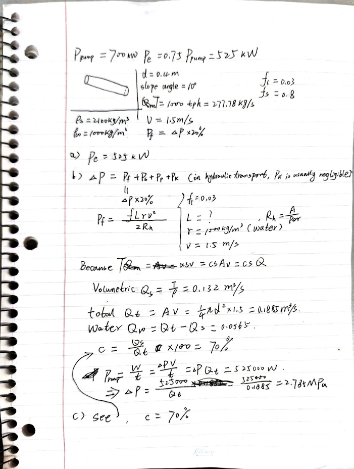
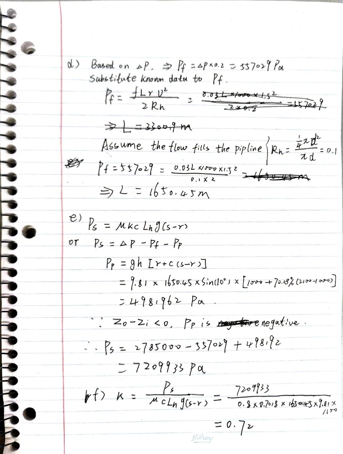

# Question 1

## what is the swell?

Swell means the volume expands to larger than its original state. In mining background, it usually means the bank state mineral or rock becoming loose state due to mining activities.

$$
\text{Swell} = \text{bulking factor} - 1 = 0.6
$$

Thus the swell is 60%.

## what is the swell factor?

The swell factor describes the increasing volume relative to bank volume. The definition equation is shown below:

$$
\text{Swell factor} = \frac{1}{1 + \text{Swell}} = \frac{1}{1 + 0.6} = 0.625
$$

## What is the BCM being moved by the truck on each trip?

$$
\text{BCM} = 40 \times 0.625 = 25
$$

## What is the loose density of the materials?

$$
\text{Loose density} = 2800 \times 0.625 = 1750 \ \text{kg/LCM}
$$

## During hauling, the average specific gravity of the solid is 2.7, what is the porosity of the loose materials?

Assume that the bulk materials are dry and ignore air weight.

$$
1.75 = 2.7 - c(2.7 - 0)
$$

$$
\Rightarrow \quad c = 0.3518
$$

That is, the loose materials include 35.18% air, so the porosity is 35.18%.

## What is the payload in metric tons (t)?

$$
\text{Payload} = \text{capacity} \times \text{density (LCM)}
$$

$$
= 40 \times 1750 = 70000 \ \text{kg} = 70 \ \text{t}
$$

# Question 2

# Question 3

$$
\begin{aligned}
\text{Wetted perimeter} &= \pi \times d \times \frac{360 - 40}{360} = 1.396 \ \text{m} \\
\text{Cross-sectional area} &= \frac{1}{4} \pi d^2 \cdot \frac{360 - 40}{360} + \frac{1}{2} r^2 \sin(40^\circ) = 0.1946 \ \text{m}^2 \\
\text{Hydraulic radius (HR)} &= \frac{\text{Cross-sectional area}}{\text{Wetted perimeter}} = \frac{0.1946}{1.396} = 0.14 \ \text{m}
\end{aligned}
$$
