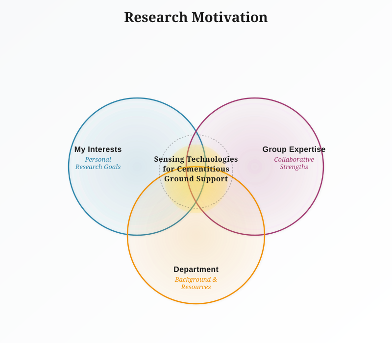
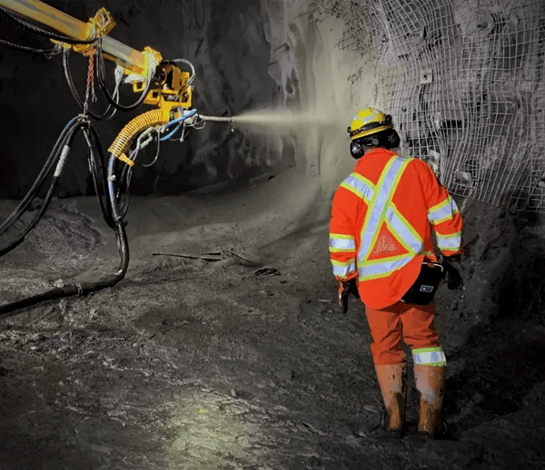
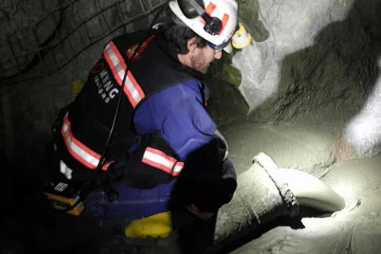
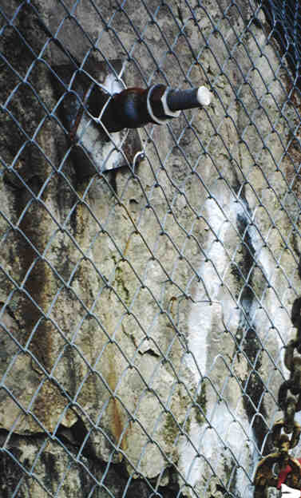
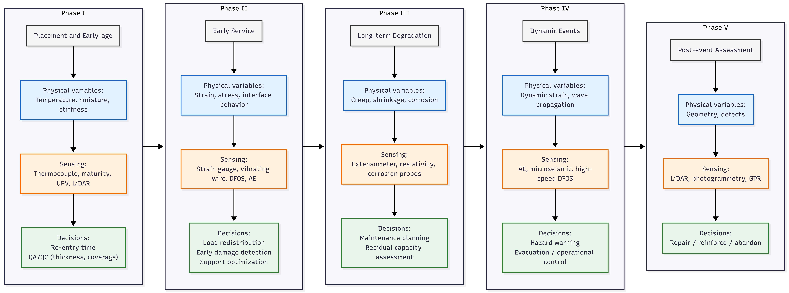
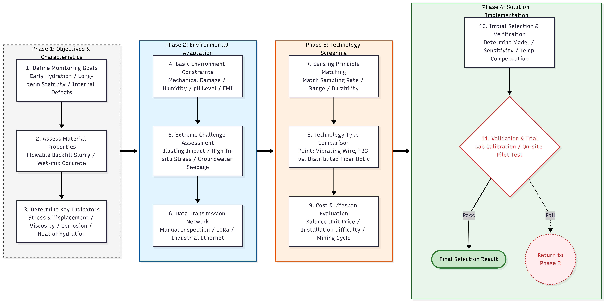

# Underground Mining and Bulk Materials Handling {.plain}

## Agenda
1. Term paper: motivation, framing, and key takeaways, etc
2. Insights and gains from this course

### About Jinpeng Zhu

- Graduate student (Civil and Environmental Engineering)
- Interest: sensing + underground mining+ cementitious material
- Focus today: lifecycle-oriented sensing for cementitious ground support

## Background and motivation

**Term paper title**: Sensing technologies for cementitious ground support systems in underground mining: advances, challenges, and future perspectives

{#fig-term-paper-location width=30%}

### Cementitious support is everywhere {.smaller}

::: columns
::: column
**Where it appears**

::: {layout-ncol=2}
{#fig-support-shotcrete width=100% height=30%}

{#fig-support-cast-lining width=100% height=30%}

{#fig-support-cemented-backfill width=100% height=30%}

{#fig-support-grouted-bolts width=100% height=30%}

:::
:::

::: column
**Why it is hard to manage**

- Performance changes with time
- Coupled hazards environmental (stress, water, seismicity, blasting)
- Limited visibility and hard communication 

::: {style="font-size: 0.5em; color: gray;"}
\tiny
\color{gray}

Image sources:  
@fig-support-shotcrete source: https://can.sika.com/en/construction/shotcrete-tunnelingmining.html  
@fig-support-cast-lining source: https://everestconstructionforms.com/access-mining-shafts/  
@fig-support-cemented-backfill source: https://can.sika.com/en/construction/shotcrete-tunnelingmining/mine-backfillingmbfproducts.html  
@fig-support-grouted-bolts source: https://upload.wikimedia.org/wikipedia/commons/b/b9/Usgsrockbolt.jpg  

\normalcolor
:::

:::
:::

## Key message and contribution

The excavation process of underground mining includes many complex procedures, harsh environments, and low visibility, so sensing technologies are necessary for improving productivity and safety.

This paper:

- Frames cementitious ground support sensing across five lifecycle phases
- Links physical variables and sensing functions to operational decisions
- Discuss why system integration (data transfer, fusion, analysis, and decision-making) is the bottleneck

## Lifecycle Framing: Lifecycle-oriented questions {.smaller}

::: columns
::: column
1. Phase I - hours to days
   + When can we re-enter safely?
   + Did we place it well (thickness/coverage)?
2. Phase II - days to weeks
   + Is it carrying strength as expected?
   + Are we seeing early cracking or interface issues?
3. Phase III - months to years
   + Is it degrading (creep, corrosion, cracking)?
   + When should we maintain, reinforce, or reassess capacity?
:::

::: column
4. _Phase IV - Dynamic events (blasting/seismic)_
   + Can the dynamic events or harzards be detected?
   + Can we know what has changed due to these events?
5. _Phase V - Post-event assessment (inspection window)_
   + What changed (geometry, cracking, hidden defects)?
   + Repair, reinforce, or abandon?
:::
:::

## Relationship between sensing and support principles 

::: {layout-ncol=2}
![Cementitious systems: shotcrete wet-mix process [@heidarnezhadShotcreteBased3D2022]](Assets/term_paper/2026-03-13-12-07-36.png){#fig-tech-map-shotcrete width=48%}

![Cementitious systems: 3D printing schematic [@zhangReviewCurrentProgress2019]](Assets/term_paper/2026-03-13-13-33-18.png){#fig-tech-map-3d-print width=48%}

![Grouted bolts mechanics: rock-anchorage interface schematic [@wangStudyEngineeringApplication2019]](Assets/term_paper/2026-03-13-16-03-53.png){#fig-tech-map-rock-anchorage width=48%}

![Grouted bolts mechanics: failure envelope before and after grouting [@wangStudyEngineeringApplication2019]](Assets/term_paper/2026-03-13-16-05-27.png){#fig-tech-map-failure-envelope width=48%}

:::

## Lifecycle challenges (map) {.stretch .compact}

{#fig-lifecycle width=85%}

## Technology selection (From sensor to decision) {.stretch .compact}

:::: {.columns}

::: {.column width="70%"}
{#fig-selection width=100%}

\footnotesize
Two short video: [Invisible dinosar](https://www.instagram.com/reel/DFNV9uiMTuD/), and [UPV test for concrete,NDT](https://www.youtube.com/watch?v=M9hkvS_OLmk)
:::

::: {.column width="30%"}
\footnotesize
- Thermal / maturity (temperature, early strength proxy)
- Mechanical response (stress/strain, [vibrating wire](https://www.geosense.com/product-category/vw-strain-gauges/))
- Deformation (displacement,[MDT](https://mdt.ca/products/instrumentation/))
- Damage / wave-based (AE, UPV, microseismic)
- Durability / chemical (corrosion, resistivity)
- Geometry (LiDAR, photogrammetry)

:::

::::

## System Integration: communication, fusion, analysis, and action

![Comparison of wireless communication systems [@ngwenyamaRecentAdvancesChallenges2025]](Assets/term_paper/2026-03-12-15-45-30.png){#fig-data-transfer-system height=75%}

- The communcation system is the core of sensing system
- Easy to deploy and install, with strong penetration, compatibility and anti-interference ability
- Currently, wire cable is widely used in underground mining, only for personnel positioning

## Why integration is the bottleneck

- Underground comms are constrained (geometry, rock mass, no GPS)
- Data is heterogeneous (multi-modal: discrete, ascoutic, visual, etc)
- Data fusion analysis, and decision-making are based on comprehensive understanding of the system, not just anysigle sensor, or single measurement.

## Challenges and future research directions {.smaller}

1. Sensor longevity and robustness
   - Sensors must survive harsh environment, such as water, blasting vibration, installation damage
   - Long-term reliability in shotcrete, backfill, and grouted bolts is still a bottleneck
2. Transition from monitoring to active control
   - Most sites collect data but still decide by habit or expierence
   - We need more smarter algorithms and more general rules that connect and combine indicators to actions
   - The industry don't have motivation to invest the sensing system; they only do what the regulations require
3. Towards self-assessment and self-decision
   - Move from passive monitoring to self-assessment
   - Use cutting-edge technologies to assist decision-making

## Process Reflections & Learning from this course

Through this course, I relized that: 

1. Writing is not a easy thing, inputs and ideas are the pre-requisite
2. The really important knowledge might not come from the slides, it is from the discussions and observations with others
1. Industry knowledge is not always right; it's better to understand the theory and principles behind the practice, and then make your own judgment
1. Dare to challenge the status quo, which is not reasonable
1. Don't just upgrade your engine, focus on the target, and notice the environment

## Closing

**Thank you. Questions?**

#### References
\tiny

::: {#refs}
:::
