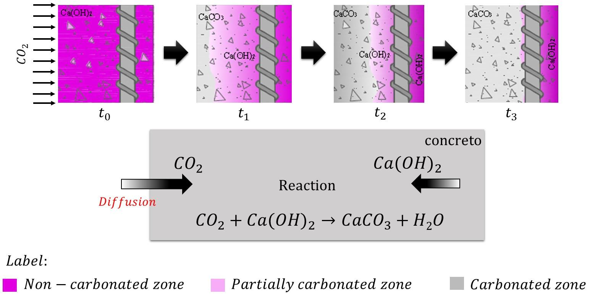
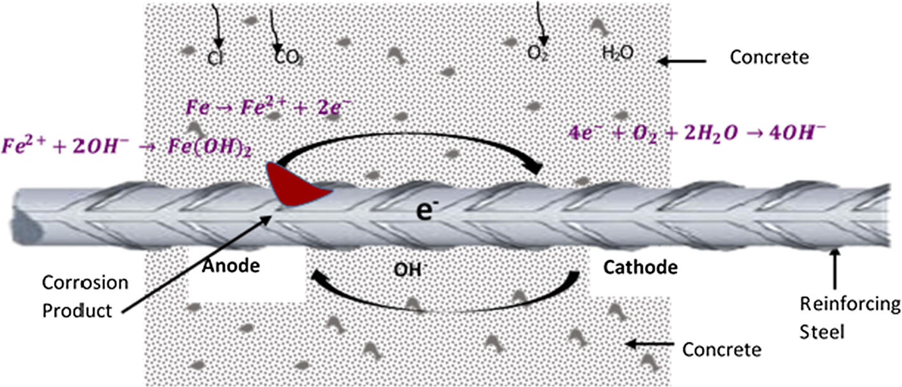
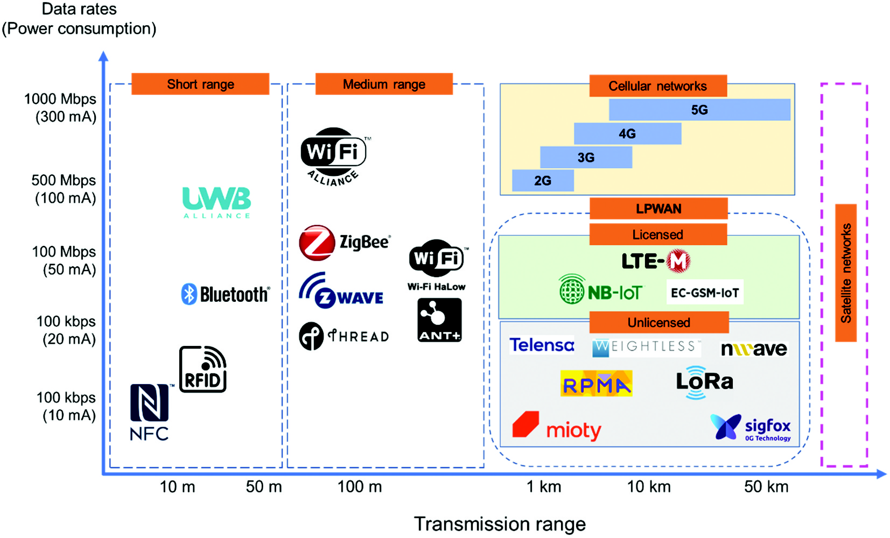

# Introduction

## Background and motivation

TODO: explain deep mining environment
- Increasing depth-> higher stress, temperature, seismicity, and operational risk
- Take some cases
- Ground support as a integrity system for safety, not a single product.

Deep and high‑stress underground mining environments are characterized by elevated in situ stresses, higher rock temperatures, increased seismic activity, and more complex hydrogeological conditions. With growing orebody depth, these factors amplify the likelihood of rockburst, time‑dependent deformation, and support degradation, which in turn increase safety risks and operational costs. Cementitious ground support systems—shotcrete, cast‑in‑place linings, cemented backfill, and grouted bolts—form an integrated safety barrier between the rock mass and workers, rather than isolated products. Effective monitoring of these systems is therefore essential to verify design assumptions, adapt support strategies, and enable safe, efficient production.

## Importance of ground support and monitoring
> Throughtout the whole lifecycle, from slurry to harden, the concrete should be ensured to avoid off track. On early age stage, placement quality, thickness, moisture, setting time, curing, strength gained.

> In service stage, some critical paramerters related to stress/strain demand, cracking, debonding, corrosion, convergence, seismic damage.

Throughout the full lifecycle, from fresh slurry to long‑term service, cementitious support must remain within acceptable bounds of quality and mechanical performance. At early ages, parameters such as placement quality, thickness, moisture retention, setting time, temperature evolution, and strength gain control both safety (e.g., re‑entry after shotcrete application) and productivity (cycle time). In service, monitoring focuses on stress and strain demand, cracking and debonding, corrosion, convergence, and seismic damage, which together govern residual capacity and the need for reinforcement or rehabilitation.

## Scope and structure of the review

> shotcrete, cast-in-place lining, backfill, the surface between grout and anchorage
> sesing categories: embedded, surface-attached, external/remote, and self-sensing materials

Cementitious materials are among the most widely used support media in underground mines, so this review concentrates on sensing technologies applicable to cement‑based systems.

This review focuses on cementitious ground support systems in underground mining—specifically shotcrete, cast‑in‑place linings including shaft linings, cemented backfill and barricades, and the grout–bolt/cable interface. For these systems, sensing solutions are grouped into four categories: embedded sensors, surface‑attached instrumentation, external/remote monitoring, and self‑sensing cementitious materials. The paper first summarizes the main support types, operating environment, and failure mechanisms. It then maps monitoring requirements to specific sensing technologies, discusses system‑level integration (communication, data fusion, and digital twins), and finally highlights key challenges and future research directions.

# Cementitious support types in underground mining

Concrete is one of the most widely cementitious materials in mining, providing durable, relatively low‑cost, and versatile support for shafts, drifts, excavations, and surface infrastructure. From the moment concrete is mixed and placed until the end of its service life, multiple properties must be monitored to ensure that design strength is reached and maintained, and to optimize construction and production schedules [@taheriReviewFiveKey2019]. The relevant parameters depend on the support function, construction method, and age, and include inherent attributes (temperature, humidity, pH, thermal and electrical conductivity, hydration degree, microstructure) and induced attributes (strain, stress, cracking, corrosion, stiffness, strength, and maturity). If abnormal changes in these parameters are not detected and acted upon, ground support performance can deteriorate, leading to increased risk of instability and lost productivity.

## Shotcrete

Shotcrete is a concrete or mortar mix that is conveyed through a hose and pneumatically projected at high velocity onto rock surfaces, typically in wet‑mix or dry‑mix form. Its ability to rapidly bond to irregular rock surfaces and gain early strength makes it the dominant primary support method in many underground mines. The durability of shotcrete is influenced by electrochemical corrosion, freeze–thaw cycles, alkali–aggregate reaction, elevated temperature exposure, microbiological attack, and mechanical damage, which can lead to shrinkage cracking, debonding, and spalling [@galanDurabilityShotcreteUnderground2019].

TODO: expand these degradation

Recently, additive manufacturing (refer in particular to 3D printing techonology), has been becoming more and more popular techniques. Form a special perspective, shotcrete is a unique type of 3D printing concrete, therefor the technologies used in 3D printing contrete can be applied to shotcrete as well.

```{r}
#| label: fig-shotcrete3dprint-r
#| fig-cap: "Shotcrete and 3D printing comparison"
#| fig-subcap: 
#|   - "Wet mix process of shotcrete @heidarnezhadShotcreteBased3D2022"
#|   - "Schematic diargram of the 3D prinitng setup @zhangReviewCurrentProgress2019"
#| layout-ncol: 2
#| fig-align: center
#| out-height: "2.5in"
#| echo: false

knitr::include_graphics(c("assets/2026-03-13-12-07-36.png", "assets/2026-03-13-13-33-18.png"))
```


## Cast-in-place concrete and shaft linings

Cast-in-place concrete is commonly used in shaft linings, pedways and any place need a precisely designation and massive structures. It's similar as the conventional concrete for modern building, and the framework will be employed usually. Therefore, the thchonoloogies used in traditional concrete will also apply in underground mining.

There is another specifial purpose as concrete pillars[@caoUtilizingConcretePillars2021] in room and pillars mining method. The concrete pillars were used to replace the empty room space and become the support, so the mineral in pillars could be exploit for increase the economic efficiency.

shaft lining concrete under simulated coastal ultra-deep mine environments[@zhouPerformanceChangeShaft2020]

As early as 1991, @linImpactEchoResponseConcrete1991 utilized the impact-echo response method to detect a shaft with flaws or not.

## Cemented backfill and barricades

Cemented past backfill (CPB) is a non-homogenous material made by mixing waste tailings water, and cement[@sheshpariReviewUndergroundMine2015]. CPB technology is one of fast growing waste utilize method, which is also a economical way of providing reliable support in undergound minng, however, poor roof-contact or other damage flaws might form a risky potential to be harmful to personnel[@yinActiveRoofcontactFuture2023].

factors contributing to the strength [@chiloaneRevisitingFactorsContributing2023]

## Grout interacts with bolts/cables

Rock bolts or Concrete bolts are widely used in civil and mining engineering to stabilize and reinforce the rock mass [@heFullyGroutedRock2015].

The schematic diagram and the principle are shown as the @fig-groutbolt-r-1 and @fig-groutbolt-r-2 [@wangStudyEngineeringApplication2019].

```{r}
#| label: fig-groutbolt-r
#| fig-cap: "The schematic diagram and the mechanics"
#| fig-subcap:
#|   - "The mechanical schematic diagram of surrounding rock-anchorage body interface"
#|   - "The mechanical schematic diagram of rock mass failure before and after grouting"
#| layout-ncol: 2
#| fig-align: center
#| out-height: "2in"
#| echo: false

knitr::include_graphics(c("assets/2026-03-13-16-03-53.png", "assets/2026-03-13-16-05-27.png"))
```

## Operating environment and constraints

blasting vibration, water inflow, temperature gradients

sensing constraint requirements: installation time, maitainability, cost, performance test

The operating environment is not stable like a building, all devices, equipments, and even tunnels will change with the open-stop moving forward. During the mining process, explosives might be used for caving the minerals, and it can produce powerful impact wave to affect the support stability and integrity; Due to the mining system high probablity through the aquiffer, the water inflow from the aquiffer will change the support physical properties and reduce the longevity of sensors. In deep mine, the high temperature gradients might cause the extra temperature drift error on sensor. There are also some security requirements must conform, in particular the coal mine, which includes the gas, and combustiable coal dust.

Thus, these harsh environment and constraints need to have more strict requirements. high stress, dynamic  loading, and ground water erosion can degrade sensors or affect signal stability. On the another hand, underground mines cannot use GPS , requiring complex wireless signal networks to transmit data from embedded sensors.

## The lifecycle of cementitious support

In underground mining, sensing technology must ultimately support specific operational decisions rather than purely academic measurement. Key decisions include re‑entry time after shotcrete application, verification of support quality (QA/QC), timing of extraction or rehabilitation, and detection of hazardous conditions such as accelerating convergence or support overloading. Therefore, each sensor type should be mapped to both its measurement function and the associated decision or alarm logic.

All data should relate or map to decisions: re-entry time, support quality(QA/QC), recovery timing, and hazard alert. 

TODO: a diargram or figure

# Failure mechanisms and monitoring requirements


## Early-age risks
> Hydration heat, thermal gradients, moisture loss, setting time, strength development, shrinkage cracking

These correspond to : temperature and humiduty history, maturity and strength, thickness and coverage

Early‑age risks include excessive hydration heat, steep thermal gradients, rapid moisture loss, delayed setting, insufficient early strength, and shrinkage cracking. These phenomena are governed by the temperature and humidity history, degree of hydration, and restraint conditions. Monitoring strategies therefore emphasize embedded thermocouples and maturity sensors, humidity and moisture probes, ultrasonic or impact‑echo methods for stiffness evolution, and external tools such as LiDAR or thickness gauges to verify coverage and geometry.


## Mechnical damage and structural instability
> Flexural cracking, debonding from rock, shear, punching, layers delamination
> These correspond to: strain/stress, crack initiation and growth, adhesion, displacement and convergence

Shotcrete is a special type of  concrete that is pheumatically projected at high velocity onto a surface. Shotcrete is typically classified into wet-mix and dry-mix types,depending on the method of mixing and delivery. Shotcrete is widely used in underground mining for ground support, tunnel linings, and slope stabilization due to its versatility, rapid application, and strong bonding properties.

Recycled concrete [@liuExperimentalStudyFailure2011]

fibre reinforced concrete [@wangMechanicalPropertiesFailure2025]

## Time-dependent deformation 

Creep and shrinkage of cementitious materials and thier effects  are two main failure types, "Serviceabiliti failures of concrete structures involving excessive cracking or deflection are relatively common, even in structures that comply with code requirements." [@gilbertTimeDependentBehaviourConcrete2010;@StateArtTimedependent2013]. Another failure type is the time dependent diffusion and corrosion, which is more related to the chemical and electrochemical degradation.

For the creep and shrinkage failure, The strain is discomposed into the creep strain $\epsilon_{cr}(t)$, shrinkage strain $\epsilon_{sh}(t)$, and the instantaneous strain $\epsilon_{e}(t)$ and the temperature strain $\epsilon_{T}(t)$, which is the sum of the elastic strain $\epsilon_{e}$ and the plastic strain $\epsilon_{p}$, as :

$$
\epsilon(t) = \epsilon_{e}(t) + \epsilon_{p}(t) + \epsilon_{cr}(t) + \epsilon_{sh}(t) + \epsilon_{T}(t)
$${#eq-time-dependent-strain}

The components of the strain over time can be calculated by proper assumptions and models, @gilbert2010time gave a comprehensive analysis and calculation for @eq-time-dependent-strain.

@nokkenTimeDependentDiffusion2006 

In practice, time‑dependent deformation is tracked using embedded strain gauges, vibrating wire instruments, extensometers, and distributed fibre optic sensing, while corrosion and carbonation are monitored via half‑cell potential measurements, resistivity mapping, embedded reference electrodes, and in some cases self‑sensing cementitious composites with conductive networks.

## Corrosion and carbonization

Corrosion and carbonization are two widespread problem affecting cementitious materials, and they are also the time-dependent failure types, but they are not like the creep and shrinkage, which is more related to the mechanical deformation, but more related to the chemical and electrochemical degradation @agboolaReviewCorrosionConcrete2021. For improving the strength and durability, steel reinforcement is widely used in cast-in-place concrete, but the corrosion of steel reinforcement is more serious than the concrete itself, with costly repair in billions of dollars annually worldwide @quraishiCorrosionReinforcedSteel2017.

{#fig-carbonation width=70%}

The main cause of carbonnation the the gaseous $CO_2$ entering , and then diffusing and dissolution into the cementious materials through the pores and fractures. It has two major processes, the formation of carbonic acid and the neutralization rection, as shown in the @eq-carbonation-1 and @eq-carbonation-2.

$$
CO_2 + H_2O \rightarrow H_2CO_3
$${#eq-carbonation-1}

$$
H_2CO_3 + Ca(OH)_2 \rightarrow CaCO_3 + 2H_2O
$${#eq-carbonation-2}

Over time, this reaction can also affect other hydration products like Calcium Silicate Hydrate (C-S-H) gel, causing it to decalcify and further lowering the pH.

{#fig-corrosion width=70%}

Corrosion is often caused by the by chloride ions. Unlike carbonation, which lowers the pH of the entire concrete matrix, chloride-induced corrosion is a more aggresive and localized mechanism. The chloride ions can move through the three main processes: diffusion, capillary absorption, and permeation, enventually reaching the steel reinforcement. There are also two phases of chloride ingress: initiation phase and propagation phase.

In the initiation phase, chloride ions just penetrate the surface and accumulate in the concrete structure, in particular in the steel surface, but they don't cause corrosion in this phase, yet. Once the critical chloride threshold is reached, the propagation phase starts, and  the anodic reaction and cathodic reaction occur, the chmechical reaction of the corrosion process is shown in the @eq-corrosion-1 and @eq-corrosion-2.
$$
Fe \rightarrow Fe^{2+} + 2e^-
$${#eq-corrosion-1}
$$
2H_2O + O_2 + 4e^- \rightarrow 4OH^-
$${#eq-corrosion-2}

The @eq-corrosion-2 comsumes the electrons generated by the @eq-corrosion-1, and produces the hydroxide ions, which can further react with the ferrous ions to form the rust products, such as $Fe(OH)_2$ and $Fe(OH)_3$. The corrosion process can cause the expansion of the steel reinforcement, which can lead to cracking and spalling of the concrete cover, and eventually structural failure.

## Dynamic loading and rockburst interaction.

The excavation and mining process includes blasting, drilling, and material handling, which generates massive dynamic loading and vibration, and these dynamic loading can cause the damage to the ground and its support system, and even cause the rockburst. Rockburst is a sudden and violent release of energy from the rock mass,

TODO: Here can summarize as a table for next two section

# Sensing technologies for cementitious ground support

FIX: the catagories seem a little embarrassed, another perspective is discretzie monitor and continuously monitor. I'm not quite sure about this classification.

A sensor can be a module, device, machine or subsystem that can capture or capture the target infromation or changes relaying on it's inter properties or reaction[@javaidSensorsDailyLife2021]. There are different classification method based on different purposes or standards. In this paper, the sensors are catogried by the 


The essence of a sensor is to capture the properties or difference of the objective. Therefore, sensors can be categoried by relating defferent physical properties: thermal, electrical, acoustical, optical, pressure, chemical and kinetic. And some sensors can combine them, such as infrared sensors.

The mining process is a complicated process for making sure safety, geomechanical stability and production efficency.

FIX: sensing technologies mapped to the lifecycle of cementitious ground support

TODO: put a framework illustration: lifecycle->mapping->physical vairable->sensors->decisions

## Placement and early-age

Target: re-entry time, early-age strength, thickness/cover (QA/QC)
Key physical paramerter: temperature hydration heat, marturity/ strenth proxy, thickness/geometry, moisture

The early-age phase (0–48 h) is critical for re-entry decisions and quality control. Monitoring focuses on indirect proxies of strength development, primarily temperature evolution, moisture condition, and early stiffness. Thermocouples are widely used to record hydration temperature history, which can be converted to in-situ strength using maturity methods [@taheriReviewFiveKey2019]. Distributed temperature sensing (DTS) further enables continuous spatial monitoring but requires careful installation and cost considerations. 

Moisture sensors help assess curing conditions, while non-destructive methods such as ultrasonic pulse velocity (UPV) provide indirect evaluation of stiffness development by measuring wave propagation velocity in the material [@malhotraNondestructiveTestingConcrete2004]. In addition, LiDAR and laser scanning are increasingly used to verify shotcrete thickness and coverage at the system scale.

Overall, sensing in this phase relies on thermal–hydraulic–stiffness proxies to support re-entry time and QA/QC decisions.


## Early service and load adaptation

target: early cracking/debonding, load redistribution, whether reinforcement is needed
key parameter: strain/stress evolution, interface behavior, crack initiation

During early service (days to weeks), the support system begins to interact with the surrounding rock mass, and monitoring shifts toward structural response. Strain gauges and vibrating wire sensors are commonly used to measure stress and strain evolution, while fibre optic sensing (FBG and distributed systems) enables spatially continuous monitoring of deformation and strain localization [@baoRecentProgressDistributed2021]. Acoustic emission techniques can detect microcrack initiation and debonding at the support–rock interface, providing early warning of damage [@grosseAcousticEmissionTesting2008].

In this phase, sensing is primarily used to detect load redistribution and early damage, supporting decisions on reinforcement and support optimization.

## Long-term service and degradation
target: durability/ residual capacity, maintenance shceduling, failure prevention
key parameter: creep/ shrinkage, corrosion/carbonation, moisture and permeability

In the long-term stage (months to years), monitoring focuses on time-dependent deformation and durability-related processes such as creep, shrinkage, and corrosion. Extensometers, vibrating wire gauges, and distributed fibre optic sensing are used to track deformation over time, while durability is assessed through electrical resistivity, half-cell potential, and embedded electrode sensors [@agboolaReviewCorrosionConcrete2021]. Moisture and transport properties also play a key role in interpreting degradation mechanisms.

Sensing in this phase supports maintenance planning and residual capacity assessment by capturing both mechanical and chemical degradation processes.

Compared with traditional sonsors that only can be performed on specific points, specific time, or single parameter, distributed fibre optic sensing(DFOS) provides more economic, comprehensive and continuous sensing technique. 

However, these advantages come with critical constriants and significant costs. DFOS is really suitbable for applying on simple geometry structure with relatively stable environment, such as bridges, tunnels and train tracks. However, DFOS might not be suitable for the conplicated geologic condition in underground mining besides the shafts structure which have lengthy and straight structure, can relatively easily install it and develop decode algorithm.

## Extrem events and system-level response
target: rockburst/blasting damage detectioni, rapid safety assessment, evacuation / alarm trigger
key parameter: high-frequency strain/stress, vibration wave propagation, global defformation

Dynamic loading from blasting and seismic activity introduces high strain rates and rapid damage evolution. Monitoring in this phase relies on high-frequency sensing techniques such as acoustic emission and microseismic systems to capture fracture processes and energy release [@grosseAcousticEmissionTesting2008]. In addition, rapid scanning methods such as LiDAR can be used for post-event deformation assessment.


The self-sensing principle has been massive studying in decades, as a novel concepts without traditional sensor achieving the monitoring function for the stress, strain, crack and flaws. Self-sensing function is obtained from the piezoresistive effect of functional fillers, which are scattered in the matrix phase and form a conductive network or planes [@bekzhanovaSelfSensingCementitiousComposites2021a]

```{r}
#| label: fig-selfsensedemo-r
#| fig-cap: "Schematic diagram of self-sensing principle [@hanIntrinsicSelfsensingConcrete2015]"
#| fig-subcap:
#|   - "Structure of ISSC"
#|   - "Typical sensing behavior of ISSC under loading"
#| layout-ncol: 2
#| fig-align: center
#| out-height: "2in"
#| echo: false

knitr::include_graphics(c("assets/2026-03-13-11-20-19.png", "assets/2026-03-13-11-34-08.png"))
```

To follow safety priority principle,  sensing emphasizes real-time detection and hazard warning under transient loading conditions.

## Post-event assessment and rehabilitation
target: damage mapping, decision: repair, reinforce/ abandon
key parameter: geometry change, crack network, internal defects

After extreme events or during scheduled inspections, sensing focuses on damage mapping and structural assessment. LiDAR, photogrammetry, and ground penetrating radar (GPR) are commonly used to identify geometric changes, cracking, and internal defects. Non-destructive methods such as ultrasonic and impact-echo testing can further evaluate internal integrity.

This phase supports decisions on repair, reinforcement, or decommissioning of support systems.

## Sensing technique selection guidance

Technologies are grouped by measurement function rather then installation form, to maintain consistency across lifecycle phases.


| Technology / Function                | Phase I | Phase II | Phase III | Phase IV | Phase V |
|-------------------------------------|---------|----------|-----------|----------|---------|
| **Thermal & maturity**              |         |          |           |          |         |
| Thermocouples / temperature sensors | ✓       | △        | –         | –        | –       |
| Maturity sensors                    | ✓       | △        | –         | –        | –       |
| Distributed temperature sensing (DTS) | ✓     | ✓        | △         | △        | –       |
| **Mechanical (strain / stress)**    |         |          |           |          |         |
| Strain gauges (electrical/FBG)      | △       | ✓        | ✓         | ✓        | △       |
| Vibrating wire gauges               | –       | ✓        | ✓         | △        | –       |
| Pressure cells / load cells         | –       | ✓        | ✓         | △        | –       |
| Fibre optic sensing (DFOS, DSS)     | △       | ✓        | ✓         | ✓        | △       |
| **Deformation & displacement**      |         |          |           |          |         |
| Extensometers                       | –       | ✓        | ✓         | △        | –       |
| Convergence meters                  | –       | ✓        | ✓         | ✓        | ✓       |
| Inclinometers                       | –       | △        | ✓         | △        | –       |
| **Damage & wave-based methods**     |         |          |           |          |         |
| Acoustic emission (AE)              | –       | ✓        | △         | ✓        | –       |
| Ultrasonic / UPV                    | ✓       | ✓        | △         | –        | ✓       |
| Impact-echo                         | ✓       | ✓        | △         | –        | ✓       |
| Microseismic monitoring             | –       | △        | △         | ✓        | △       |
| **Durability & chemical**           |         |          |           |          |         |
| Half-cell potential                 | –       | –        | ✓         | –        | △       |
| Electrical resistivity              | △       | △        | ✓         | –        | △       |
| Corrosion probes                    | –       | –        | ✓         | –        | △       |
| Humidity / RH sensors               | ✓       | △        | ✓         | –        | –       |
| **Geometric / global mapping**      |         |          |           |          |         |
| LiDAR / laser scanning              | ✓       | △        | ✓         | ✓        | ✓       |
| Photogrammetry / DIC                | ✓       | △        | ✓         | △        | ✓       |
| Ground penetrating radar (GPR)      | –       | △        | ✓         | –        | ✓       |
| **Emerging / integrated**           |         |          |           |          |         |
| Self-sensing cementitious materials | △       | ✓        | ✓         | △        | –       |

: Across the lifecycle, sensing focus from: (1) material state (thermal–hydraulic), to (2) structural response (mechanical), to (3) degradation processes (chemical), and finally to (4) system-level behavior under dynamic loading.


Such as **MDT** and **hilti** **DYWIDAG** and groundprobe developed  series of sensors can apply in the mining enviroments.

```{mermaid}
flowchart LR
    %% Thick lines between phases to lock the left-to-right order
    Phase1 ==> Phase2 ==> Phase3 ==> Phase4

    subgraph Phase1 [Phase 1: Objectives & Characteristics]
        direction TB
        A1[1. Define Monitoring Goals<br/>Early Hydration / Long-term Stability / Internal Defects] --> A2[2. Assess Material Properties<br/>Flowable Backfill Slurry / Wet-mix Concrete]
        A2 --> A3[3. Determine Key Indicators<br/>Stress & Displacement / Viscosity / Corrosion / Heat of Hydration]
    end

    subgraph Phase2 [Phase 2: Environmental Adaptation]
        direction TB
        B1[4. Basic Environment Constraints<br/>Mechanical Damage / Humidity / pH Level / EMI] --> B2[5. Extreme Challenge Assessment<br/>Blasting Impact / High In-situ Stress / Groundwater Seepage]
        B2 --> B3[6. Data Transmission Network<br/>Manual Inspection / LoRa / Industrial Ethernet]
    end

    subgraph Phase3 [Phase 3: Technology Screening]
        direction TB
        C1[7. Sensing Principle Matching<br/>Match Sampling Rate / Range / Durability] --> C2[8. Technology Type Comparison<br/>Point: Vibrating Wire, FBG vs. Distributed Fiber Optic]
        C2 --> C3[9. Cost & Lifespan Evaluation<br/>Balance Unit Price / Installation Difficulty / Mining Cycle]
    end

    subgraph Phase4 [Phase 4: Solution Implementation]
        direction TB
        D1[10. Initial Selection & Verification<br/>Determine Model / Sensitivity / Temp Compensation] --> D2{11. Validation & Trial<br/>Lab Calibration / On-site Pilot Test}
        D2 -- Pass --> D3([Final Selection Result])
        
        %% 👇 Internal jump node to perfectly solve cross-graph layout crashes
        D2 -. Fail .-> D4((Return to<br/>Phase 3))
    end

    %% Style beautification and visual hierarchy
    style Phase1 fill:#f5f5f5,stroke:#333,stroke-dasharray: 5 5,stroke-width:2px
    style Phase2 fill:#e1f5fe,stroke:#01579b,stroke-width:2px
    style Phase3 fill:#fff3e0,stroke:#e65100,stroke-width:2px
    style Phase4 fill:#e8f5e9,stroke:#1b5e20,stroke-width:2px
    
    style D3 fill:#c8e6c9,stroke:#2e7d32,stroke-width:3px,color:#000
    style D2 fill:#fff,stroke:#d32f2f,stroke-width:2px,color:#d32f2f
    
    %% Special warning style for the return node
    style D4 fill:#ffebee,stroke:#c62828,stroke-width:2px,color:#c62828,stroke-dasharray: 3 3
```

# System integration

Regarding on IoT, communication, analytics, and action in underground mines

## Underground wireless communication and data transmission

Data transmission techonologies is another key aspect in system integration. Through decades of development, comminicarion technologies shuch as the IoT, LoRa, Zigbee, Bluetooth, WiFi etc, already can support the monitoring requirements.

The relationship between data rates and transimission range is shown as the @fig-data-transer-system [@ngwenyamaRecentAdvancesChallenges2025].

{#fig-data-transer-system width=80%}

Note: this figure provides a qualitative comparison only; actual data rates and transmission ranges vary significantly depending on environment conditions and specific protocal version.

Now the main challenge is to improve the signal penetration ability and the stability.

## Data fusion (IoT and data-driven monitoring framework)

How to use the discretize embedded data to fuse the global external data spatio-temporal fusion.


## AI/ML for predictive maintenance and condition assessment

Based on history data and algorithm to monitor the abnormal and early warning.

## Digital twin concepts

Build the real-time virtual model, like the LLM, enough data combines proper algorithm causing emergence

# Challenges and future rsearch directions

## Sensor longevity and robustness

At present, the sensor longevity and robustness is still a critical challenge for the underground mining environment. The harsh conditions, including dust, moisture,  and mechanical vibration, can degrade the sensor performance and lead to failure. The traditional wire-based sensors include massive wiring and complex installation and maintenance, which can be costly and time consuming. The wireless sensors can reduce the wiring complexity, but they are still or more susceptible to the harsh environment; on the other hand, the power supply is also a critica issue for wireless sensors, as the battery life is limited and the replacement can be difficult in undergound mines.

## Standardization QA/QC, and cost-effectiveness

The sector has significant potential to follow a trajectory similar to other safety-critical industries, where progressive standardization enabled reliable automation and large-scale adoption. In underground mining, however, most current regulations for ground support monitoring remain high-level and performance-oriented, with limited technical detail on sensing architecture, calibration intervals, environmental qualification, redundancy, and data quality requirements.

Future progress depends on converting qualitative guidance into measurable QA/QC frameworks that define acceptance criteria across the full lifecycle, from installation and commissioning to long-term operation and replacement. Cost-effectiveness should be evaluated using total cost of ownership rather than initial purchase price alone, because robust standards can reduce false alarms, unplanned downtime, and maintenance burden, thereby improving both safety outcomes and economic performance.

## Transition from monitoring to active control

The next step for underground cementitious support systems is to move from passive monitoring to closed-loop, risk-informed control. In this transition, sensing is not only used for reporting conditions, but also for triggering operational decisions in near real time, such as modifying spraying parameters, adjusting support density, delaying re-entry, or initiating local reinforcement.

A practical pathway is a four-layer architecture: (1) multimodal sensing (embedded, surface, and remote), (2) data fusion and state estimation, (3) decision logic (rule-based thresholds and/or ML prediction), and (4) supervised actuation. In mining applications, human-in-the-loop operation remains essential because geotechnical conditions are highly uncertain and consequences of false actions can be severe. Therefore, automation should be introduced progressively, beginning with decision support, then semi-autonomous execution, and finally constrained autonomy under strict safety interlocks.

OpenClaw can be integrated as the actuation and orchestration layer in this framework. Specifically, OpenClaw-compatible control modules can receive validated condition indicators (e.g., rapid convergence growth, abnormal strain localization, delayed strength gain), map them to pre-approved response policies, and issue machine-level commands to support equipment or robotic platforms. To ensure safe deployment, this integration should include: deterministic fail-safe states, hard geofencing around active headings, confidence-based action gating, and complete event logging for QA/QC and post-event analysis. Under this approach, OpenClaw is not a standalone replacement for engineering judgement, but a controllable execution interface that operationalizes sensing intelligence into timely ground-support actions.

# Conclusion

Digital fabrication with concrete and cementitious materials have been prosperously developing in the path decade @wanglerDigitalConcreteReview2019. The sensing technologies will boost this process and bring it back to the mining industry, which is in urgent need of digitalization and automation. The future research should focus on the integration of sensing technologies with the digital fabrication process, and the development of new sensing technologies that are specifically designed for the mining industry.

Signle sensor or technology couldn't slove all problems, based on the failure mechanism combine embedded, external and smart materials, and assisted by AI framework, is the inevitable trend of concrete ground support monitoring of underground mining. This review shows that no single sensing technology can address all monitoring requirements for cementitious ground support in underground mines. A combination of embedded sensors, surface‑attached instrumentation, external and remote methods, and emerging self‑sensing materials is needed to cover early‑age performance, long‑term deformation, durability, and dynamic loading. When integrated through robust communication networks, data fusion, and digital‑twin frameworks, these technologies can support a transition from periodic, manual inspection towards risk‑informed, semi‑autonomous control of cementitious support systems.

# References

::: {#refs}
:::
